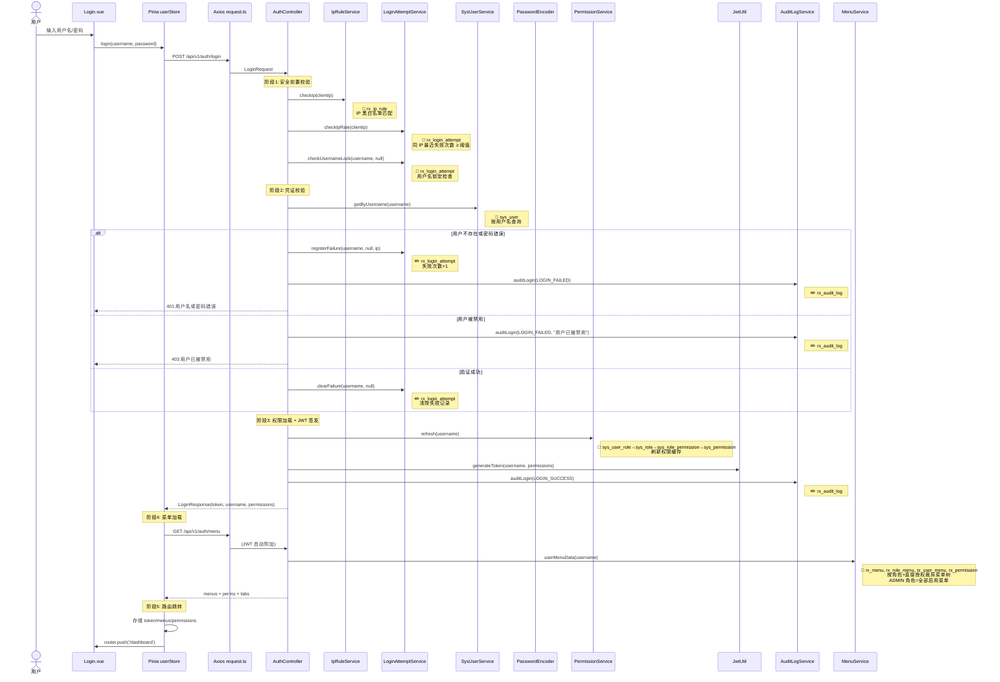
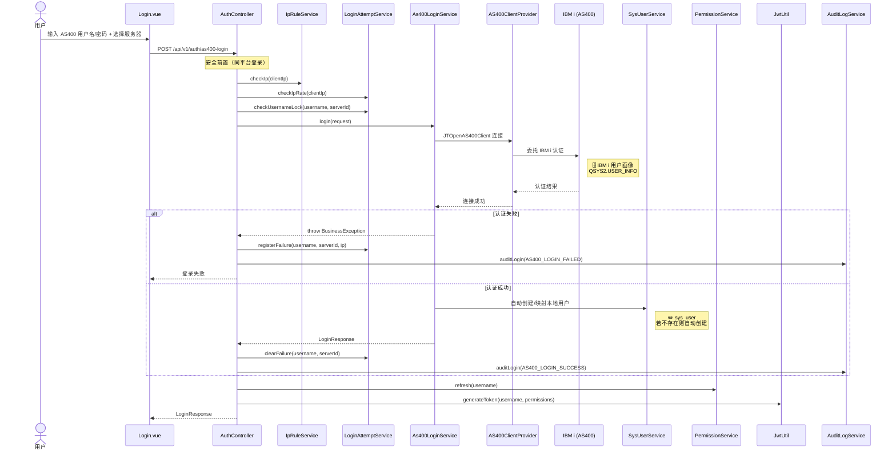
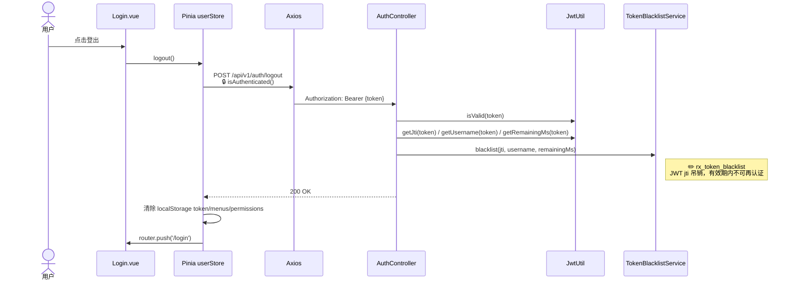

# 用户登录与认证

## 1.1 平台账号登录

`POST /api/v1/auth/login`

### 涉及数据表

| 阶段 | 数据表 | 操作 | 说明 |
|------|--------|------|------|
| 安全前置 | `rx_ip_rule` | 📖 | IP 黑白名单匹配 |
| 安全前置 | `rx_login_attempt` | 📖 | 同 IP 失败次数 / 用户名锁定 |
| 凭证校验 | `sys_user` | 📖 | 按用户名查询用户信息 |
| 登录失败 | `rx_login_attempt` | ✏️ | 失败次数 +1 |
| 登录失败 | `rx_audit_log` | ✏️ | 记录失败审计 |
| 登录成功 | `rx_login_attempt` | ✏️ | 清除失败记录 |
| 权限加载 | `sys_user_role` | 📖 | 用户角色关联 |
| 权限加载 | `sys_role` | 📖 | 角色信息 |
| 权限加载 | `sys_role_permission` | 📖 | 角色权限关联 |
| 权限加载 | `sys_permission` | 📖 | 权限码列表 |
| 登录成功 | `rx_audit_log` | ✏️ | 记录成功审计 |
| 菜单加载 | `rx_menu` | 📖 | 菜单树 + 按钮权限码 |
| 菜单加载 | `rx_role_menu` | 📖 | 角色菜单授权 |
| 菜单加载 | `rx_user_menu` | 📖 | 用户直接菜单授权 |
| 菜单加载 | `rx_tab` | 📖 | 标签页定义 |

---

## 1.2 AS400 用户画像登录

`POST /api/v1/auth/as400-login`

---

## 1.3 登出流程

`POST /api/v1/auth/logout`

