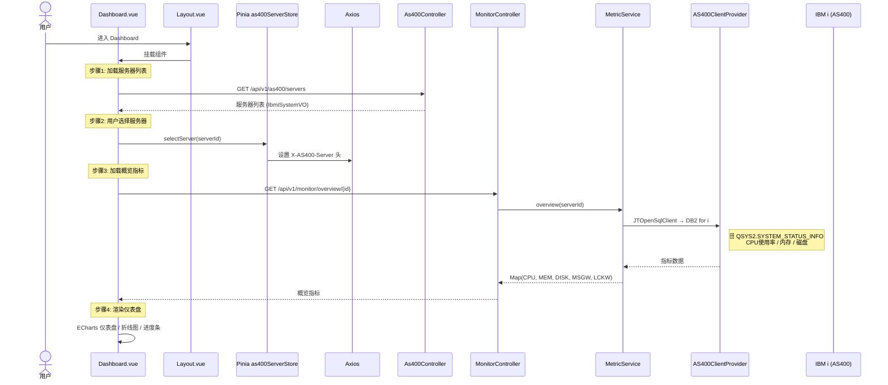

# Dashboard 仪表盘

## 仪表盘加载流程

### 涉及组件

| 组件 | 路径 | 说明 |
|------|------|------|
| `Dashboard.vue` | `frontend/src/views/` | 仪表盘主页，ECharts 渲染 |
| `Layout.vue` | `frontend/src/layout/` | 主布局，侧边栏+顶栏 |
| `Pinia as400ServerStore` | `frontend/src/stores/` | 服务器选择状态管理 |
| `As400Controller` | `backend/.../as400/` | 服务器列表接口 |
| `MonitorController` | `backend/.../monitor/` | 监控指标接口 |

### 涉及数据表

| 数据表 | 操作 | 说明 |
|--------|------|------|
| `rx_ibmi_system` | 📖 | 启用的服务器列表 |
| `QSYS2.SYSTEM_STATUS_INFO` | 🗄️ | CPU/内存/磁盘使用率 |
| `QSYS2.ACTIVE_JOB_INFO` | 🗄️ | MSGW/LCKW 作业计数 |
| `rx_metric` | 📖 | 最近采集指标快照 |