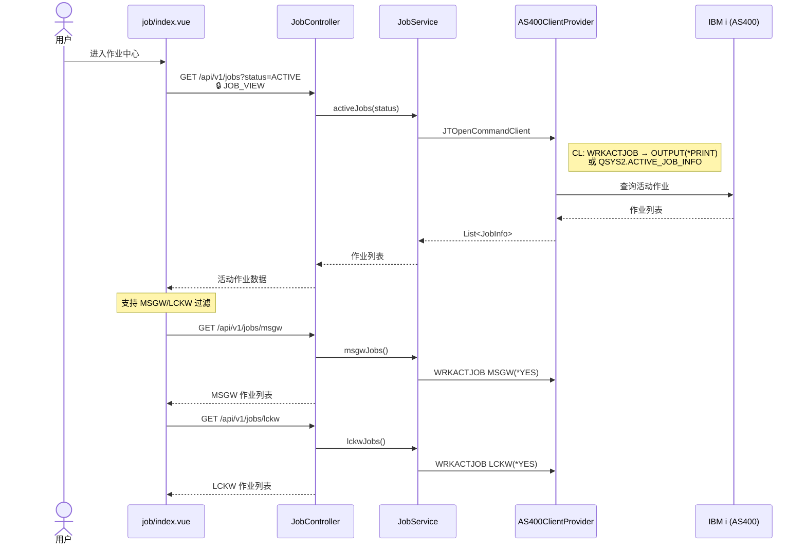
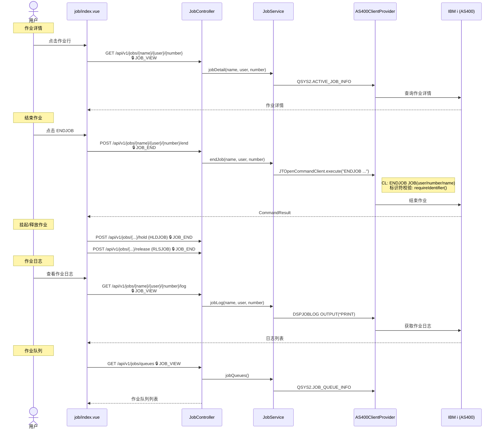
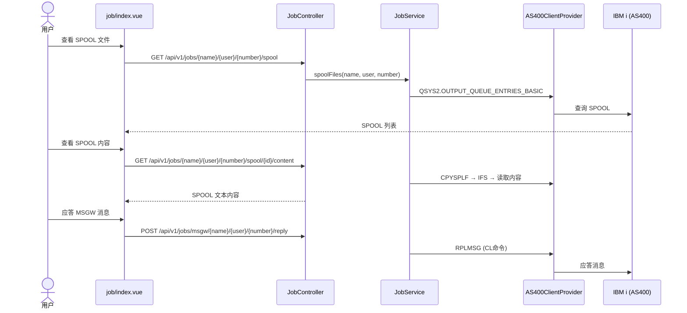
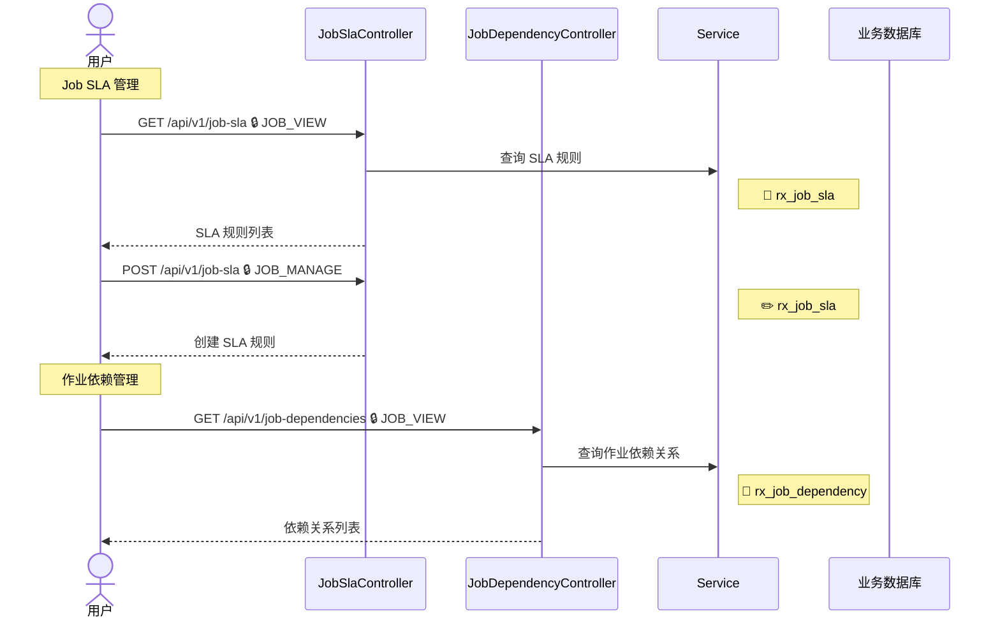

# 作业中心

## 3.1 活动作业列表

`GET /api/v1/jobs`

---

## 3.2 作业控制与日志

ENDJOB / HLDJOB / RLSJOB / DSPJOBLOG / MSGW 应答

---

## 3.3 SPOOL 文件与管理

---

## 3.4 Job SLA 与依赖 {#job-sla}

### 涉及权限码

| 权限码 | 说明 |
|--------|------|
| `JOB_VIEW` | 作业查看 |
| `JOB_END` | 作业控制（结束/挂起/释放） |
| `JOB_MANAGE` | SLA 管理 |

### 涉及数据表

| 数据表 | 操作 | 说明 |
|--------|------|------|
| `QSYS2.ACTIVE_JOB_INFO` | 🗄️ | 活动作业列表 |
| `QSYS2.JOB_QUEUE_INFO` | 🗄️ | 作业队列信息 |
| `QSYS2.OUTPUT_QUEUE_ENTRIES_BASIC` | 🗄️ | SPOOL 文件列表 |
| `rx_job_sla` | 📖✏️ | SLA 规则 |
| `rx_job_dependency` | 📖 | 作业依赖关系 |