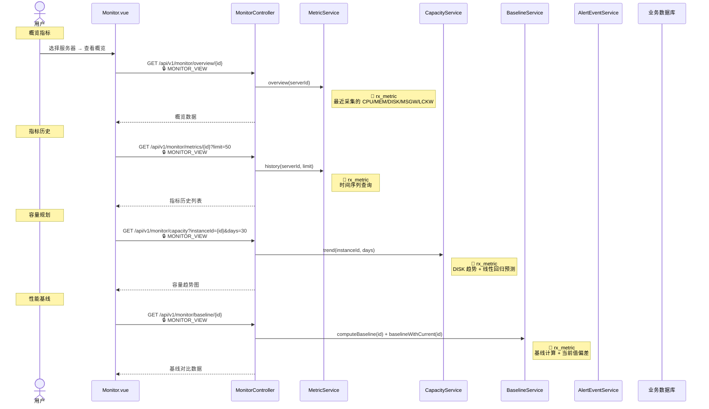
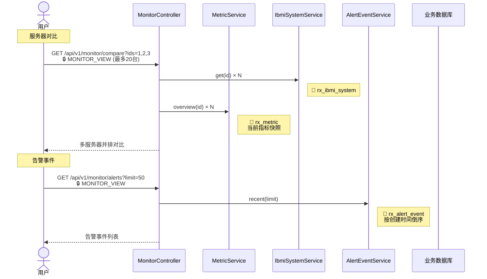
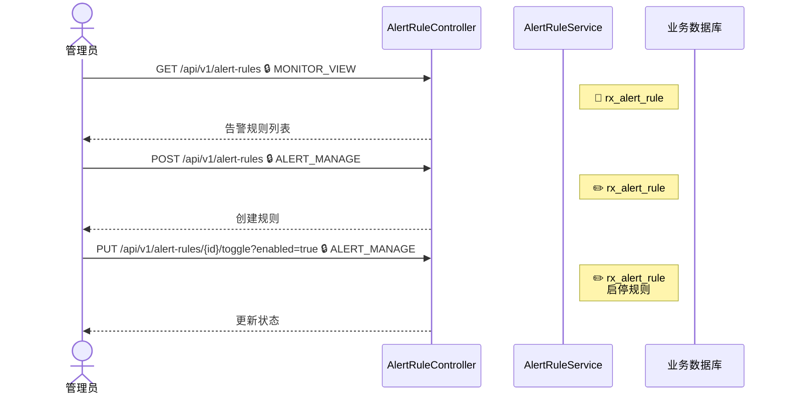
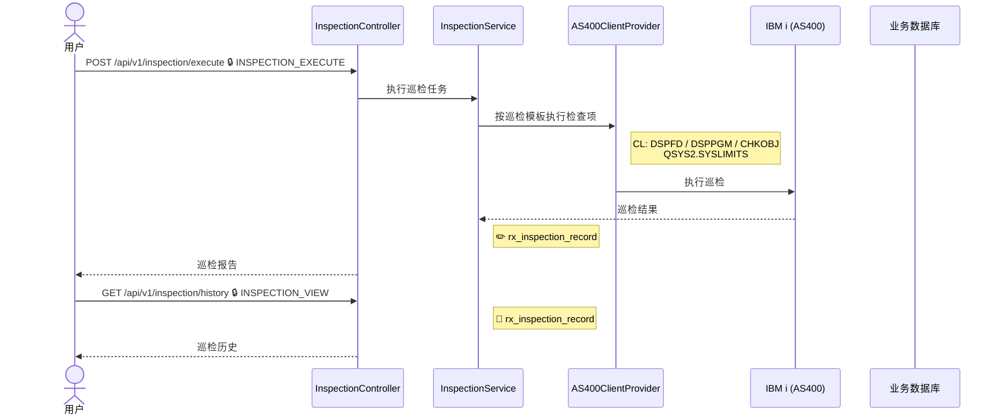

# 监控中心

## 4.1 监控概览与指标历史 {#metrics}

---

## 4.2 服务器对比与告警 {#server-compare}

---

## 4.3 告警规则管理 {#alert-rules}

---

## 4.4 巡检（Inspection） {#inspection}

### 涉及权限码

| 权限码 | 说明 |
|--------|------|
| `MONITOR_VIEW` | 监控查看 |
| `ALERT_MANAGE` | 告警规则管理 |
| `INSPECTION_VIEW` | 巡检查看 |
| `INSPECTION_EXECUTE` | 巡检执行 |

### 涉及数据表

| 数据表 | 操作 | 说明 |
|--------|------|------|
| `rx_metric` | 📖 | 指标采集数据 |
| `rx_alert_rule` | 📖✏️ | 告警规则 |
| `rx_alert_event` | 📖 | 告警事件 |
| `rx_inspection_record` | 📖✏️ | 巡检记录 |
| `rx_ibmi_system` | 📖 | 服务器配置 |