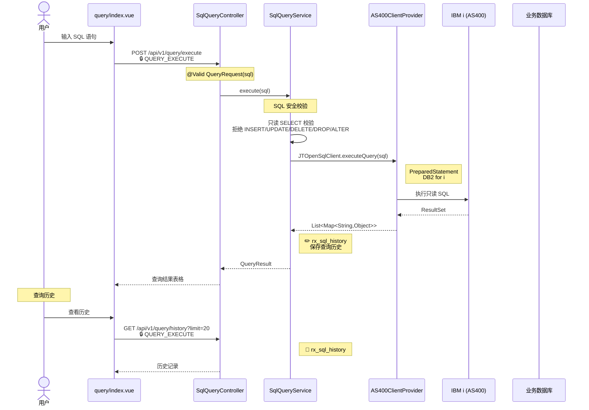
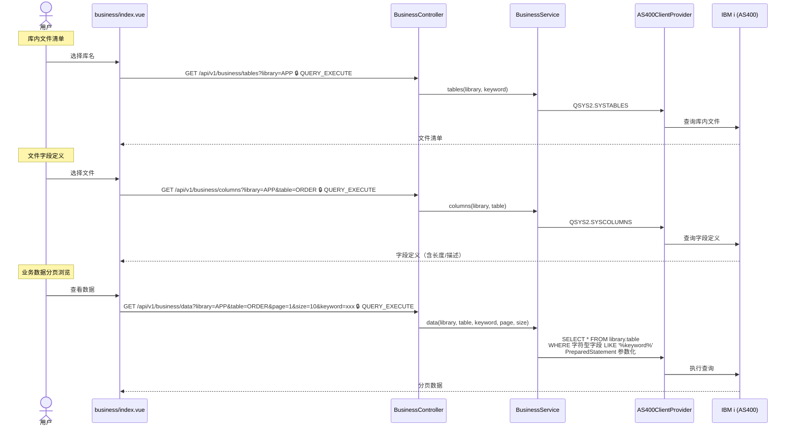

# SQL 查询与业务数据

## 5.1 SQL 查询执行

`POST /api/v1/query/execute`

---

## 5.2 业务数据浏览 {#biz-data}

`GET /api/v1/business/*`

### 安全机制

- **只读校验**：后端拒绝 INSERT/UPDATE/DELETE/DROP/ALTER 等写入操作
- **参数化查询**：使用 PreparedStatement，防止 SQL 注入
- **权限控制**：`QUERY_EXECUTE` 权限码

### 涉及数据表

| 数据表/系统表 | 操作 | 说明 |
|--------------|------|------|
| 用户指定库表 | 🗄️ | 业务数据查询 |
| `QSYS2.SYSTABLES` | 🗄️ | 库内文件清单 |
| `QSYS2.SYSCOLUMNS` | 🗄️ | 字段定义 |
| `rx_sql_history` | 📖✏️ | 查询历史记录 |