# AS400 工具集

## 服务器管理 {#server-manage}

`GET/POST/PUT/DELETE /api/v1/as400/systems/*`

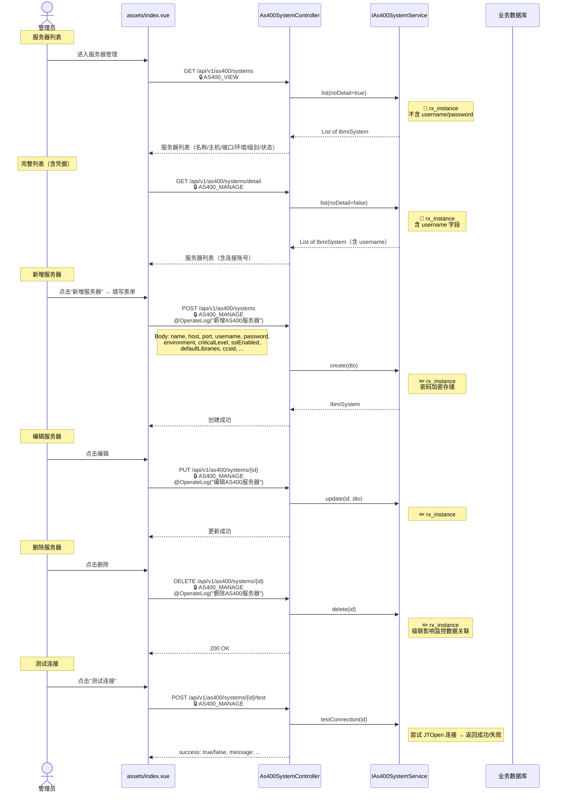

---

## 6.1 IFS 文件管理 {#ifs}

`GET/POST /api/v1/ifs/*`

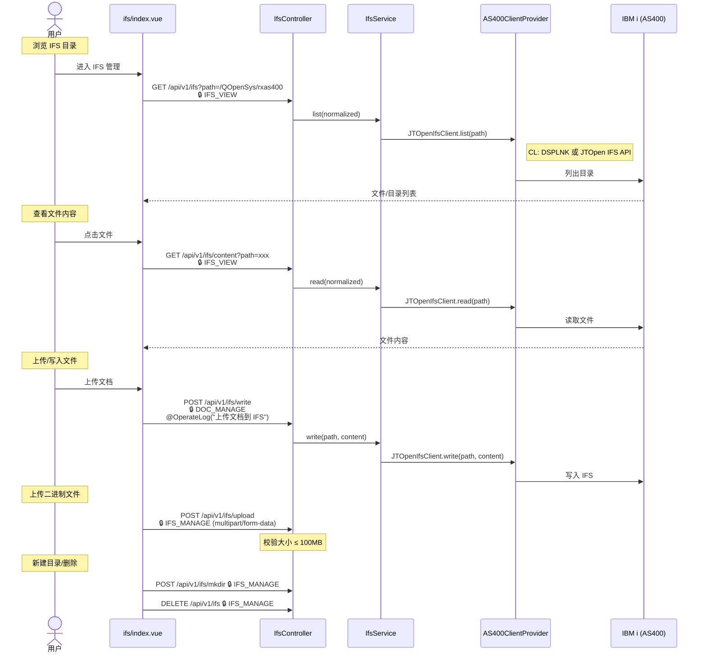

---

## 6.2 对象管理 {#objects}

`GET /api/v1/objects/*`

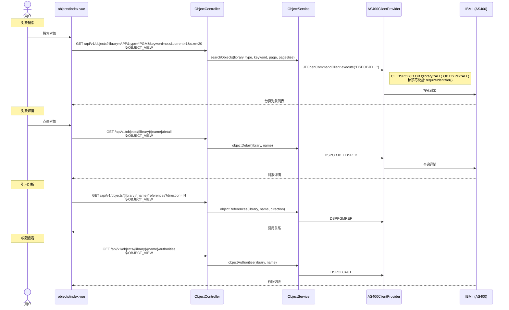

---

## 6.3 PF 物理文件浏览 {#pf}

`GET /api/v1/pf/*`

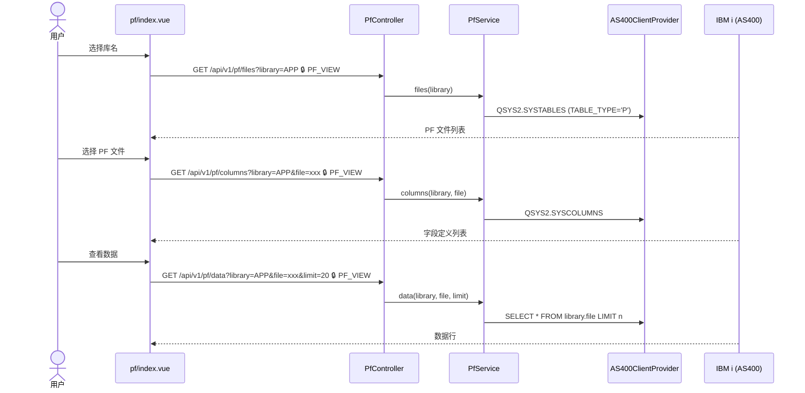

---

## 6.4 子系统管理 {#subsystems}

`GET/POST /api/v1/subsystems/*`

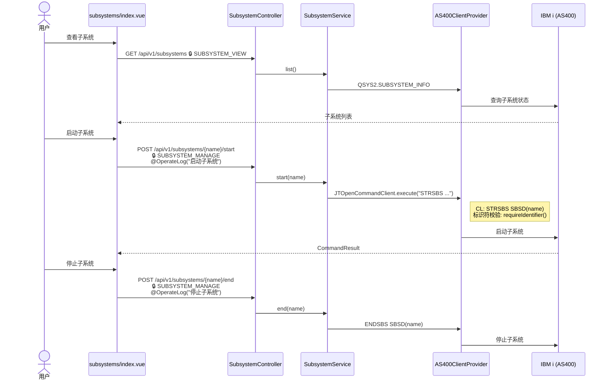

---

## 6.5 命令脚本中心 {#scripts}

`GET/POST /api/v1/scripts/*`

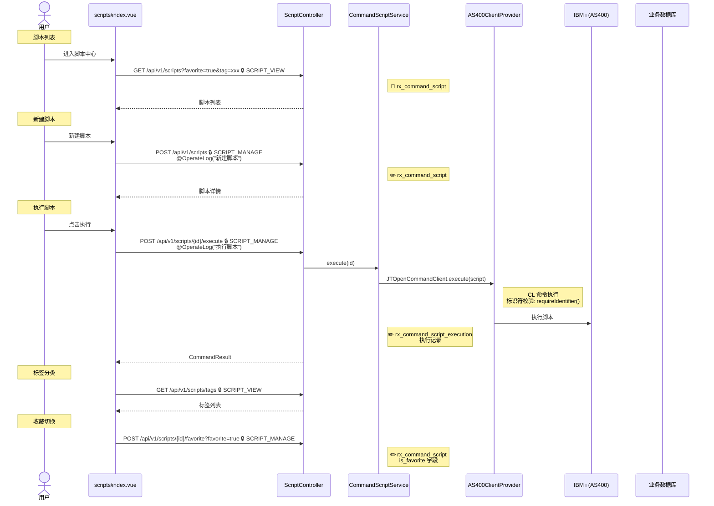

---

## 6.6 作业调度中心 {#schedules}

`GET/POST /api/v1/schedules/*`

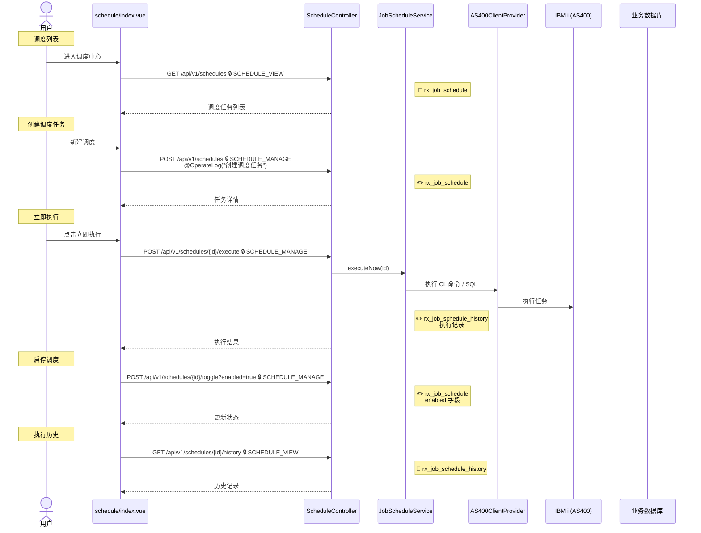

---

## 6.7 执行历史审计 {#executions}

`GET /api/v1/executions`

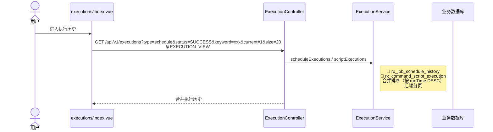

---

## 6.8 编译中心 {#compile}

`POST /api/v1/compile`

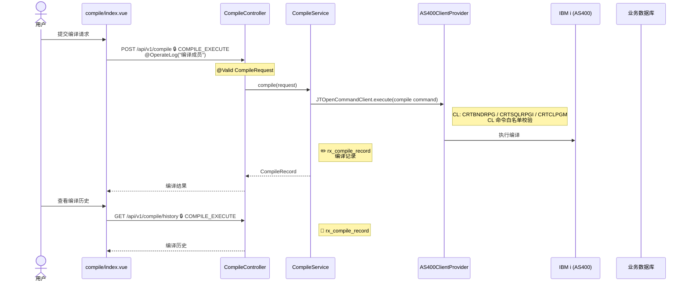

---

## 6.9 源码浏览 {#source}

`GET /api/v1/source/*`

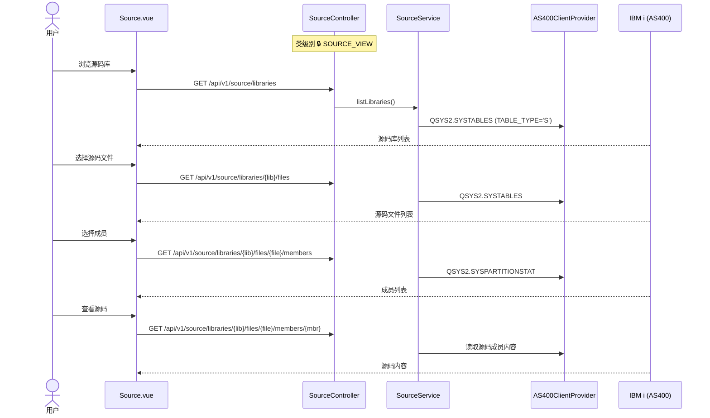

---

## 6.10 其他工具 {#other-tools}

拓扑图 / 消息文件 / 系统值 / 表字段

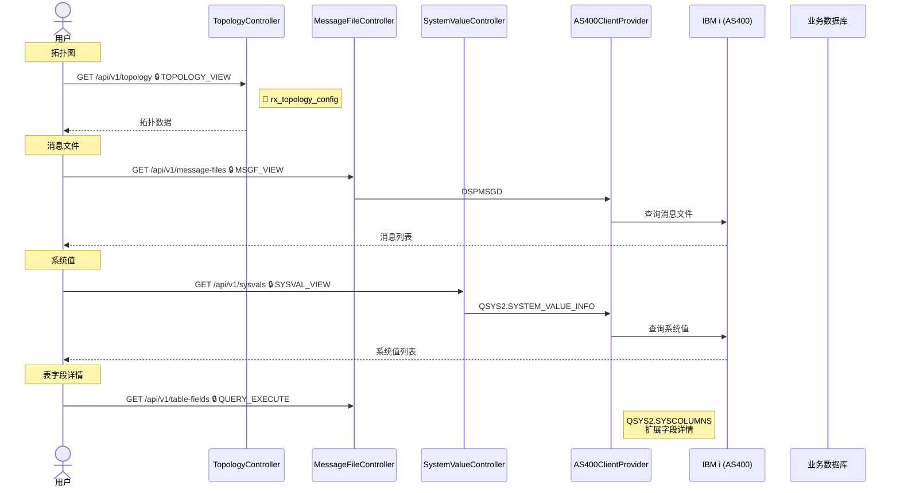

### 涉及权限码汇总

| 权限码 | 功能 |
|--------|------|
| `IFS_VIEW` / `IFS_MANAGE` | IFS 文件管理 |
| `OBJECT_VIEW` | 对象查看 |
| `PF_VIEW` | PF 文件查看 |
| `SUBSYSTEM_VIEW` / `SUBSYSTEM_MANAGE` | 子系统管理 |
| `SCRIPT_VIEW` / `SCRIPT_MANAGE` | 脚本管理 |
| `SCHEDULE_VIEW` / `SCHEDULE_MANAGE` | 调度管理 |
| `EXECUTION_VIEW` | 执行历史 |
| `COMPILE_EXECUTE` | 编译执行 |
| `SOURCE_VIEW` | 源码查看 |
| `TOPOLOGY_VIEW` | 拓扑查看 |
| `MSGF_VIEW` | 消息文件 |
| `SYSVAL_VIEW` | 系统值 |
| `DOC_MANAGE` | 文档管理（上传到 IFS） |