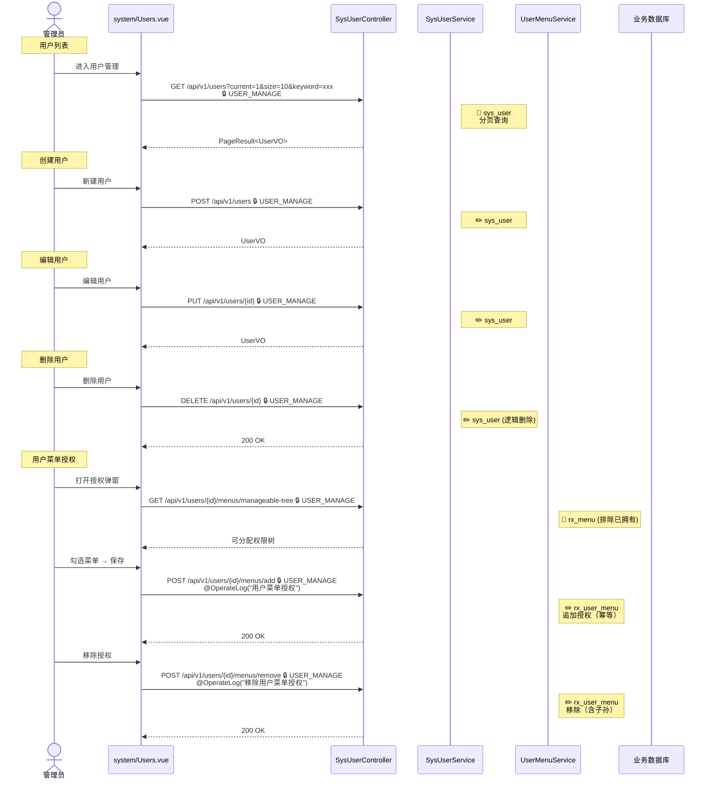
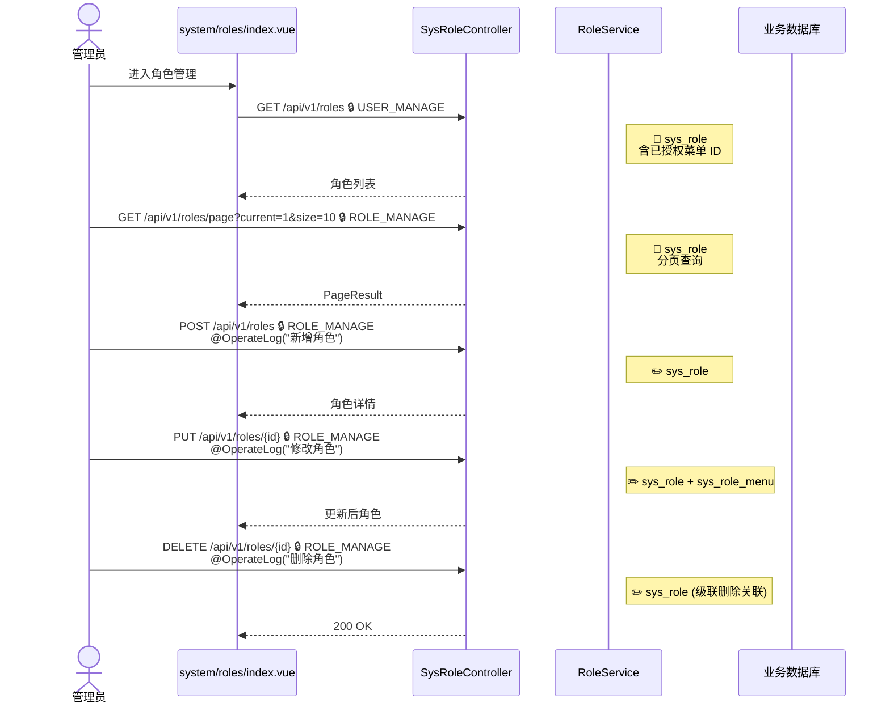
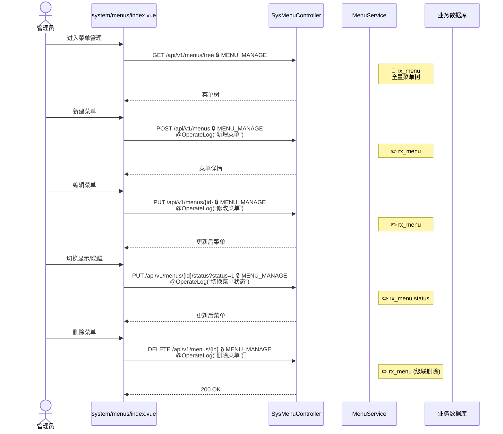
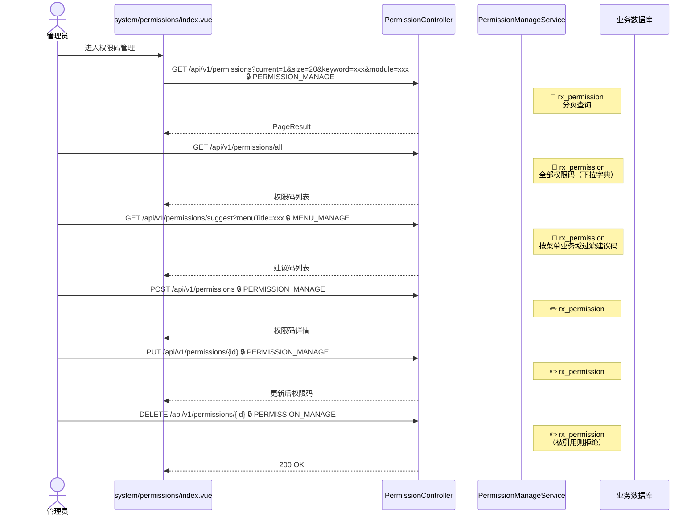
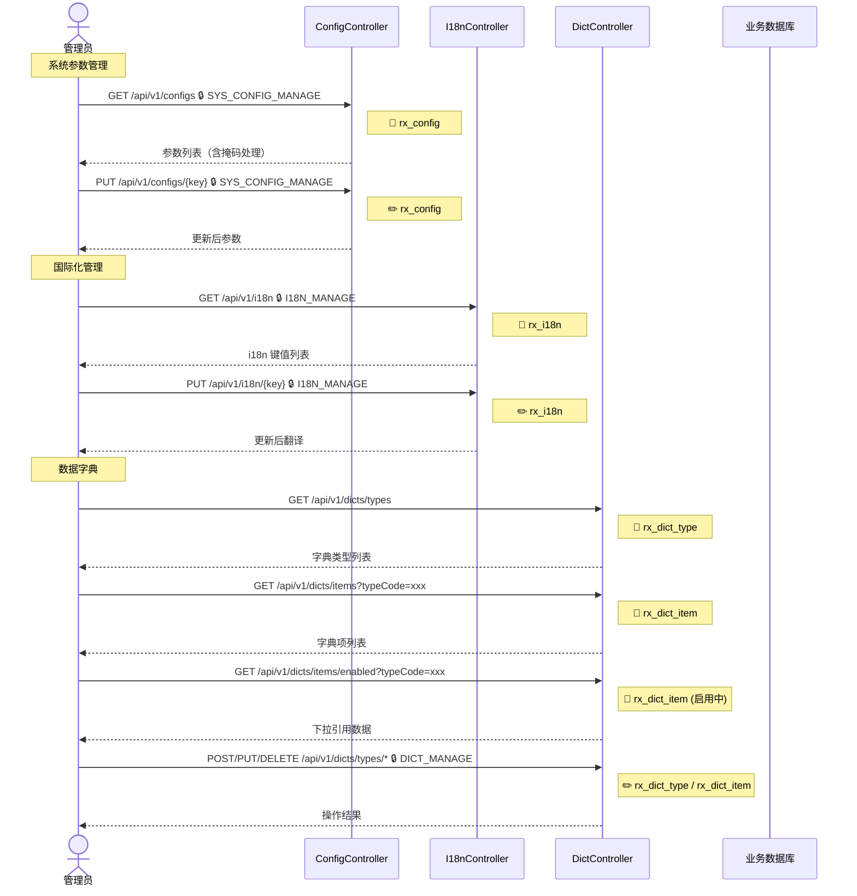
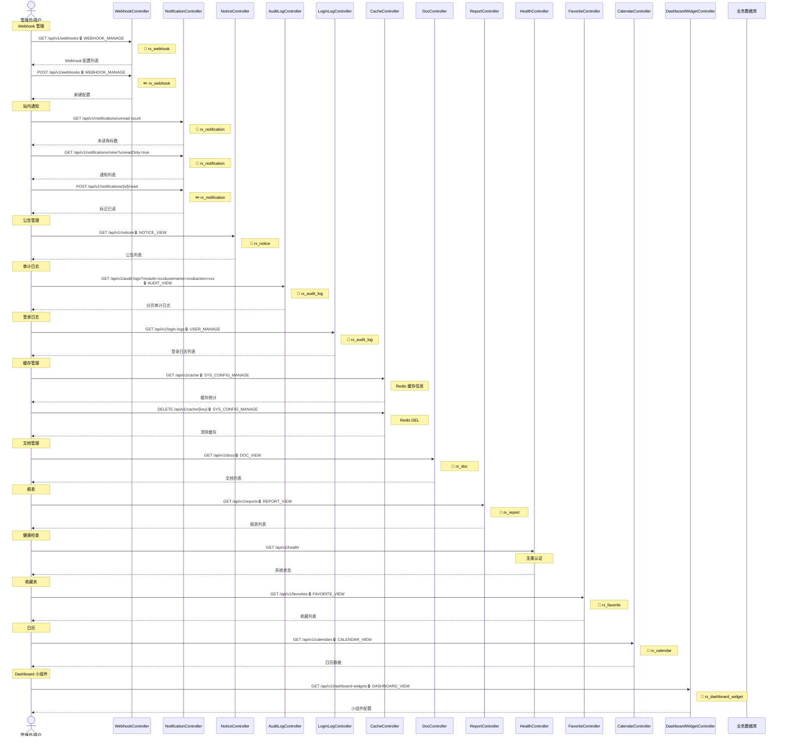

# 系统管理

## 7.1 用户管理 {#users}

`/api/v1/users/*`

---

## 7.2 角色管理 {#roles}

`/api/v1/roles/*`

---

## 7.3 菜单管理 {#menus}

`/api/v1/menus/*`

---

## 7.4 权限码管理 {#permissions}

`/api/v1/permissions/*`

---

## 7.5 系统配置、国际化、数据字典 {#config}

---

## 7.6 其他功能 {#other}

Webhook / 通知 / 公告 / 审计日志 / 登录日志 / 缓存管理 / 文档 / 报表 / 收藏 / 日历 / Dashboard 小组件

### 涉及权限码

| 权限码 | 模块 |
|--------|------|
| `USER_MANAGE` | 用户管理 |
| `ROLE_MANAGE` | 角色管理 |
| `MENU_MANAGE` | 菜单管理 |
| `PERMISSION_MANAGE` | 权限码管理 |
| `SYS_CONFIG_MANAGE` | 系统配置 |
| `I18N_MANAGE` | 国际化 |
| `DICT_MANAGE` | 数据字典 |
| `WEBHOOK_MANAGE` | Webhook |
| `AUDIT_VIEW` | 审计日志 |
| `DOC_VIEW` / `DOC_MANAGE` | 文档管理 |
| `REPORT_VIEW` | 报表查看 |
| `FAVORITE_VIEW` | 收藏夹 |
| `CALENDAR_VIEW` | 日历 |
| `DASHBOARD_VIEW` | 仪表盘小组件 |