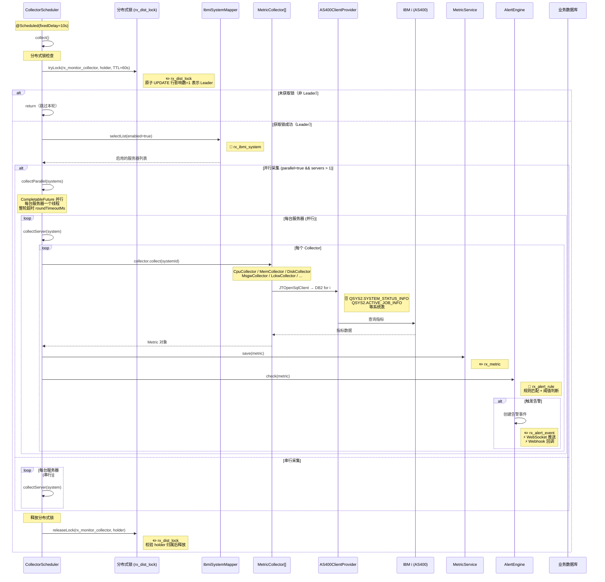

# 定时任务与后台采集

## 8.1 CollectorScheduler 后台采集流程

### 核心设计要点

| 设计点 | 说明 |
|--------|------|
| 分布式锁 | 基于数据库 `rx_dist_lock` 原子 UPDATE，多实例部署仅 Leader 采集 |
| 并行采集 | `CompletableFuture` 并行，每台服务器独立线程，整轮超时控制 |
| 指标采集器 | 策略模式，CPU/MEM/DISK/MSGW/LCKW 各自独立 Collector |
| 告警联动 | 采集后立即触发规则匹配，阈值超限自动创建告警事件 |
| 告警通知 | WebSocket 实时推送 + Webhook 回调（邮件/企业微信等） |

### 涉及数据表

| 数据表/系统表 | 操作 | 说明 |
|--------------|------|------|
| `rx_dist_lock` | 📖✏️ | 分布式锁（Leader 选举） |
| `rx_ibmi_system` | 📖 | 启用的服务器列表 |
| `QSYS2.SYSTEM_STATUS_INFO` | 🗄️ | CPU/内存/磁盘指标 |
| `QSYS2.ACTIVE_JOB_INFO` | 🗄️ | MSGW/LCKW 作业计数 |
| `rx_metric` | ✏️ | 写入采集指标 |
| `rx_alert_rule` | 📖 | 告警规则匹配 |
| `rx_alert_event` | ✏️ | 触发的告警事件 |