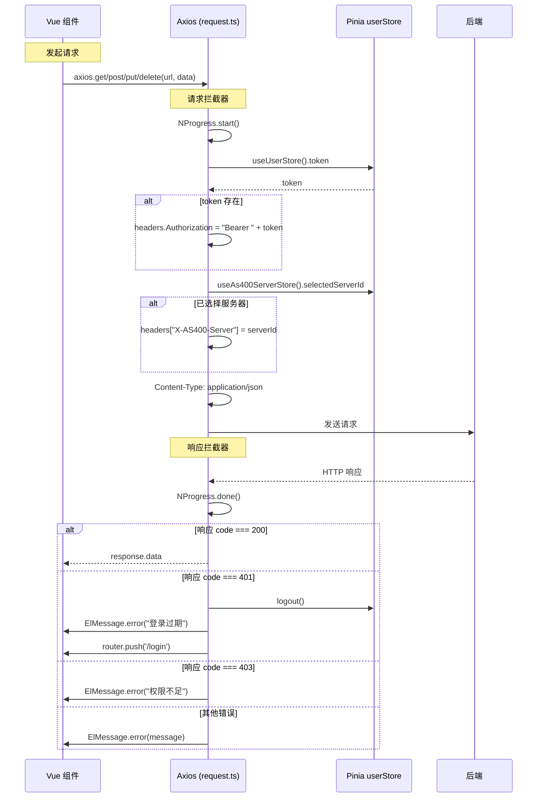
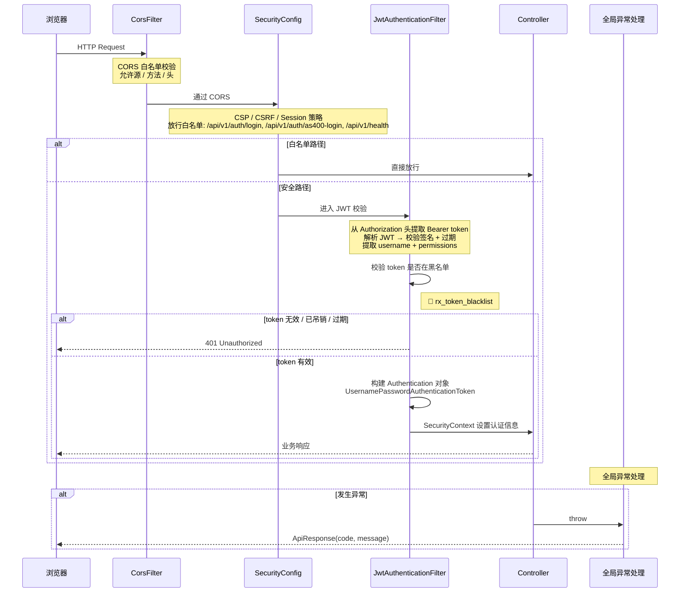

# 请求拦截器链

## 9.1 前端 Axios 请求/响应拦截器

位于 `frontend/src/utils/request.ts`



---

## 9.2 后端 Security Filter 链

位于 `backend/.../security/`



### Filter 链顺序

```
HTTP Request
  → CorsFilter (CORS 白名单)
  → SecurityConfig (CSP / CSRF / Session / 白名单路径)
  → JwtAuthenticationFilter (JWT 校验 + 黑名单 + 权限注入)
  → Controller (业务处理)
  → 全局异常处理 (统一响应格式)
```