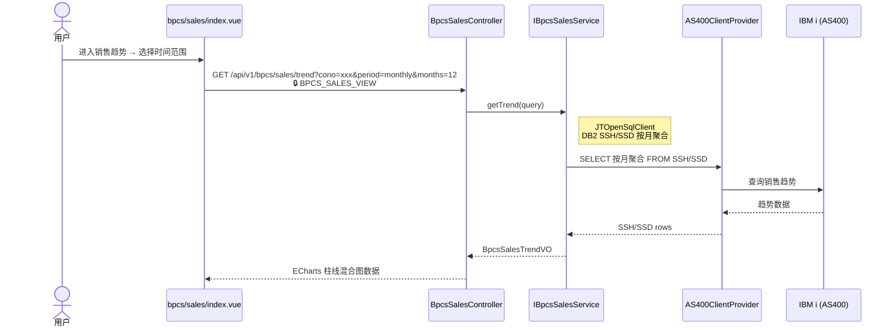
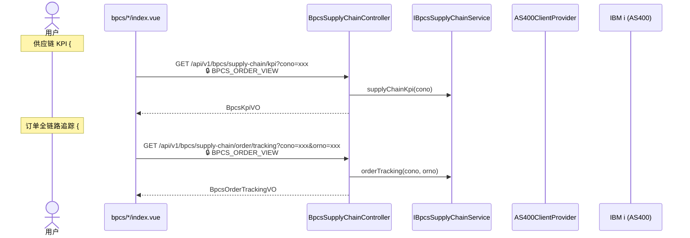

# 业务管理（BPCS）

`/api/v1/bpcs/*`

## 订单时间轴 {#order-timeline}

```mermaid
sequenceDiagram
    actor U as 用户
    participant OrderView as bpcs/order/index.vue
    participant OrderCtrl as BpcsOrderController
    participant OrderSvc as IBpcsOrderService
    participant AS400Client as AS400ClientProvider
    participant IBMi as IBM i (AS400)

    U->>OrderView: 输入订单号/客户号查询
    OrderView->>OrderCtrl: GET /api/v1/bpcs/orders/header?cono=xxx&orno=xxx<br/>🔒 BPCS_ORDER_VIEW
    OrderCtrl->>OrderSvc: getHeader(query)
    Note right of OrderSvc: JTOpenSqlClient<br/>DB2 ECH/ECL
    OrderSvc->>AS400Client: SELECT * FROM ECH/ECL
    AS400Client->>IBMi: 查询订单头
    IBMi-->>AS400Client: 订单头数据
    AS400Client-->>OrderSvc: ECH/ECL rows
    OrderSvc-->>OrderCtrl: BpcsOrderHeaderVO
    OrderCtrl-->>OrderView: 订单头 + 进程时间轴

    U->>OrderView: 点击查看订单行
    OrderView->>OrderCtrl: GET /api/v1/bpcs/orders/lines?cono=xxx&orno=xxx<br/>🔒 BPCS_ORDER_VIEW
    OrderCtrl->>OrderSvc: getLines(query)
    Note right of OrderSvc: JTOpenSqlClient<br/>DB2 ECL
    OrderSvc->>AS400Client: SELECT * FROM ECL
    AS400Client->>IBMi: 查询订单行
    IBMi-->>AS400Client: 订单行数据
    AS400Client-->>OrderSvc: ECL rows
    OrderSvc-->>OrderCtrl: List&lt;BpcsOrderLineVO&gt;
    OrderCtrl-->>OrderView: 订单行全集（含各阶段数量/价格/仓库/行级状态推导）
```

## 客户档案 {#customer}

```mermaid
sequenceDiagram
    actor U as 用户
    participant CustView as bpcs/customer/index.vue
    participant CustCtrl as BpcsCustomerController
    participant CustSvc as IBpcsCustomerService
    participant AS400Client as AS400ClientProvider
    participant IBMi as IBM i (AS400)

    U->>CustView: 进入客户档案 → 输入关键词搜索
    CustView->>CustCtrl: GET /api/v1/bpcs/customers?keyword=xxx&current=1&size=20<br/>🔒 BPCS_CUSTOMER_VIEW
    CustCtrl->>CustSvc: search(query)
    Note right of CustSvc: JTOpenSqlClient<br/>DB2 RCM + EST
    CustSvc->>AS400Client: SELECT * FROM RCM/EST
    AS400Client->>IBMi: 查询客户
    IBMi-->>AS400Client: 客户列表
    AS400Client-->>CustSvc: RCM/EST rows
    CustSvc-->>CustCtrl: PageResult&lt;BpcsCustomerVO&gt;
    CustCtrl-->>CustView: 客户分页列表

    U->>CustView: 点击客户行查看详情
    CustView->>CustCtrl: GET /api/v1/bpcs/customers/{cono}/{cust}<br/>🔒 BPCS_CUSTOMER_VIEW
    CustCtrl->>CustSvc: getDetail(cono, cust)
    Note right of CustSvc: JTOpenSqlClient<br/>DB2 RCM + EST<br/>含 Ship-To 列表
    CustSvc->>AS400Client: SELECT * FROM RCM/EST WHERE CONO=? AND CUST=?
    AS400Client->>IBMi: 查询客户详情
    IBMi-->>AS400Client: 客户详情 + Ship-To
    AS400Client-->>CustSvc: RCM/EST rows
    CustSvc-->>CustCtrl: BpcsCustomerVO
    CustCtrl-->>CustView: 客户详情（含 Ship-To 列表）
```

## 库存可用量 {#inventory}

```mermaid
sequenceDiagram
    actor U as 用户
    participant InvView as bpcs/inventory/index.vue
    participant InvCtrl as BpcsInventoryController
    participant InvSvc as IBpcsInventoryService
    participant AS400Client as AS400ClientProvider
    participant IBMi as IBM i (AS400)

    U->>InvView: 进入库存 → 输入物料号/描述/仓库
    InvView->>InvCtrl: GET /api/v1/bpcs/inventory?keyword=xxx&current=1&size=20<br/>🔒 BPCS_INVENTORY_VIEW
    InvCtrl->>InvSvc: search(query)
    Note right of InvSvc: JTOpenSqlClient<br/>DB2 IIM + IWI
    InvSvc->>AS400Client: SELECT * FROM IIM/IWI
    AS400Client->>IBMi: 查询库存可用量
    IBMi-->>AS400Client: 库存数据
    AS400Client-->>InvSvc: IIM/IWI rows
    InvSvc-->>InvCtrl: PageResult&lt;BpcsInventoryVO&gt;
    InvCtrl-->>InvView: 库存可用量列表
```

## 发运看板 {#shipping}

```mermaid
sequenceDiagram
    actor U as 用户
    participant ShipView as bpcs/shipping/index.vue
    participant ShipCtrl as BpcsShippingController
    participant ShipSvc as IBpcsShippingService
    participant AS400Client as AS400ClientProvider
    participant IBMi as IBM i (AS400)

    U->>ShipView: 进入发运看板 → 输入状态/载荷号筛选
    ShipView->>ShipCtrl: GET /api/v1/bpcs/shipping?status=xxx&lhno=xxx&current=1&size=20<br/>🔒 BPCS_SHIPPING_VIEW
    ShipCtrl->>ShipSvc: search(query)
    Note right of ShipSvc: JTOpenSqlClient<br/>DB2 LLH
    ShipSvc->>AS400Client: SELECT * FROM LLH
    AS400Client->>IBMi: 查询载荷
    IBMi-->>AS400Client: 载荷数据
    AS400Client-->>ShipSvc: LLH rows
    ShipSvc-->>ShipCtrl: PageResult&lt;BpcsLoadVO&gt;
    ShipCtrl-->>ShipView: 载荷列表（四列 Kanban）
```

## 发票轨迹 {#invoice}

```mermaid
sequenceDiagram
    actor U as 用户
    participant InvView as bpcs/invoice/index.vue
    participant InvCtrl as BpcsInvoiceController
    participant InvSvc as IBpcsInvoiceService
    participant AS400Client as AS400ClientProvider
    participant IBMi as IBM i (AS400)

    U->>InvView: 进入发票轨迹 → 输入订单号/客户号
    InvView->>InvCtrl: GET /api/v1/bpcs/invoices?cono=xxx&orno=xxx&current=1&size=20<br/>🔒 BPCS_INVOICE_VIEW
    InvCtrl->>InvSvc: search(query)
    Note right of InvSvc: JTOpenSqlClient<br/>DB2 BBH/BBL（在制）+ SIH/SIL（历史）
    InvSvc->>AS400Client: SELECT * FROM BBH/BBL/SIH/SIL
    AS400Client->>IBMi: 查询发票
    IBMi-->>AS400Client: 发票数据
    AS400Client-->>InvSvc: BBH/BBL/SIH/SIL rows
    InvSvc-->>InvCtrl: PageResult&lt;BpcsInvoiceVO&gt;
    InvCtrl-->>InvView: 发票 Timeline + Tab 数据
```

## 销售趋势 {#sales}



## 采购订单 {#purchase}

```mermaid
sequenceDiagram
    actor U as 用户
    participant PurchView as bpcs/purchase/index.vue
    participant PurchCtrl as BpcsPurchaseController
    participant PurchSvc as IBpcsPurchaseService
    participant AS400Client as AS400ClientProvider
    participant IBMi as IBM i (AS400)

    U->>PurchView: 进入采购订单 → 输入供应商号/订单号
    PurchView->>PurchCtrl: GET /api/v1/bpcs/purchases?cono=xxx&pono=xxx&vendor=xxx&current=1&size=20<br/>🔒 BPCS_PURCHASE_VIEW
    PurchCtrl->>PurchSvc: search(query)
    Note right of PurchSvc: JTOpenSqlClient<br/>DB2 HPH + HPO
    PurchSvc->>AS400Client: SELECT * FROM HPH/HPO
    AS400Client->>IBMi: 查询采购订单
    IBMi-->>AS400Client: 采购订单数据
    AS400Client-->>PurchSvc: HPH/HPO rows
    PurchSvc-->>PurchCtrl: PageResult&lt;BpcsPurchaseOrderVO&gt;
    PurchCtrl-->>PurchView: 采购订单分页
```

## 物料主档 {#item}

```mermaid
sequenceDiagram
    actor U as 用户
    participant ItemView as bpcs/item/index.vue
    participant ItemCtrl as BpcsItemController
    participant ItemSvc as IBpcsItemService
    participant AS400Client as AS400ClientProvider
    participant IBMi as IBM i (AS400)

    U->>ItemView: 进入物料主档 → 输入物料号/描述
    ItemView->>ItemCtrl: GET /api/v1/bpcs/items?keyword=xxx&current=1&size=20<br/>🔒 BPCS_ITEM_VIEW
    ItemCtrl->>ItemSvc: search(query)
    Note right of ItemSvc: JTOpenSqlClient<br/>DB2 IIM
    ItemSvc->>AS400Client: SELECT * FROM IIM
    AS400Client->>IBMi: 查询物料列表
    IBMi-->>AS400Client: 物料数据
    AS400Client-->>ItemSvc: IIM rows
    ItemSvc-->>ItemCtrl: PageResult&lt;BpcsItemVO&gt;
    ItemCtrl-->>ItemView: 物料列表（左侧列表 + 右侧多 Tab 详情）

    U->>ItemView: 点击物料行查看详情
    ItemView->>ItemCtrl: GET /api/v1/bpcs/items/{item}<br/>🔒 BPCS_ITEM_VIEW
    ItemCtrl->>ItemSvc: getDetail(item)
    Note right of ItemSvc: JTOpenSqlClient<br/>DB2 IIM + IWI + HPO + SSD<br/>库存/采购/销售全维度
    ItemSvc->>AS400Client: SELECT 多表关联
    AS400Client->>IBMi: 查询物料全维度
    IBMi-->>AS400Client: 多维度数据
    AS400Client-->>ItemSvc: IIM/IWI/HPO/SSD rows
    ItemSvc-->>ItemCtrl: BpcsItemVO
    ItemCtrl-->>ItemView: 物料详情（含库存/采购/销售全维度 Tab 数据）
```

## 供应链增强（Phase 1-4） {#supply-chain}

### Phase 1 — 基础功能 {#sc-phase1}

```mermaid
sequenceDiagram
    actor U as 用户
    participant SCView as bpcs/*/index.vue
    participant SCCtrl as BpcsSupplyChainController
    participant SCSvc as IBpcsSupplyChainService
    participant AS400Client as AS400ClientProvider
    participant IBMi as IBM i (AS400)

    Note over U: 订单列表 {#sc-order-list}
    U->>SCView: 进入订单列表
    SCView->>SCCtrl: GET /api/v1/bpcs/supply-chain/orders?cono=xxx&orno=xxx<br/>🔒 BPCS_ORDER_VIEW
    SCCtrl->>SCSvc: searchOrders(query)
    SCSvc->>AS400Client: JTOpenSqlClient → DB2
    SCCtrl-->>SCView: List&lt;BpcsOrderListVO&gt;

    Note over U: 库存预警 {#sc-inventory-alert}
    SCView->>SCCtrl: GET /api/v1/bpcs/supply-chain/inventory/alerts?cono=xxx&limit=50<br/>🔒 BPCS_INVENTORY_VIEW
    SCCtrl->>SCSvc: inventoryAlerts(cono, limit)
    SCCtrl-->>SCView: List&lt;BpcsInventoryAlertVO&gt;

    Note over U: 销售分析 {#sc-sales-analysis}
    SCView->>SCCtrl: GET /api/v1/bpcs/supply-chain/sales/analysis?cono=xxx&topN=10<br/>🔒 BPCS_SALES_VIEW
    SCCtrl->>SCSvc: salesAnalysis(cono, topN)
    SCCtrl-->>SCView: BpcsSalesAnalysisVO
```

### Phase 2 — 扩展功能 {#sc-phase2}

```mermaid
sequenceDiagram
    actor U as 用户
    participant SCView as bpcs/*/index.vue
    participant SCCtrl as BpcsSupplyChainController
    participant SCSvc as IBpcsSupplyChainService
    participant AS400Client as AS400ClientProvider
    participant IBMi as IBM i (AS400)

    Note over U: 库存变动历史 {#sc-inventory-history}
    SCView->>SCCtrl: GET /api/v1/bpcs/supply-chain/inventory/history?cono=xxx&item=xxx&fromDate=xxx&toDate=xxx&limit=100<br/>🔒 BPCS_INVENTORY_VIEW
    SCCtrl->>SCSvc: inventoryHistory(cono, item, fromDate, toDate, limit)
    SCCtrl-->>SCView: List&lt;BpcsInventoryHistoryVO&gt;

    Note over U: 采购收货 {#sc-purchase-receiving}
    SCView->>SCCtrl: GET /api/v1/bpcs/supply-chain/purchase/receiving?cono=xxx&pono=xxx&vendor=xxx&limit=100<br/>🔒 BPCS_PURCHASE_VIEW
    SCCtrl->>SCSvc: purchaseReceiving(cono, pono, vendor, limit)
    SCCtrl-->>SCView: List&lt;BpcsPurchaseReceivingVO&gt;

    Note over U: 发运列表 {#sc-shipping-list}
    SCView->>SCCtrl: GET /api/v1/bpcs/supply-chain/shipping/list?cono=xxx&lhno=xxx&carrier=xxx&limit=100<br/>🔒 BPCS_SHIPPING_VIEW
    SCCtrl->>SCSvc: shippingList(cono, lhno, carrier, limit)
    SCCtrl-->>SCView: List&lt;BpcsLoadVO&gt;
```

### Phase 3 — 分析功能 {#sc-phase3}

```mermaid
sequenceDiagram
    actor U as 用户
    participant SCView as bpcs/*/index.vue
    participant SCCtrl as BpcsSupplyChainController
    participant SCSvc as IBpcsSupplyChainService
    participant AS400Client as AS400ClientProvider
    participant IBMi as IBM i (AS400)

    Note over U: ABC 分析 {#sc-abc-analysis}
    SCView->>SCCtrl: GET /api/v1/bpcs/supply-chain/inventory/abc?cono=xxx&limit=100<br/>🔒 BPCS_INVENTORY_VIEW
    SCCtrl->>SCSvc: abcAnalysis(cono, limit)
    SCCtrl-->>SCView: List&lt;BpcsAbcAnalysisVO&gt;

    Note over U: 供应商绩效 {#sc-supplier-perf}
    SCView->>SCCtrl: GET /api/v1/bpcs/supply-chain/supplier/performance?cono=xxx&limit=20<br/>🔒 BPCS_PURCHASE_VIEW
    SCCtrl->>SCSvc: supplierPerformance(cono, limit)
    SCCtrl-->>SCView: List&lt;BpcsSupplierPerfVO&gt;
```

### Phase 4 — 高级功能 {#sc-phase4}



### 涉及功能模块

| 模块 | 路由 | 前端组件 | 后端 Controller | 数据源（DB2 for i） |
|------|------|----------|-----------------|---------------------|
| 订单时间轴 | `/bpcs-order` | `bpcs/order/index.vue` | `BpcsOrderController` | ECH / ECL |
| 客户档案 | `/bpcs-customer` | `bpcs/customer/index.vue` | `BpcsCustomerController` | RCM / EST |
| 库存可用量 | `/bpcs-inventory` | `bpcs/inventory/index.vue` | `BpcsInventoryController` | IIM / IWI |
| 发运看板 | `/bpcs-shipping` | `bpcs/shipping/index.vue` | `BpcsShippingController` | LLH |
| 发票轨迹 | `/bpcs-invoice` | `bpcs/invoice/index.vue` | `BpcsInvoiceController` | BBH/BBL（在制）+ SIH/SIL（历史） |
| 销售趋势 | `/bpcs-sales` | `bpcs/sales/index.vue` | `BpcsSalesController` | SSH / SSD（按月聚合） |
| 采购订单 | `/bpcs-purchase` | `bpcs/purchase/index.vue` | `BpcsPurchaseController` | HPH / HPO |
| 物料主档 | `/bpcs-item` | `bpcs/item/index.vue` | `BpcsItemController` | IIM / IWI / HPO / SSD |
| 订单列表 | `/bpcs-order-list` | `bpcs/orderList/index.vue` | `BpcsSupplyChainController` | DB2 |
| 库存预警 | `/bpcs-inventory-alert` | `bpcs/inventoryAlert/index.vue` | `BpcsSupplyChainController` | DB2 |
| 销售分析 | `/bpcs-sales-analysis` | `bpcs/salesAnalysis/index.vue` | `BpcsSupplyChainController` | DB2 |
| 库存变动 | `/bpcs-inventory-history` | `bpcs/inventoryHistory/index.vue` | `BpcsSupplyChainController` | DB2 |
| 采购收货 | `/bpcs-purchase-receiving` | `bpcs/purchaseReceiving/index.vue` | `BpcsSupplyChainController` | DB2 |
| 发运列表 | `/bpcs-shipping-list` | `bpcs/shippingList/index.vue` | `BpcsSupplyChainController` | DB2 |
| ABC 分析 | `/bpcs-abc-analysis` | `bpcs/abcAnalysis/index.vue` | `BpcsSupplyChainController` | DB2 |
| 供应商绩效 | `/bpcs-supplier-perf` | `bpcs/supplierPerf/index.vue` | `BpcsSupplyChainController` | DB2 |
| 供应链 KPI | `/bpcs-kpi` | `bpcs/kpi/index.vue` | `BpcsSupplyChainController` | DB2 |
| 订单全链路 | `/bpcs-order-tracking` | `bpcs/orderTracking/index.vue` | `BpcsSupplyChainController` | DB2 |

### 涉及权限码

| 权限码 | 说明 |
|--------|------|
| `BPCS_ORDER_VIEW` | 订单查看 |
| `BPCS_CUSTOMER_VIEW` | 客户查看 |
| `BPCS_INVENTORY_VIEW` | 库存查看 |
| `BPCS_SHIPPING_VIEW` | 发运查看 |
| `BPCS_INVOICE_VIEW` | 发票查看 |
| `BPCS_SALES_VIEW` | 销售查看 |
| `BPCS_PURCHASE_VIEW` | 采购查看 |
| `BPCS_ITEM_VIEW` | 物料查看 |

### 涉及 DB2 for i 数据表

| 数据表 | 操作 | 说明 |
|--------|------|------|
| ECH | 📖 | 订单头（Customer Order Header） |
| ECL | 📖 | 订单行（Customer Order Line） |
| RCM | 📖 | 客户主档（Customer Master） |
| EST | 📖 | Ship-To 地址 |
| IIM | 📖 | 物料主档（Item Master） |
| IWI | 📖 | 库存仓库（Item Warehouse） |
| LLH | 📖 | 载荷头（Load Header） |
| BBH | 📖 | 在制发票头（Billing Header） |
| BBL | 📖 | 在制发票行（Billing Line） |
| SIH | 📖 | 历史发票头（Sales Invoice Header） |
| SIL | 📖 | 历史发票行（Sales Invoice Line） |
| SSH | 📖 | 销售统计头（Sales Summary Header） |
| SSD | 📖 | 销售统计明细（Sales Summary Detail） |
| HPH | 📖 | 采购订单头（Purchase Order Header） |
| HPO | 📖 | 采购订单行（Purchase Order Line） |