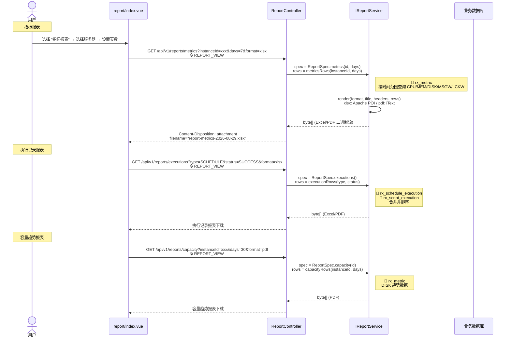
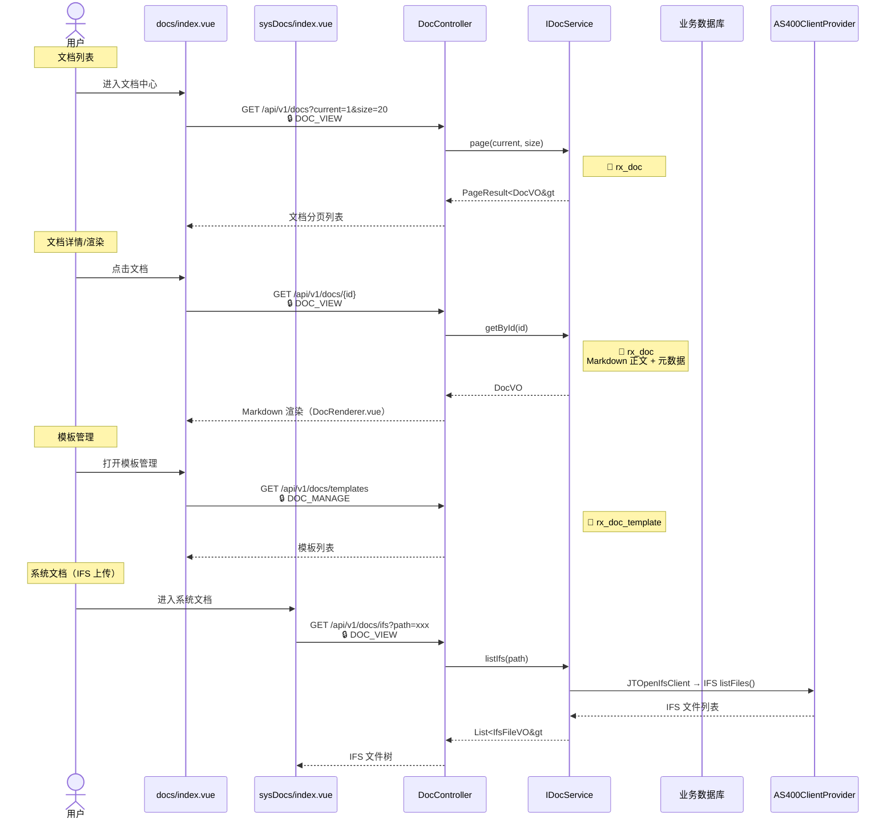

# 报表与文档

`/api/v1/reports/*` `/api/v1/report-schedules/*` `/api/v1/docs/*`

## 报表生成（手动下载） {#report-gen}



## 报表定时任务 {#report-schedule}

```mermaid
sequenceDiagram
    actor U as 管理员
    participant ReportView as report/index.vue
    participant SchedCtrl as ReportScheduleController
    participant SchedSvc as IReportScheduleService
    participant DB as 业务数据库

    U->>ReportView: 切换到 "定时任务" 标签
    ReportView->>SchedCtrl: GET /api/v1/report-schedules<br/>🔒 REPORT_VIEW
    SchedCtrl->>SchedSvc: list()
    Note right of SchedSvc: 📖 rx_report_schedule
    SchedSvc-->>SchedCtrl: List<ReportSchedule&gt; → List<ReportScheduleVO&gt;
    SchedCtrl-->>ReportView: 定时任务列表

    U->>ReportView: 点击"新建定时任务"
    ReportView->>SchedCtrl: POST /api/v1/report-schedules<br/>🔒 REPORT_MANAGE<br/>@OperateLog("创建定时报表任务")
    Note right of ReportView: Body: {name, reportType, format, serverId, days, cronExpr, recipients, enabled}
    SchedCtrl->>SchedSvc: create(schedule, currentUsername)
    Note right of SchedSvc: ✏️ rx_report_schedule
    SchedSvc-->>SchedCtrl: ReportSchedule
    SchedCtrl-->>ReportView: ReportScheduleVO

    U->>ReportView: 编辑定时任务
    ReportView->>SchedCtrl: PUT /api/v1/report-schedules/{id}<br/>🔒 REPORT_MANAGE<br/>@OperateLog("更新定时报表任务")
    SchedCtrl->>SchedSvc: update(id, schedule)
    Note right of SchedSvc: ✏️ rx_report_schedule
    SchedSvc-->>SchedCtrl: ReportSchedule
    SchedCtrl-->>ReportView: 更新成功

    U->>ReportView: 启停任务
    ReportView->>SchedCtrl: PUT /api/v1/report-schedules/{id}/toggle?enabled=true<br/>🔒 REPORT_MANAGE<br/>@OperateLog("启停定时报表任务")
    SchedCtrl->>SchedSvc: toggle(id, enabled)
    Note right of SchedSvc: ✏️ rx_report_schedule.enabled
    SchedSvc-->>SchedCtrl: ReportSchedule
    SchedCtrl-->>ReportView: 状态已更新

    U->>ReportView: 立即执行
    ReportView->>SchedCtrl: POST /api/v1/report-schedules/{id}/execute<br/>🔒 REPORT_MANAGE<br/>@OperateLog("立即执行定时报表任务")
    SchedCtrl->>SchedSvc: executeNow(id)
    Note right of SchedSvc: 立即触发报表生成 + 邮件发送<br/>✏️ rx_report_schedule_history
    SchedSvc-->>SchedCtrl: ScheduleExecuteResultVO
    SchedCtrl-->>ReportView: 执行结果（含文件路径/邮件状态）

    U->>ReportView: 查看执行历史
    ReportView->>SchedCtrl: GET /api/v1/report-schedules/{id}/history<br/>🔒 REPORT_VIEW
    SchedCtrl->>SchedSvc: history(id)
    Note right of SchedSvc: 📖 rx_report_schedule_history
    SchedSvc-->>SchedCtrl: List<ReportScheduleHistoryVO&gt;
    SchedCtrl-->>ReportView: 执行历史列表

    U->>ReportView: 删除定时任务
    ReportView->>SchedCtrl: DELETE /api/v1/report-schedules/{id}<br/>🔒 REPORT_MANAGE<br/>@OperateLog("删除定时报表任务")
    SchedCtrl->>SchedSvc: delete(id)
    Note right of SchedSvc: ✏️ rx_report_schedule
    SchedSvc-->>SchedCtrl: void
    SchedCtrl-->>ReportView: 200 OK
```

## 文档中心 {#doc-center}



### 涉及功能模块

| 模块 | 路由 | 前端组件 | 后端 Controller | Service |
|------|------|----------|-----------------|---------|
| 报表中心 | `/report` | `report/index.vue` | `ReportController` | `IReportService` |
| 定时报表 | `/report`（Tab） | `report/ReportScheduleDialog.vue` | `ReportScheduleController` | `IReportScheduleService` |
| 文档中心 | `/docs` | `docs/index.vue` | `DocController` | `IDocService` |
| 系统文档 | `/sys-docs` | `sysDocs/index.vue` | `DocController` | `IDocService` |

### 涉及数据表

| 数据表 | 操作 | 说明 |
|--------|------|------|
| `rx_metric` | 📖 | 指标历史（报表数据源） |
| `rx_schedule_execution` | 📖 | 定时任务执行记录（报表数据源） |
| `rx_script_execution` | 📖 | 命令脚本执行记录（报表数据源） |
| `rx_report_schedule` | 📖✏️ | 定时报表任务配置 |
| `rx_report_schedule_history` | 📖✏️ | 定时报表执行历史 |
| `rx_doc` | 📖✏️ | 文档内容 |
| `rx_doc_template` | 📖✏️ | 文档模板 |
| `rx_config` | 📖 | SMTP 配置（邮件发送） |

### 涉及权限码

| 权限码 | 说明 | 使用位置 |
|--------|------|---------|
| `REPORT_VIEW` | 报表查看 | 手动下载报表、查看定时任务列表、查看执行历史 |
| `REPORT_MANAGE` | 报表管理 | 定时任务 CRUD、启停、立即执行 |
| `DOC_VIEW` | 文档查看 | 文档列表、详情、IFS 浏览 |
| `DOC_MANAGE` | 文档管理 | 文档创建/编辑/删除、模板管理 |