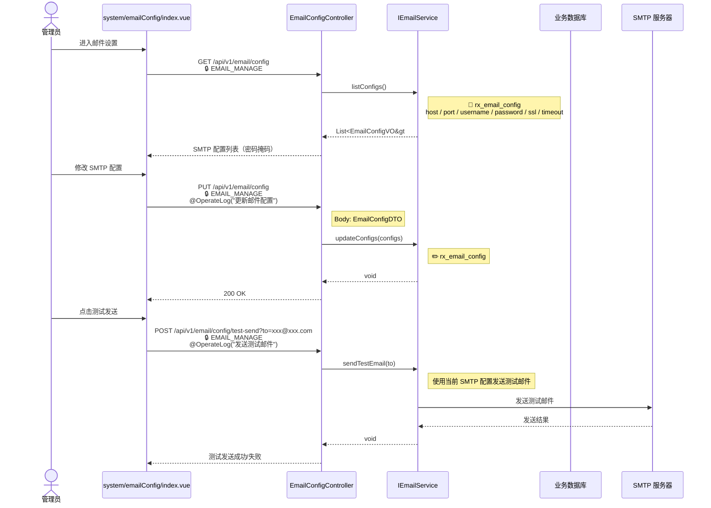
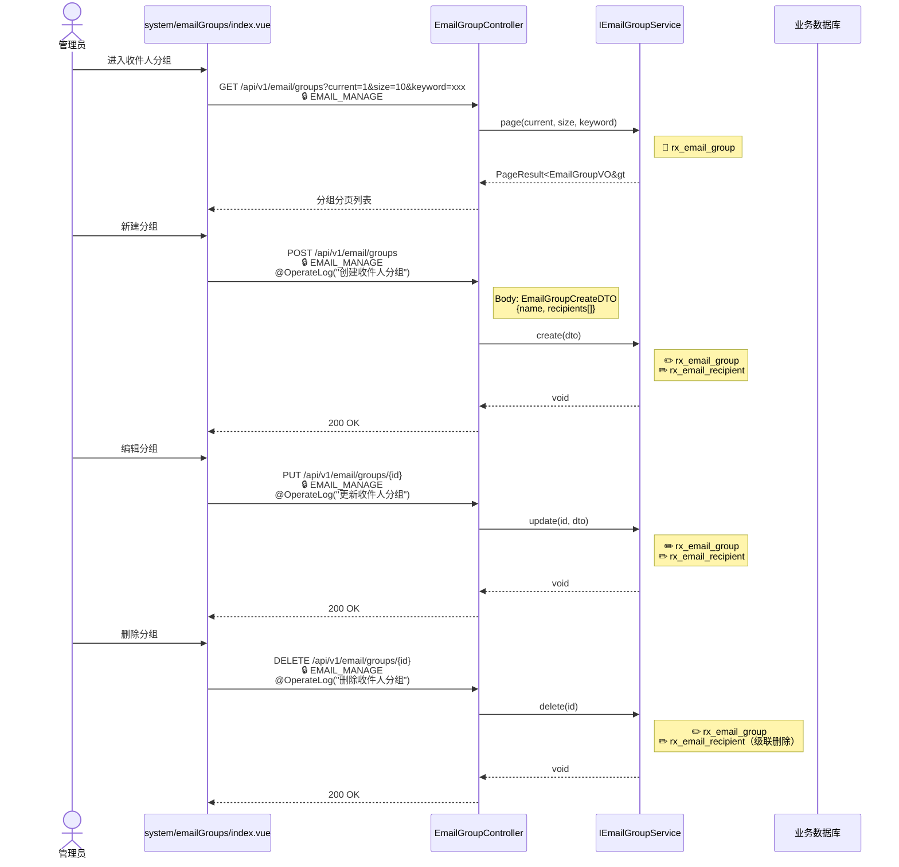
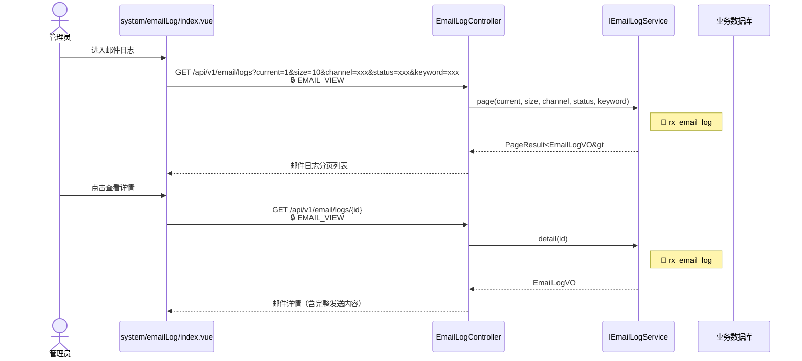

# 邮件中心

`/api/v1/email/*`

## 写邮件 {#email-compose}

```mermaid
sequenceDiagram
    actor U as 用户
    participant Compose as mail/compose.vue
    participant GroupCtrl as EmailGroupController
    participant SendCtrl as EmailSendController
    participant SendSvc as IEmailService
    participant SMTP as SMTP 服务器
    participant DB as 业务数据库

    U->>Compose: 进入写邮件
    Compose->>GroupCtrl: GET /api/v1/email/groups/all<br/>🔒 EMAIL_SEND
    Note right of GroupCtrl: IEmailGroupService.listAll()<br/>📖 rx_email_group
    GroupCtrl-->>Compose: List<EmailGroupVO&gt; 收件人分组下拉

    U->>Compose: 填写收件人/主题/正文/优先级
    Compose->>SendCtrl: POST /api/v1/email/send<br/>🔒 EMAIL_SEND<br/>@OperateLog("发送邮件")
    Note right of SendCtrl: Body: EmailSendDTO<br/>{subject, text, recipients, priority}
    SendCtrl->>SendSvc: send(MailMessage.manual(subject, text, recipients, priority))
    Note right of SendSvc: 构建 MimeMessage<br/>📖 rx_config (email.*) → SMTP 配置
    SendSvc->>SMTP: 发送邮件
    SMTP-->>SendSvc: 发送结果
    Note right of SendSvc: ✏️ rx_email_log<br/>记录发送日志
    SendSvc-->>SendCtrl: void
    SendCtrl-->>Compose: 200 OK（发送成功）
```

## 邮件设置 {#email-settings}



## 收件人分组 {#email-groups}



## 邮件日志 {#email-logs}



### 涉及功能模块

| 模块 | 路由 | 前端组件 | 后端 Controller | Service |
|------|------|----------|-----------------|---------|
| 写邮件 | `/mail/compose` | `mail/compose.vue` | `EmailSendController` | `IEmailService` |
| 邮件设置 | `/system/email-config` | `system/emailConfig/index.vue` | `EmailConfigController` | `IEmailService` |
| 收件人分组 | `/system/email-groups` | `system/emailGroups/index.vue` | `EmailGroupController` | `IEmailGroupService` |
| 邮件日志 | `/system/email-log` | `system/emailLog/index.vue` | `EmailLogController` | `IEmailLogService` |

### 涉及数据表

| 数据表 | 操作 | 说明 |
|--------|------|------|
| `rx_email_config` | 📖✏️ | SMTP 配置（host/port/username/password/ssl/timeout） |
| `rx_email_group` | 📖✏️ | 收件人分组 |
| `rx_email_recipient` | 📖✏️ | 分组内收件人 |
| `rx_email_log` | 📖✏️ | 邮件发送日志 |
| `rx_config` | 📖 | SMTP 配置（email.* 键值对） |

### 涉及权限码

| 权限码 | 说明 | 使用位置 |
|--------|------|---------|
| `EMAIL_SEND` | 发送邮件 | 写邮件、获取分组列表 |
| `EMAIL_MANAGE` | 邮件管理 | 邮件设置、收件人分组 CRUD |
| `EMAIL_VIEW` | 邮件日志查看 | 邮件日志查询 |