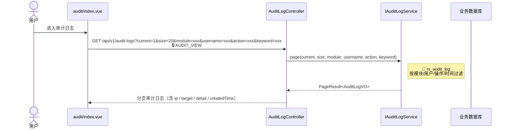
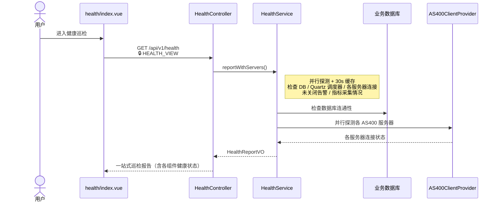
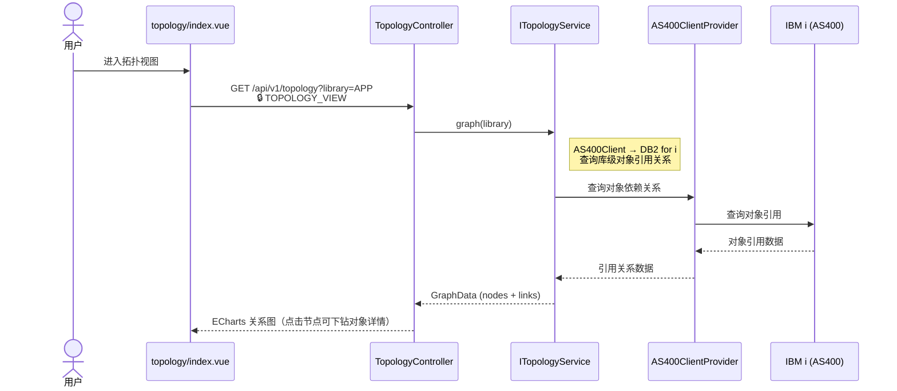
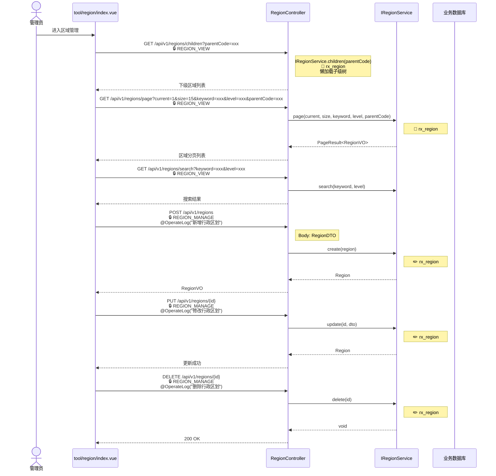
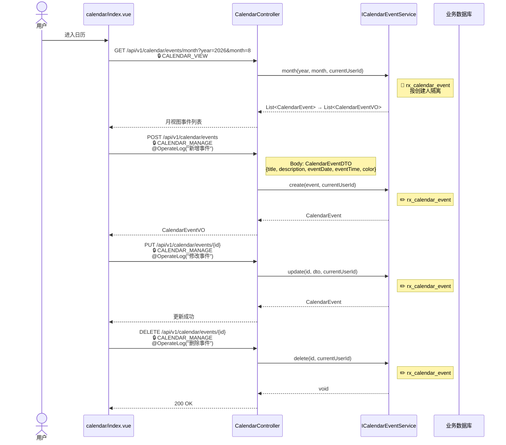
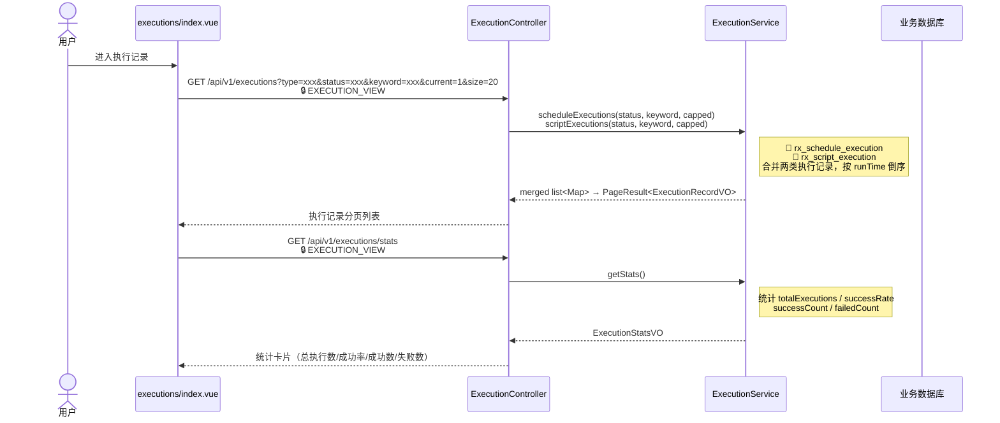
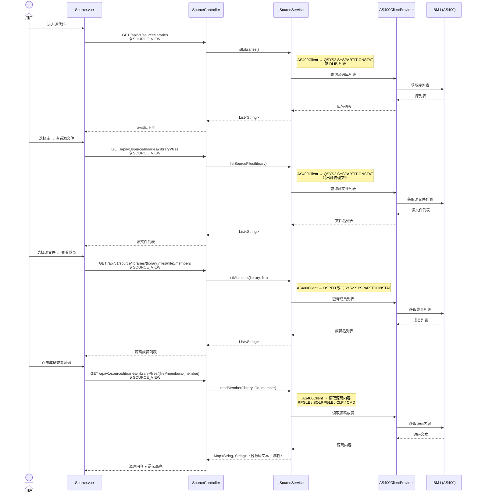

# 发布与代码 / 工具

## 工具模块 {#tools}

`/api/v1/audit-logs` `/api/v1/health` `/api/v1/topology` `/api/v1/regions` `/api/v1/calendar/events` `/api/v1/executions`

### 审计日志

### 健康巡检

### 拓扑分析

### 区域管理

### 日历

### 执行记录

## 发布与代码 {#release}

`/api/v1/source/*`

### 源代码浏览

### 涉及功能模块

| 模块 | 路由 | 前端组件 | 后端 Controller | Service |
|------|------|----------|-----------------|---------|
| 审计日志 | `/audit` | `audit/index.vue` | `AuditLogController` | `IAuditLogService` |
| 健康巡检 | `/health` | `health/index.vue` | `HealthController` | `HealthService` |
| 拓扑分析 | `/topology` | `topology/index.vue` | `TopologyController` | `ITopologyService` |
| 区域管理 | `/region` | `tool/region/index.vue` | `RegionController` | `IRegionService` |
| 日历 | `/calendar` | `calendar/index.vue` | `CalendarController` | `ICalendarEventService` |
| 执行记录 | `/executions` | `executions/index.vue` | `ExecutionController` | `ExecutionService` |
| 源代码 | `/source` | `Source.vue` | `SourceController` | `ISourceService` |

### 涉及数据表

| 数据表 | 操作 | 说明 |
|--------|------|------|
| `rx_audit_log` | 📖 | 审计日志（@OperateLog 注解自动写入） |
| `rx_region` | 📖✏️ | 行政区划（省/市/区/街道 四级树） |
| `rx_calendar_event` | 📖✏️ | 日历事件（按创建人隔离） |
| `rx_schedule_execution` | 📖 | 定时任务执行记录（执行记录合并数据源） |
| `rx_script_execution` | 📖 | 命令脚本执行记录（执行记录合并数据源） |

### 涉及权限码

| 权限码 | 说明 | 使用位置 |
|--------|------|---------|
| `AUDIT_VIEW` | 审计查看 | 审计日志分页查询 |
| `HEALTH_VIEW` | 健康巡检查看 | 健康巡检报告 |
| `TOPOLOGY_VIEW` | 拓扑查看 | 拓扑关系图查询 |
| `REGION_VIEW` | 区域查看 | 区域树/分页/搜索 |
| `REGION_MANAGE` | 区域管理 | 区域 CRUD |
| `CALENDAR_VIEW` | 日历查看 | 日历月视图 |
| `CALENDAR_MANAGE` | 日历管理 | 日历事件 CRUD |
| `EXECUTION_VIEW` | 执行记录查看 | 执行记录分页/统计 |
| `SOURCE_VIEW` | 源码查看 | 源码库/文件/成员/内容浏览 |