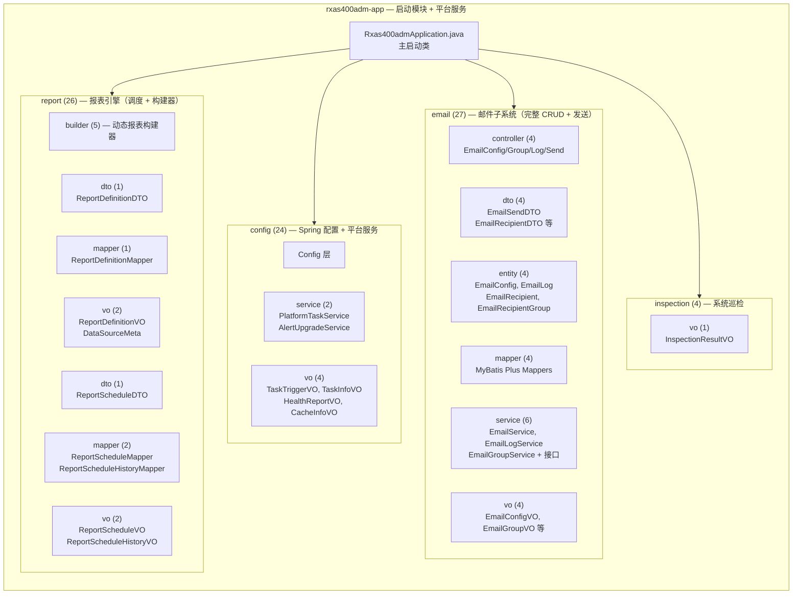
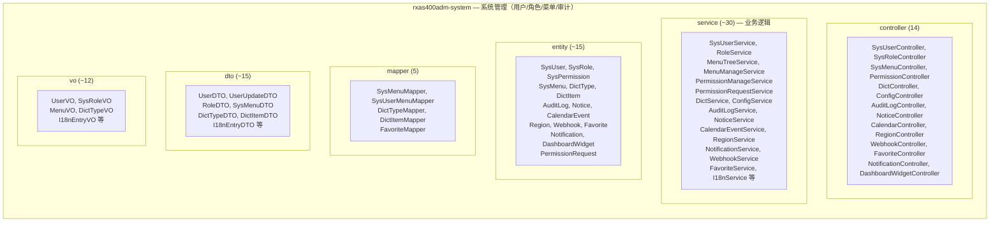
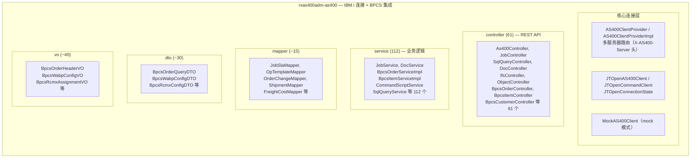
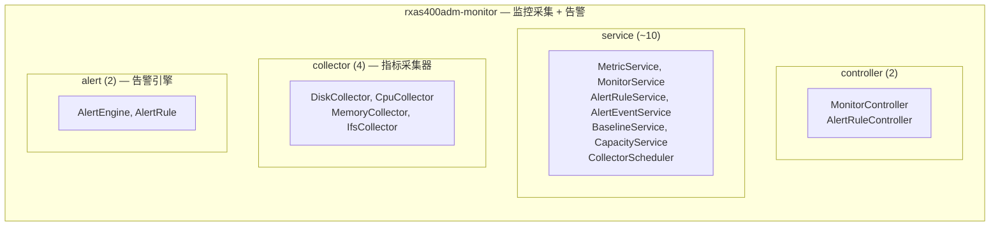
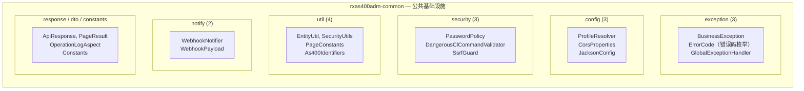
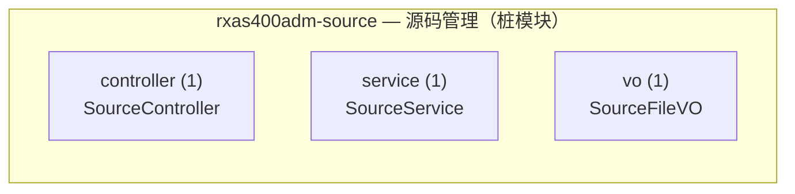
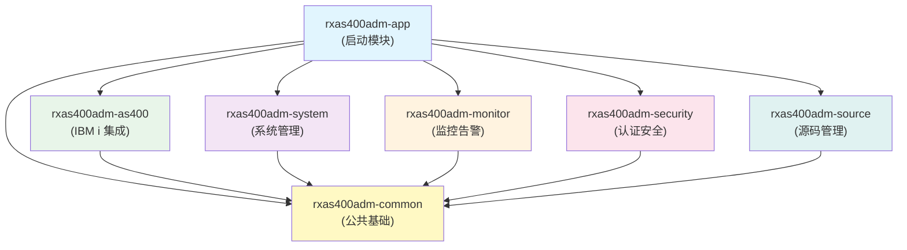
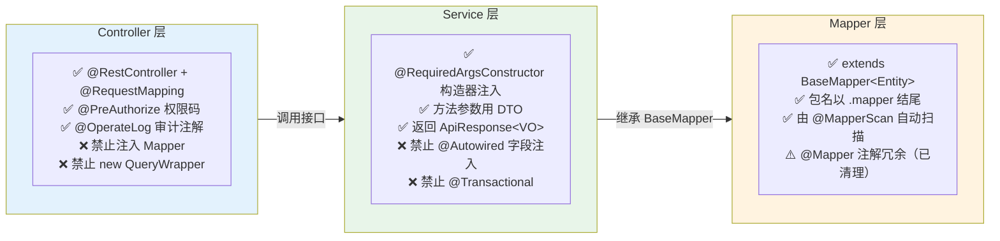

# 后端模块结构总览

> 自动生成方式：扫描 `backend/` 下所有 `.java` 文件，按包路径统计文件数。
> 此文档展示 RXAS400ADM 后端 7 个 Maven 模块的包结构与职责划分。

---

## rxas400adm-app（启动模块，82 文件）

---

## rxas400adm-security（44 文件）

```mermaid
graph TD
    subgraph security["rxas400adm-security — 认证与安全"]
        direction TB

        subgraph secConfig["config (6) — 安全配置"]
            secCfgItems["SecurityConfig<br/>JwtProperties, CorsProperties<br/>RateLimitProperties<br/>ProxyProperties<br/>LoginSecurityProperties"]
        end

        subgraph secCtrl["controller (2)"]
            secCtrlItems["AuthController<br/>IpRuleController"]
        end

        subgraph secDto["dto (7)"]
            secDtoItems["LoginRequest, LoginResponse<br/>ChangePasswordDTO<br/>RefreshTokenDTO 等"]
        end

        subgraph secEntity["entity (3)"]
            secEntityItems["TokenBlacklist<br/>LoginAttempt, IpRule"]
        end

        subgraph secFilter["filter (2) — 请求过滤器"]
            secFilterItems["JwtAuthenticationFilter<br/>RateLimitFilter"]
        end

        subgraph secJwt["jwt (1)"]
            secJwtItems["JwtUtil"]
        end

        subgraph secMapper["mapper (3)"]
            secMapperItems["TokenBlacklistMapper<br/>LoginAttemptMapper<br/>IpRuleMapper"]
        end

        subgraph secSvc["service (14) — 核心安全服务"]
            secSvcItems["AuthService, PermissionService<br/>LoginAttemptService<br/>TokenBlacklistService<br/>IpRuleService<br/>As400LoginService 等"]
        end

        subgraph secVo["vo (6)"]
            secVoItems["TokenRefreshVO, ProfileVO<br/>MenuDataResponseVO 等"]
        end
    end
```

---

## rxas400adm-system（153 文件）

---

## rxas400adm-as400（474 文件 — 最大模块）

---

## rxas400adm-monitor（39 文件）

---

## rxas400adm-common（26 文件）

---

## rxas400adm-source（3 文件）

---

## 模块依赖关系

---

## 分层规范（Controller → Service → Mapper）

