# rxas400adm-app 模块（自动生成）

> ⚠️ 此文件由 `scripts/generate-flow-diagrams.cjs` 自动生成，请勿手动编辑。

> 生成时间：2026-08-28T15:50:32.312Z

## root

### DELETE /{name}

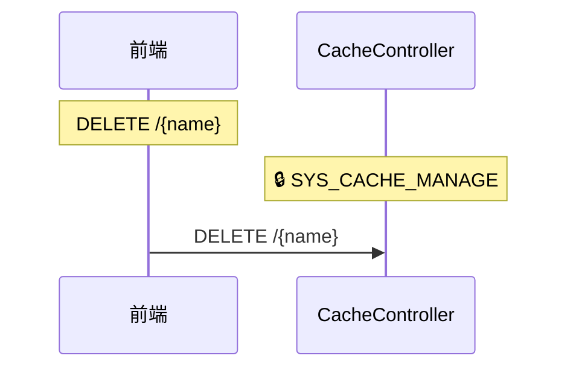

### POST /test-send

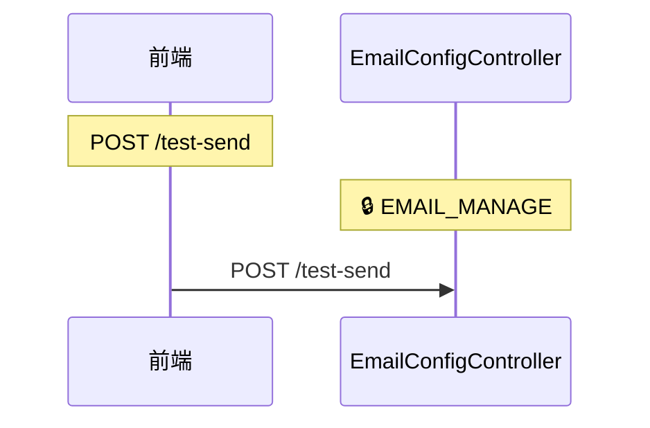

### GET /all


### PUT /{id}

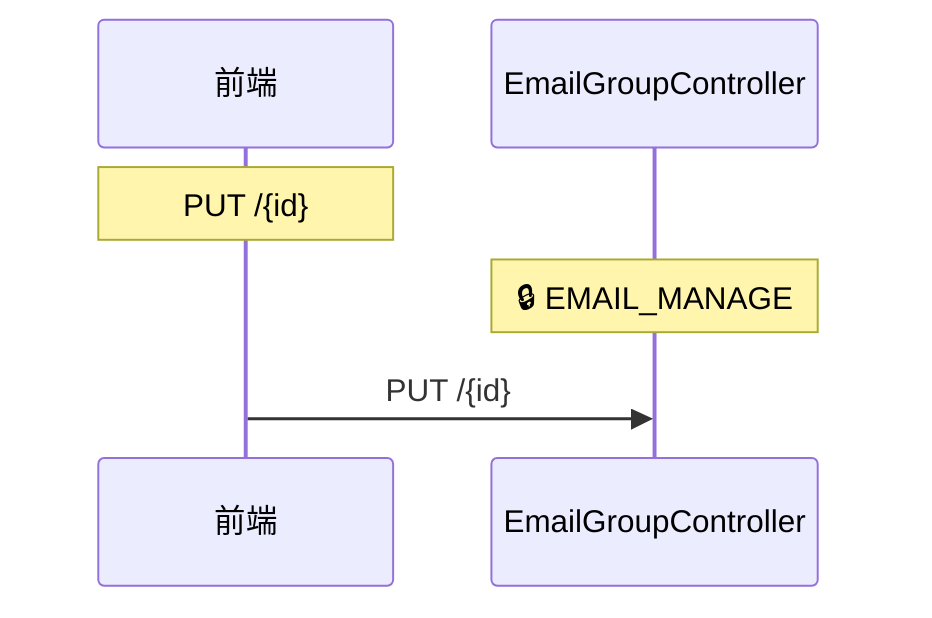

### DELETE /{id}

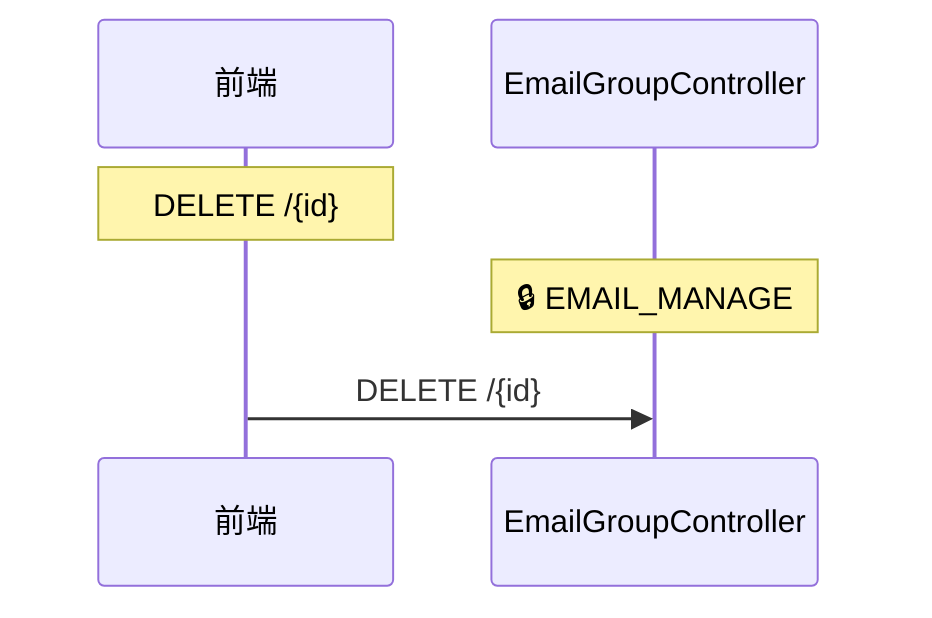

### GET /{id}


### GET /generate


### GET /export

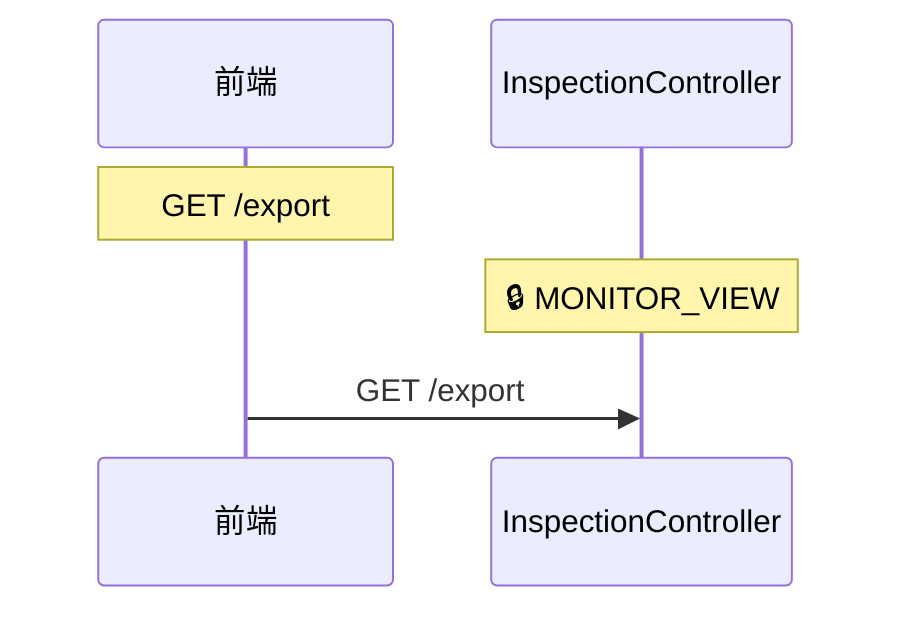

### GET /metrics


### GET /executions


### GET /capacity

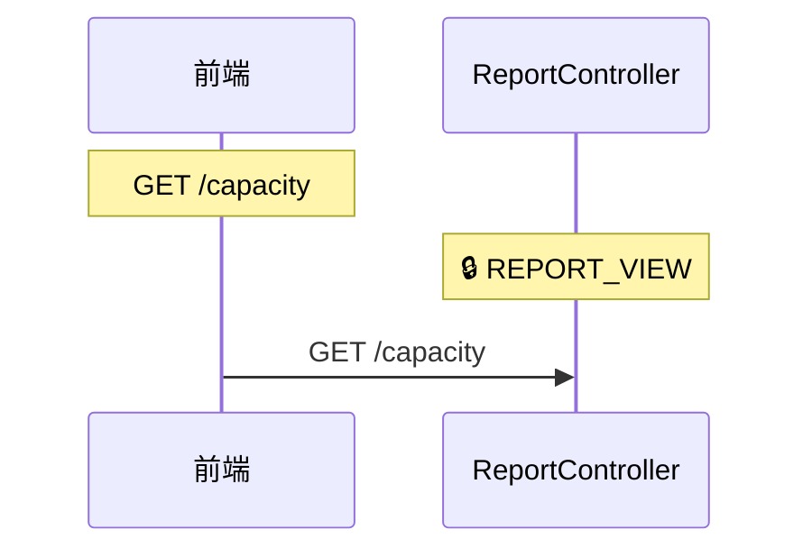

### PUT /{id}

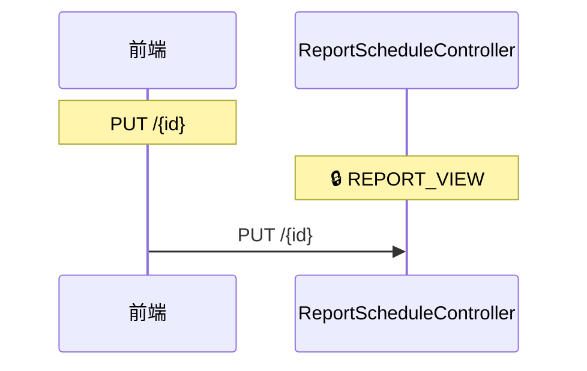

### DELETE /{id}

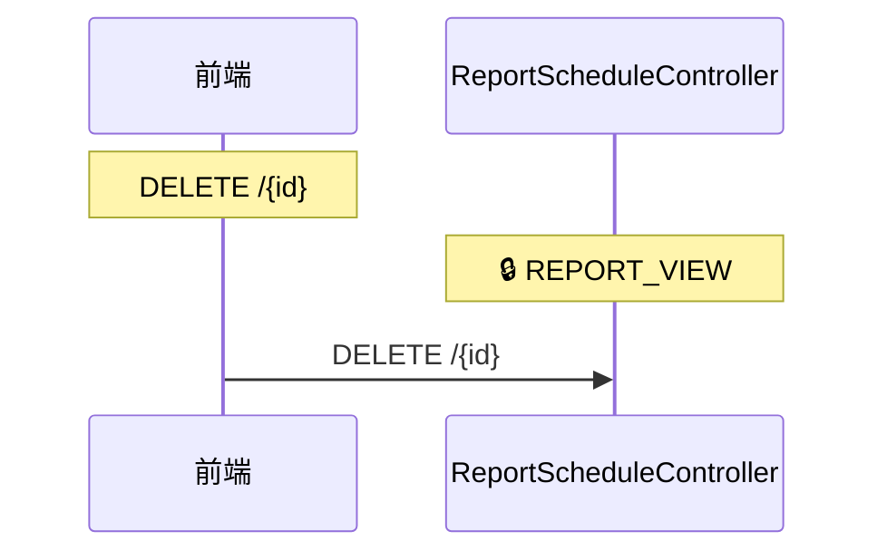

## v1

### ALL /api/v1/caches

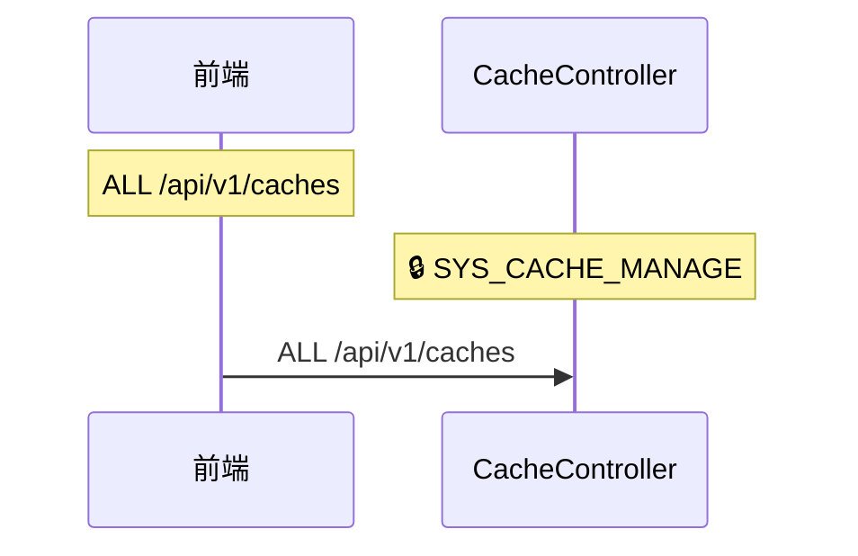

### ALL /api/v1/health

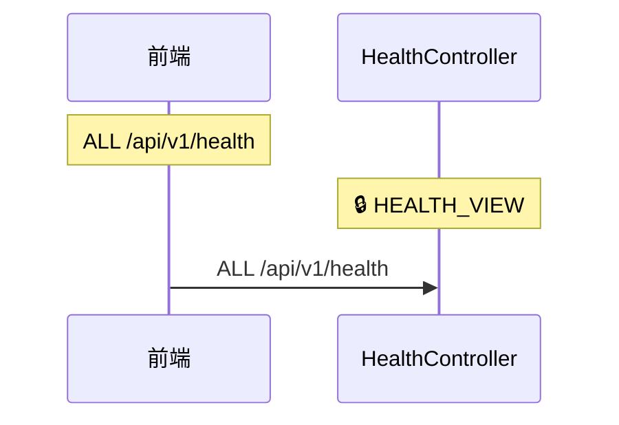

### ALL /api/v1/tasks

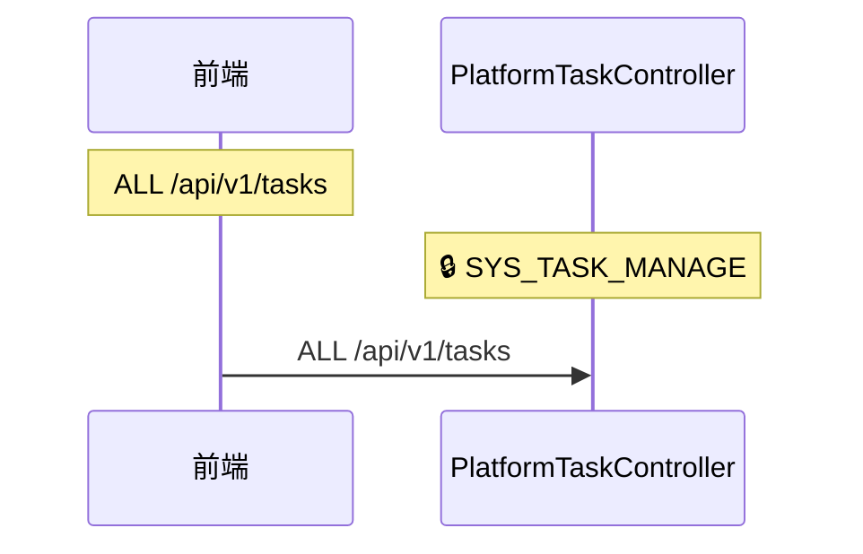

### ALL /api/v1/email/config

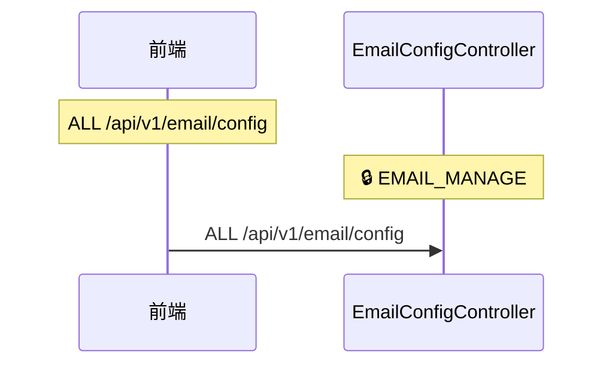

### ALL /api/v1/email/groups

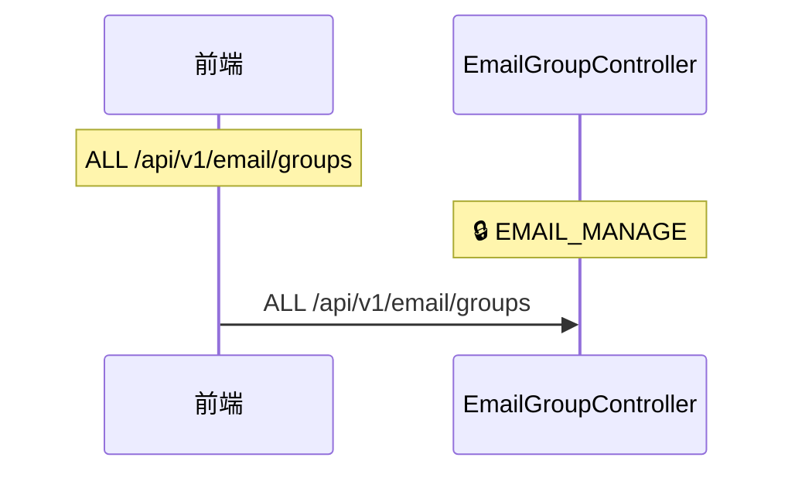

### ALL /api/v1/email/logs

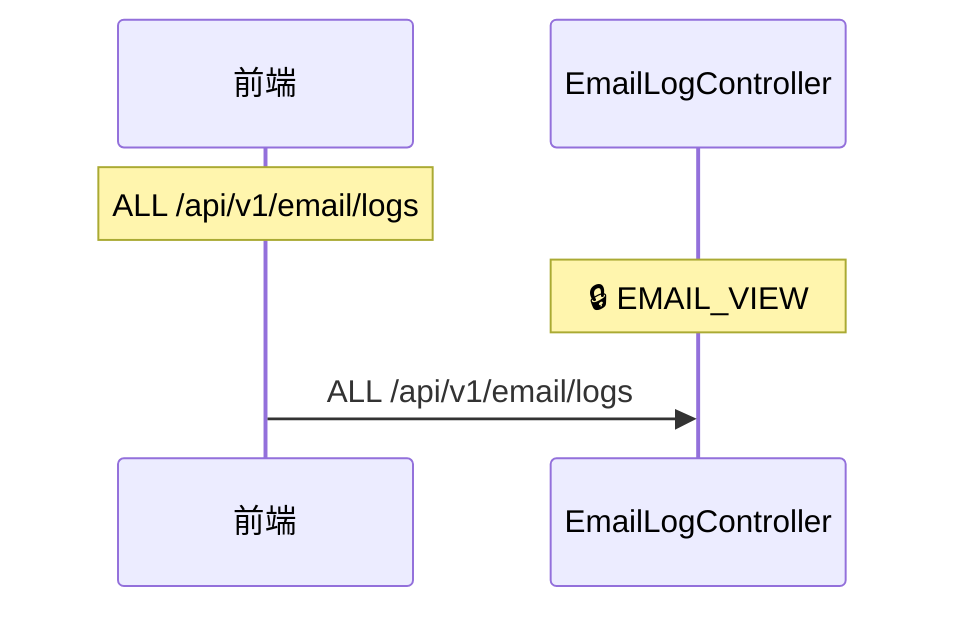

### ALL /api/v1/email/send

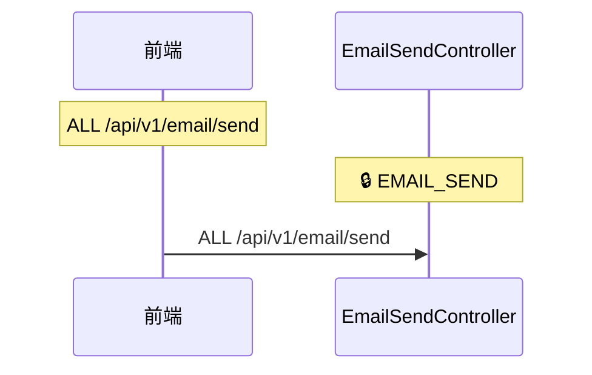

### ALL /api/v1/inspection

```mermaid
sequenceDiagram
    participant F as 前端
    participant P1 as InspectionController

    Note over F: ALL /api/v1/inspection
    Note over P1: 🔒 MONITOR_VIEW
    F->>P1: ALL /api/v1/inspection
```

### ALL /api/v1/reports

```mermaid
sequenceDiagram
    participant F as 前端
    participant P1 as ReportController

    Note over F: ALL /api/v1/reports
    Note over P1: 🔒 REPORT_VIEW
    F->>P1: ALL /api/v1/reports
```

### ALL /api/v1/report-schedules

```mermaid
sequenceDiagram
    participant F as 前端
    participant P1 as ReportScheduleController

    Note over F: ALL /api/v1/report-schedules
    Note over P1: 🔒 REPORT_VIEW
    F->>P1: ALL /api/v1/report-schedules
```

## {methodName}

### POST /{beanName}/{methodName}/trigger

```mermaid
sequenceDiagram
    participant F as 前端
    participant P1 as PlatformTaskController

    Note over F: POST /{beanName}/{methodName}/trigger
    Note over P1: 🔒 SYS_TASK_MANAGE
    F->>P1: POST /{beanName}/{methodName}/trigger
```

## members

### GET /{id}/members

```mermaid
sequenceDiagram
    participant F as 前端
    participant P1 as EmailGroupController

    Note over F: GET /{id}/members
    Note over P1: 🔒 EMAIL_MANAGE
    F->>P1: GET /{id}/members
```

### POST /{id}/members

```mermaid
sequenceDiagram
    participant F as 前端
    participant P1 as EmailGroupController

    Note over F: POST /{id}/members
    Note over P1: 🔒 EMAIL_MANAGE
    F->>P1: POST /{id}/members
```

### DELETE /{id}/members/{memberId}

```mermaid
sequenceDiagram
    participant F as 前端
    participant P1 as EmailGroupController

    Note over F: DELETE /{id}/members/{memberId}
    Note over P1: 🔒 EMAIL_MANAGE
    F->>P1: DELETE /{id}/members/{memberId}
```

## toggle

### PUT /{id}/toggle

```mermaid
sequenceDiagram
    participant F as 前端
    participant P1 as ReportScheduleController

    Note over F: PUT /{id}/toggle
    Note over P1: 🔒 REPORT_VIEW
    F->>P1: PUT /{id}/toggle
```

## execute

### POST /{id}/execute

```mermaid
sequenceDiagram
    participant F as 前端
    participant P1 as ReportScheduleController

    Note over F: POST /{id}/execute
    Note over P1: 🔒 REPORT_VIEW
    F->>P1: POST /{id}/execute
```

## history

### GET /{id}/history

```mermaid
sequenceDiagram
    participant F as 前端
    participant P1 as ReportScheduleController

    Note over F: GET /{id}/history
    Note over P1: 🔒 REPORT_VIEW
    F->>P1: GET /{id}/history
```
