# rxas400adm-as400 模块（自动生成）

> ⚠️ 此文件由 `scripts/generate-flow-diagrams.cjs` 自动生成，请勿手动编辑。

> 生成时间：2026-08-28T15:50:32.325Z

## root

### GET /systems

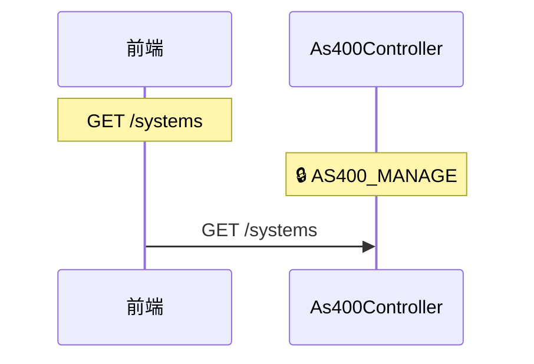

### POST /systems

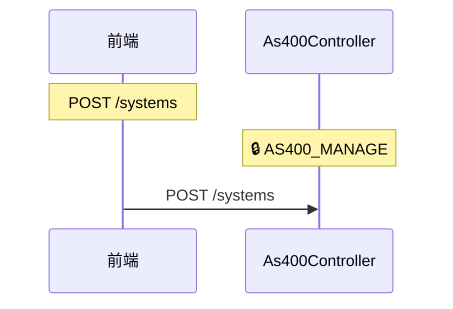

### GET /{item}


### GET /header

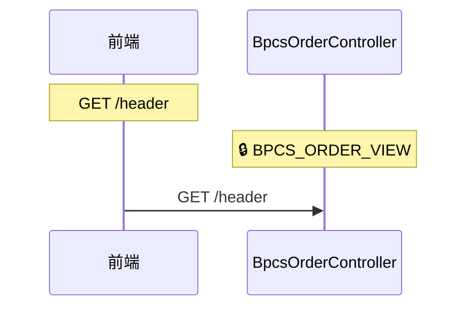

### GET /lines

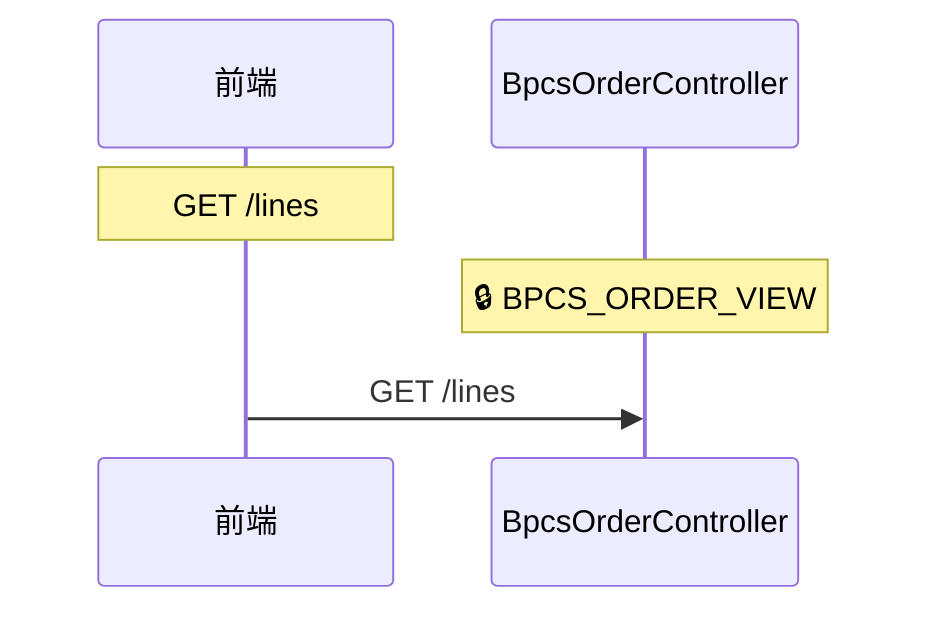

### GET /trend

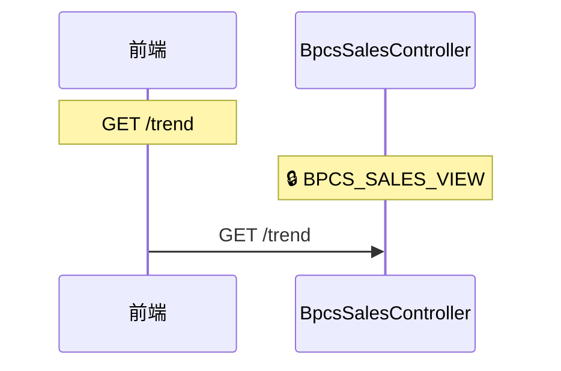

### GET /orders

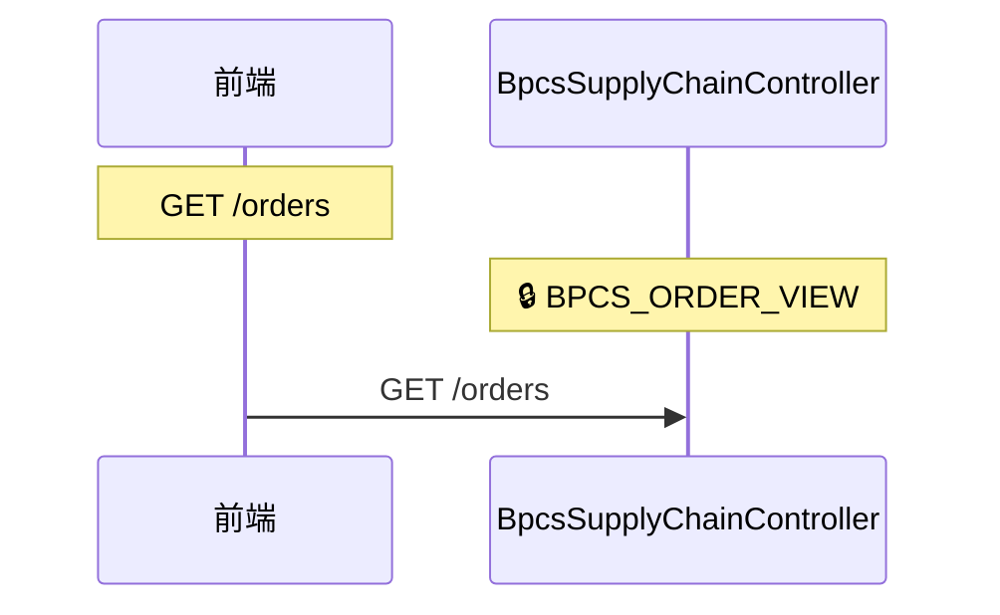

### GET /kpi

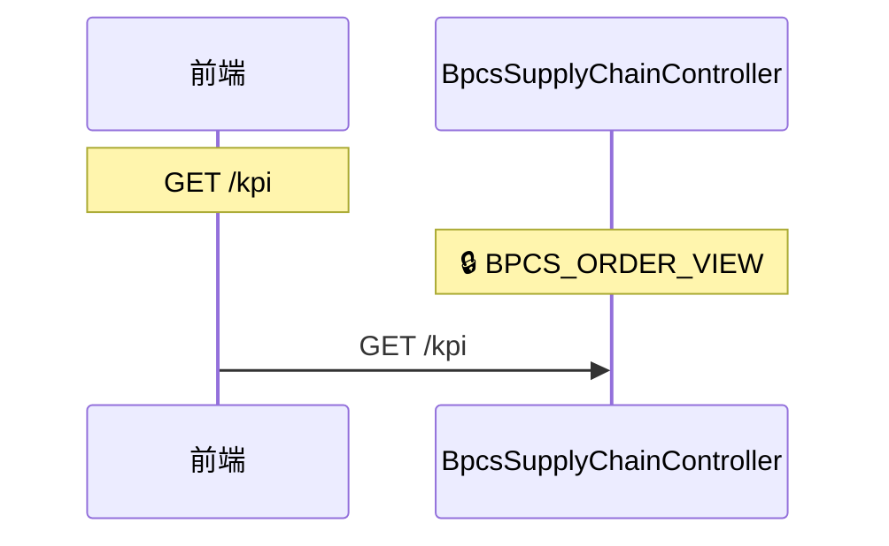

### GET /tables

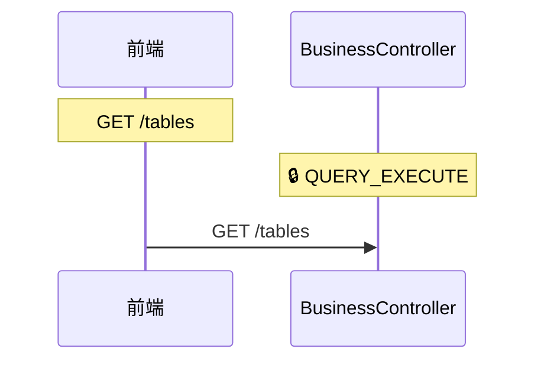

### GET /columns

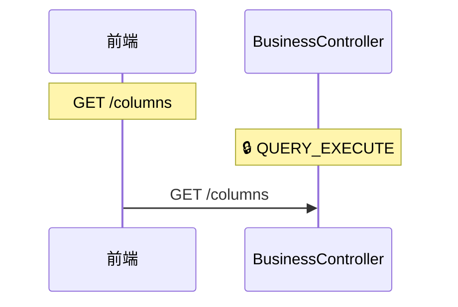

### GET /data

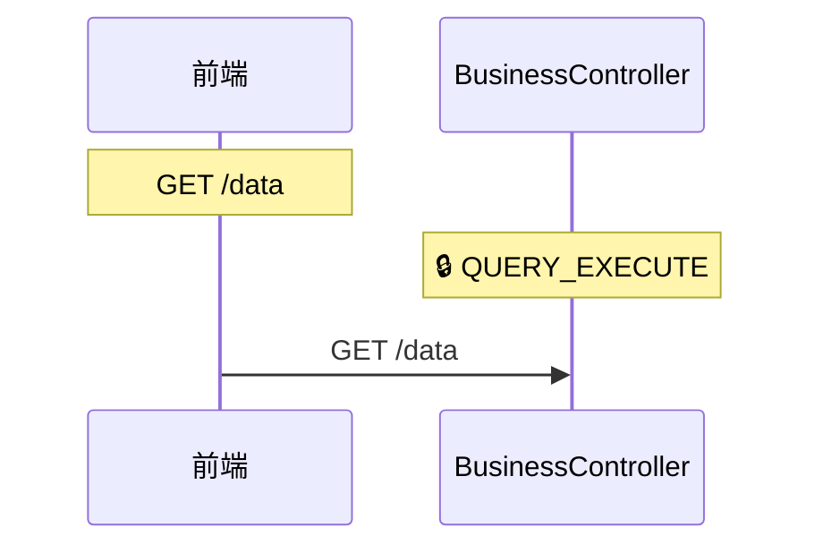

### GET /detail


### PUT /{name}

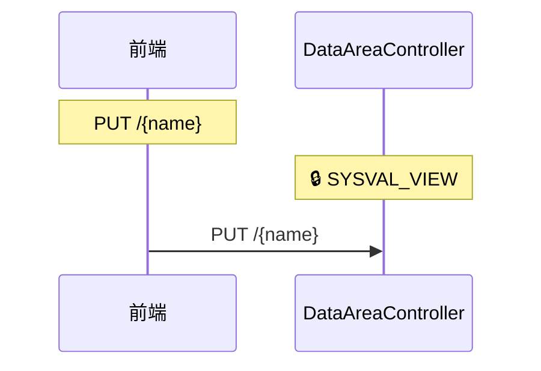

### DELETE /{name}

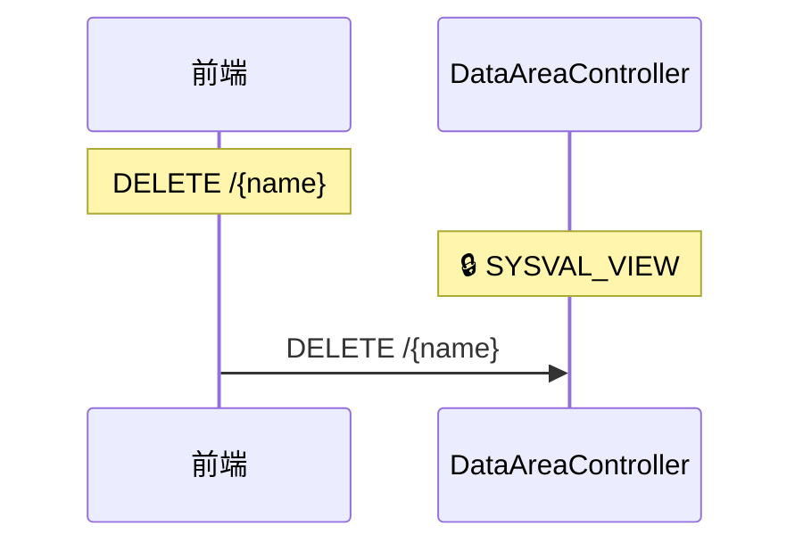

### GET /doc-templates

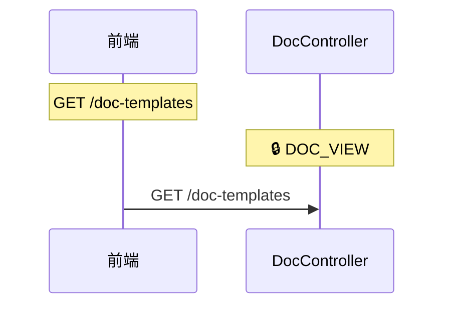

### POST /doc-templates

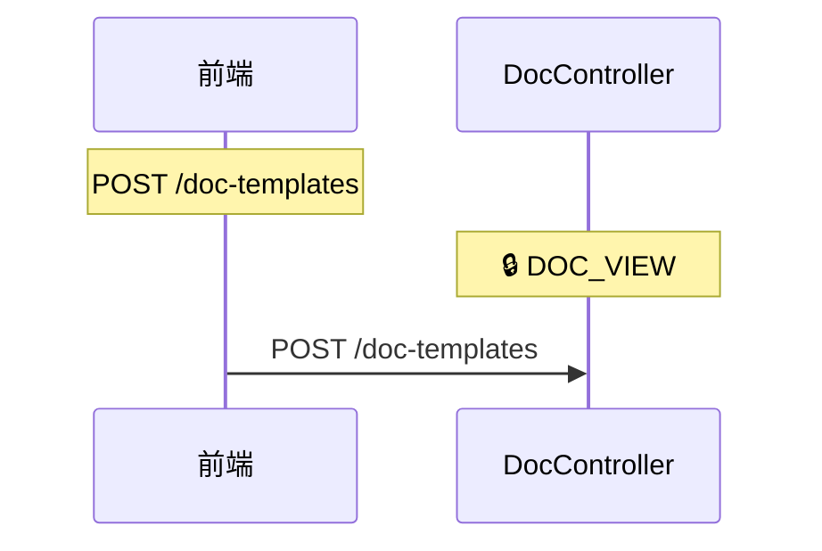

### GET /docs

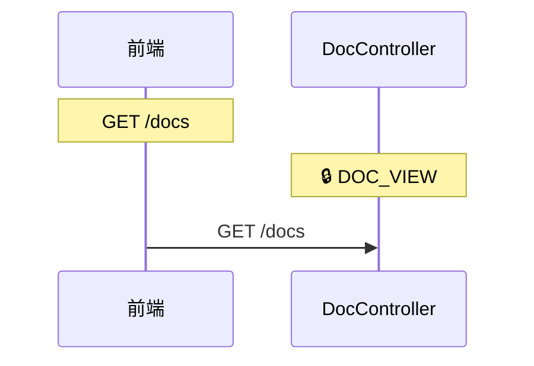

### POST /docs

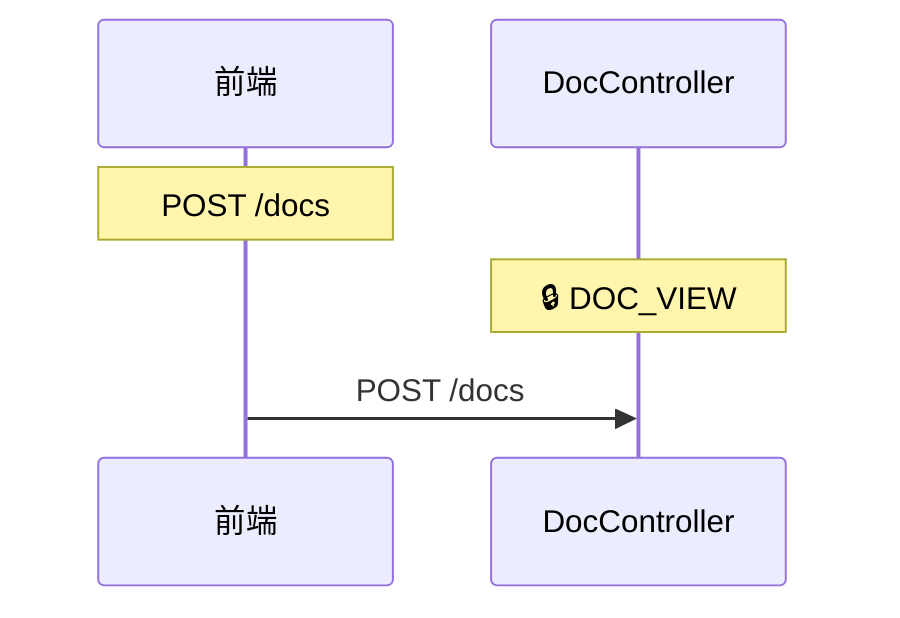

### GET /stats


### GET /content

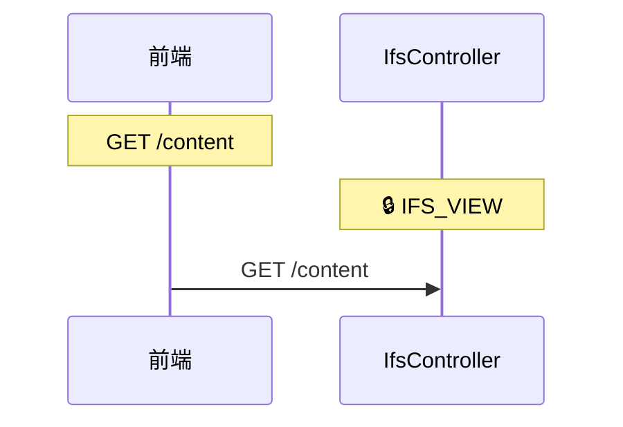

### POST /write

```mermaid
sequenceDiagram
    participant F as 前端
    participant P1 as IfsController

    Note over F: POST /write
    Note over P1: 🔒 IFS_VIEW
    F->>P1: POST /write
```

### POST /upload

```mermaid
sequenceDiagram
    participant F as 前端
    participant P1 as IfsController

    Note over F: POST /upload
    Note over P1: 🔒 IFS_VIEW
    F->>P1: POST /upload
```

### GET /download

```mermaid
sequenceDiagram
    participant F as 前端
    participant P1 as IfsController

    Note over F: GET /download
    Note over P1: 🔒 IFS_VIEW
    F->>P1: GET /download
```

### POST /mkdir

```mermaid
sequenceDiagram
    participant F as 前端
    participant P1 as IfsController

    Note over F: POST /mkdir
    Note over P1: 🔒 IFS_VIEW
    F->>P1: POST /mkdir
```

### DELETE /file

```mermaid
sequenceDiagram
    participant F as 前端
    participant P1 as IfsController

    Note over F: DELETE /file
    Note over P1: 🔒 IFS_VIEW
    F->>P1: DELETE /file
```

### POST /restore

```mermaid
sequenceDiagram
    participant F as 前端
    participant P1 as IfsController

    Note over F: POST /restore
    Note over P1: 🔒 IFS_VIEW
    F->>P1: POST /restore
```

### GET /msgw

```mermaid
sequenceDiagram
    participant F as 前端
    participant P1 as JobController

    Note over F: GET /msgw
    Note over P1: 🔒 JOB_VIEW
    F->>P1: GET /msgw
```

### GET /lckw

```mermaid
sequenceDiagram
    participant F as 前端
    participant P1 as JobController

    Note over F: GET /lckw
    Note over P1: 🔒 JOB_VIEW
    F->>P1: GET /lckw
```

### GET /detail

```mermaid
sequenceDiagram
    participant F as 前端
    participant P1 as JobController

    Note over F: GET /detail
    Note over P1: 🔒 JOB_VIEW
    F->>P1: GET /detail
```

### POST /end

```mermaid
sequenceDiagram
    participant F as 前端
    participant P1 as JobController

    Note over F: POST /end
    Note over P1: 🔒 JOB_VIEW
    F->>P1: POST /end
```

### POST /batch-end

```mermaid
sequenceDiagram
    participant F as 前端
    participant P1 as JobController

    Note over F: POST /batch-end
    Note over P1: 🔒 JOB_VIEW
    F->>P1: POST /batch-end
```

### POST /hold

```mermaid
sequenceDiagram
    participant F as 前端
    participant P1 as JobController

    Note over F: POST /hold
    Note over P1: 🔒 JOB_VIEW
    F->>P1: POST /hold
```

### POST /release

```mermaid
sequenceDiagram
    participant F as 前端
    participant P1 as JobController

    Note over F: POST /release
    Note over P1: 🔒 JOB_VIEW
    F->>P1: POST /release
```

### GET /log

```mermaid
sequenceDiagram
    participant F as 前端
    participant P1 as JobController

    Note over F: GET /log
    Note over P1: 🔒 JOB_VIEW
    F->>P1: GET /log
```

### GET /queues

```mermaid
sequenceDiagram
    participant F as 前端
    participant P1 as JobController

    Note over F: GET /queues
    Note over P1: 🔒 JOB_VIEW
    F->>P1: GET /queues
```

### GET /spool

```mermaid
sequenceDiagram
    participant F as 前端
    participant P1 as JobController

    Note over F: GET /spool
    Note over P1: 🔒 JOB_VIEW
    F->>P1: GET /spool
```

### POST /reply

```mermaid
sequenceDiagram
    participant F as 前端
    participant P1 as JobController

    Note over F: POST /reply
    Note over P1: 🔒 JOB_VIEW
    F->>P1: POST /reply
```

### GET /history-log

```mermaid
sequenceDiagram
    participant F as 前端
    participant P1 as JobController

    Note over F: GET /history-log
    Note over P1: 🔒 JOB_VIEW
    F->>P1: GET /history-log
```

### GET /rules

```mermaid
sequenceDiagram
    participant F as 前端
    participant P1 as JobSlaController

    Note over F: GET /rules
    Note over P1: 🔒 JOB_VIEW
    F->>P1: GET /rules
```

### POST /rules

```mermaid
sequenceDiagram
    participant F as 前端
    participant P1 as JobSlaController

    Note over F: POST /rules
    Note over P1: 🔒 JOB_VIEW
    F->>P1: POST /rules
```

### GET /executions

```mermaid
sequenceDiagram
    participant F as 前端
    participant P1 as JobSlaController

    Note over F: GET /executions
    Note over P1: 🔒 JOB_VIEW
    F->>P1: GET /executions
```

### GET /files

```mermaid
sequenceDiagram
    participant F as 前端
    participant P1 as MessageFileController

    Note over F: GET /files
    Note over P1: 🔒 MSGF_VIEW
    F->>P1: GET /files
```

### GET /messages

```mermaid
sequenceDiagram
    participant F as 前端
    participant P1 as MessageFileController

    Note over F: GET /messages
    Note over P1: 🔒 MSGF_VIEW
    F->>P1: GET /messages
```

### POST /messages

```mermaid
sequenceDiagram
    participant F as 前端
    participant P1 as MessageFileController

    Note over F: POST /messages
    Note over P1: 🔒 MSGF_VIEW
    F->>P1: POST /messages
```

### PUT /messages

```mermaid
sequenceDiagram
    participant F as 前端
    participant P1 as MessageFileController

    Note over F: PUT /messages
    Note over P1: 🔒 MSGF_VIEW
    F->>P1: PUT /messages
```

### DELETE /messages

```mermaid
sequenceDiagram
    participant F as 前端
    participant P1 as MessageFileController

    Note over F: DELETE /messages
    Note over P1: 🔒 MSGF_VIEW
    F->>P1: DELETE /messages
```

### PUT /{id}

```mermaid
sequenceDiagram
    participant F as 前端
    participant P1 as OpTemplateController

    Note over F: PUT /{id}
    Note over P1: 🔒 SCRIPT_MANAGE
    F->>P1: PUT /{id}
```

### DELETE /{id}

```mermaid
sequenceDiagram
    participant F as 前端
    participant P1 as OpTemplateController

    Note over F: DELETE /{id}
    Note over P1: 🔒 SCRIPT_MANAGE
    F->>P1: DELETE /{id}
```

### GET /files

```mermaid
sequenceDiagram
    participant F as 前端
    participant P1 as PfController

    Note over F: GET /files
    Note over P1: 🔒 PF_VIEW
    F->>P1: GET /files
```

### GET /columns

```mermaid
sequenceDiagram
    participant F as 前端
    participant P1 as PfController

    Note over F: GET /columns
    Note over P1: 🔒 PF_VIEW
    F->>P1: GET /columns
```

### GET /data

```mermaid
sequenceDiagram
    participant F as 前端
    participant P1 as PfController

    Note over F: GET /data
    Note over P1: 🔒 PF_VIEW
    F->>P1: GET /data
```

### GET /stats

```mermaid
sequenceDiagram
    participant F as 前端
    participant P1 as PfController

    Note over F: GET /stats
    Note over P1: 🔒 PF_VIEW
    F->>P1: GET /stats
```

### PUT /{id}

```mermaid
sequenceDiagram
    participant F as 前端
    participant P1 as ScheduleController

    Note over F: PUT /{id}
    Note over P1: 🔒 SCHEDULE_VIEW
    F->>P1: PUT /{id}
```

### DELETE /{id}

```mermaid
sequenceDiagram
    participant F as 前端
    participant P1 as ScheduleController

    Note over F: DELETE /{id}
    Note over P1: 🔒 SCHEDULE_VIEW
    F->>P1: DELETE /{id}
```

### GET /tags

```mermaid
sequenceDiagram
    participant F as 前端
    participant P1 as ScriptController

    Note over F: GET /tags
    Note over P1: 🔒 SCRIPT_VIEW
    F->>P1: GET /tags
```

### PUT /{id}

```mermaid
sequenceDiagram
    participant F as 前端
    participant P1 as ScriptController

    Note over F: PUT /{id}
    Note over P1: 🔒 SCRIPT_VIEW
    F->>P1: PUT /{id}
```

### DELETE /{id}

```mermaid
sequenceDiagram
    participant F as 前端
    participant P1 as ScriptController

    Note over F: DELETE /{id}
    Note over P1: 🔒 SCRIPT_VIEW
    F->>P1: DELETE /{id}
```

### POST /execute

```mermaid
sequenceDiagram
    participant F as 前端
    participant P1 as SqlQueryController

    Note over F: POST /execute
    Note over P1: 🔒 QUERY_EXECUTE
    F->>P1: POST /execute
```

### GET /history

```mermaid
sequenceDiagram
    participant F as 前端
    participant P1 as SqlQueryController

    Note over F: GET /history
    Note over P1: 🔒 QUERY_EXECUTE
    F->>P1: GET /history
```

### GET /detail

```mermaid
sequenceDiagram
    participant F as 前端
    participant P1 as SystemValueController

    Note over F: GET /detail
    Note over P1: 🔒 SYSVAL_VIEW
    F->>P1: GET /detail
```

### PUT /{name}

```mermaid
sequenceDiagram
    participant F as 前端
    participant P1 as SystemValueController

    Note over F: PUT /{name}
    Note over P1: 🔒 SYSVAL_VIEW
    F->>P1: PUT /{name}
```

### POST /batch

```mermaid
sequenceDiagram
    participant F as 前端
    participant P1 as SystemValueController

    Note over F: POST /batch
    Note over P1: 🔒 SYSVAL_VIEW
    F->>P1: POST /batch
```

### POST /switch

```mermaid
sequenceDiagram
    participant F as 前端
    participant P1 as UserProfileController

    Note over F: POST /switch
    Note over P1: 🔒 USER_MANAGE
    F->>P1: POST /switch
```

## detail

### GET /systems/detail

```mermaid
sequenceDiagram
    participant F as 前端
    participant P1 as As400Controller

    Note over F: GET /systems/detail
    Note over P1: 🔒 AS400_MANAGE
    F->>P1: GET /systems/detail
```

## enabled

### GET /servers/enabled

```mermaid
sequenceDiagram
    participant F as 前端
    participant P1 as As400Controller

    Note over F: GET /servers/enabled
    Note over P1: 🔒 AS400_MANAGE
    F->>P1: GET /servers/enabled
```

## {id}

### PUT /systems/{id}

```mermaid
sequenceDiagram
    participant F as 前端
    participant P1 as As400Controller

    Note over F: PUT /systems/{id}
    Note over P1: 🔒 AS400_MANAGE
    F->>P1: PUT /systems/{id}
```

### DELETE /systems/{id}

```mermaid
sequenceDiagram
    participant F as 前端
    participant P1 as As400Controller

    Note over F: DELETE /systems/{id}
    Note over P1: 🔒 AS400_MANAGE
    F->>P1: DELETE /systems/{id}
```

### POST /systems/{id}/test

```mermaid
sequenceDiagram
    participant F as 前端
    participant P1 as As400Controller

    Note over F: POST /systems/{id}/test
    Note over P1: 🔒 AS400_MANAGE
    F->>P1: POST /systems/{id}/test
```

### POST /systems/{id}/command

```mermaid
sequenceDiagram
    participant F as 前端
    participant P1 as As400Controller

    Note over F: POST /systems/{id}/command
    Note over P1: 🔒 AS400_MANAGE
    F->>P1: POST /systems/{id}/command
```

### PUT /doc-templates/{id}

```mermaid
sequenceDiagram
    participant F as 前端
    participant P1 as DocController

    Note over F: PUT /doc-templates/{id}
    Note over P1: 🔒 DOC_VIEW
    F->>P1: PUT /doc-templates/{id}
```

### DELETE /doc-templates/{id}

```mermaid
sequenceDiagram
    participant F as 前端
    participant P1 as DocController

    Note over F: DELETE /doc-templates/{id}
    Note over P1: 🔒 DOC_VIEW
    F->>P1: DELETE /doc-templates/{id}
```

### GET /docs/{id}

```mermaid
sequenceDiagram
    participant F as 前端
    participant P1 as DocController

    Note over F: GET /docs/{id}
    Note over P1: 🔒 DOC_VIEW
    F->>P1: GET /docs/{id}
```

### PUT /docs/{id}

```mermaid
sequenceDiagram
    participant F as 前端
    participant P1 as DocController

    Note over F: PUT /docs/{id}
    Note over P1: 🔒 DOC_VIEW
    F->>P1: PUT /docs/{id}
```

### DELETE /docs/{id}

```mermaid
sequenceDiagram
    participant F as 前端
    participant P1 as DocController

    Note over F: DELETE /docs/{id}
    Note over P1: 🔒 DOC_VIEW
    F->>P1: DELETE /docs/{id}
```

### POST /docs/{id}/restore

```mermaid
sequenceDiagram
    participant F as 前端
    participant P1 as DocController

    Note over F: POST /docs/{id}/restore
    Note over P1: 🔒 DOC_VIEW
    F->>P1: POST /docs/{id}/restore
```

### DELETE /docs/{id}/purge

```mermaid
sequenceDiagram
    participant F as 前端
    participant P1 as DocController

    Note over F: DELETE /docs/{id}/purge
    Note over P1: 🔒 DOC_VIEW
    F->>P1: DELETE /docs/{id}/purge
```

### POST /docs/{id}/submit

```mermaid
sequenceDiagram
    participant F as 前端
    participant P1 as DocController

    Note over F: POST /docs/{id}/submit
    Note over P1: 🔒 DOC_VIEW
    F->>P1: POST /docs/{id}/submit
```

### POST /docs/{id}/approve

```mermaid
sequenceDiagram
    participant F as 前端
    participant P1 as DocController

    Note over F: POST /docs/{id}/approve
    Note over P1: 🔒 DOC_VIEW
    F->>P1: POST /docs/{id}/approve
```

### POST /docs/{id}/reject

```mermaid
sequenceDiagram
    participant F as 前端
    participant P1 as DocController

    Note over F: POST /docs/{id}/reject
    Note over P1: 🔒 DOC_VIEW
    F->>P1: POST /docs/{id}/reject
```

### GET /docs/{id}/versions

```mermaid
sequenceDiagram
    participant F as 前端
    participant P1 as DocController

    Note over F: GET /docs/{id}/versions
    Note over P1: 🔒 DOC_VIEW
    F->>P1: GET /docs/{id}/versions
```

### POST /docs/{id}/rollback/{version}

```mermaid
sequenceDiagram
    participant F as 前端
    participant P1 as DocController

    Note over F: POST /docs/{id}/rollback/{version}
    Note over P1: 🔒 DOC_VIEW
    F->>P1: POST /docs/{id}/rollback/{version}
```

### GET /docs/{id}/file

```mermaid
sequenceDiagram
    participant F as 前端
    participant P1 as DocController

    Note over F: GET /docs/{id}/file
    Note over P1: 🔒 DOC_VIEW
    F->>P1: GET /docs/{id}/file
```

### PUT /rules/{id}

```mermaid
sequenceDiagram
    participant F as 前端
    participant P1 as JobSlaController

    Note over F: PUT /rules/{id}
    Note over P1: 🔒 JOB_VIEW
    F->>P1: PUT /rules/{id}
```

### DELETE /rules/{id}

```mermaid
sequenceDiagram
    participant F as 前端
    participant P1 as JobSlaController

    Note over F: DELETE /rules/{id}
    Note over P1: 🔒 JOB_VIEW
    F->>P1: DELETE /rules/{id}
```

## v1

### ALL /api/v1/as400

```mermaid
sequenceDiagram
    participant F as 前端
    participant P1 as As400Controller

    Note over F: ALL /api/v1/as400
    Note over P1: 🔒 AS400_MANAGE
    F->>P1: ALL /api/v1/as400
```

### ALL /api/v1/bpcs/customers

```mermaid
sequenceDiagram
    participant F as 前端
    participant P1 as BpcsCustomerController

    Note over F: ALL /api/v1/bpcs/customers
    Note over P1: 🔒 BPCS_CUSTOMER_VIEW
    F->>P1: ALL /api/v1/bpcs/customers
```

### ALL /api/v1/bpcs/inventory

```mermaid
sequenceDiagram
    participant F as 前端
    participant P1 as BpcsInventoryController

    Note over F: ALL /api/v1/bpcs/inventory
    Note over P1: 🔒 BPCS_INVENTORY_VIEW
    F->>P1: ALL /api/v1/bpcs/inventory
```

### ALL /api/v1/bpcs/invoices

```mermaid
sequenceDiagram
    participant F as 前端
    participant P1 as BpcsInvoiceController

    Note over F: ALL /api/v1/bpcs/invoices
    Note over P1: 🔒 BPCS_INVOICE_VIEW
    F->>P1: ALL /api/v1/bpcs/invoices
```

### ALL /api/v1/bpcs/items

```mermaid
sequenceDiagram
    participant F as 前端
    participant P1 as BpcsItemController

    Note over F: ALL /api/v1/bpcs/items
    Note over P1: 🔒 BPCS_ITEM_VIEW
    F->>P1: ALL /api/v1/bpcs/items
```

### ALL /api/v1/bpcs/orders

```mermaid
sequenceDiagram
    participant F as 前端
    participant P1 as BpcsOrderController

    Note over F: ALL /api/v1/bpcs/orders
    Note over P1: 🔒 BPCS_ORDER_VIEW
    F->>P1: ALL /api/v1/bpcs/orders
```

### ALL /api/v1/bpcs/purchases

```mermaid
sequenceDiagram
    participant F as 前端
    participant P1 as BpcsPurchaseController

    Note over F: ALL /api/v1/bpcs/purchases
    Note over P1: 🔒 BPCS_PURCHASE_VIEW
    F->>P1: ALL /api/v1/bpcs/purchases
```

### ALL /api/v1/bpcs/sales

```mermaid
sequenceDiagram
    participant F as 前端
    participant P1 as BpcsSalesController

    Note over F: ALL /api/v1/bpcs/sales
    Note over P1: 🔒 BPCS_SALES_VIEW
    F->>P1: ALL /api/v1/bpcs/sales
```

### ALL /api/v1/bpcs/shipping

```mermaid
sequenceDiagram
    participant F as 前端
    participant P1 as BpcsShippingController

    Note over F: ALL /api/v1/bpcs/shipping
    Note over P1: 🔒 BPCS_SHIPPING_VIEW
    F->>P1: ALL /api/v1/bpcs/shipping
```

### ALL /api/v1/bpcs/supply-chain

```mermaid
sequenceDiagram
    participant F as 前端
    participant P1 as BpcsSupplyChainController

    Note over F: ALL /api/v1/bpcs/supply-chain
    Note over P1: 🔒 BPCS_ORDER_VIEW
    F->>P1: ALL /api/v1/bpcs/supply-chain
```

### ALL /api/v1/business

```mermaid
sequenceDiagram
    participant F as 前端
    participant P1 as BusinessController

    Note over F: ALL /api/v1/business
    Note over P1: 🔒 QUERY_EXECUTE
    F->>P1: ALL /api/v1/business
```

### ALL /api/v1/data-areas

```mermaid
sequenceDiagram
    participant F as 前端
    participant P1 as DataAreaController

    Note over F: ALL /api/v1/data-areas
    Note over P1: 🔒 SYSVAL_VIEW
    F->>P1: ALL /api/v1/data-areas
```

### ALL /api/v1

```mermaid
sequenceDiagram
    participant F as 前端
    participant P1 as DocController

    Note over F: ALL /api/v1
    Note over P1: 🔒 DOC_VIEW
    F->>P1: ALL /api/v1
```

### ALL /api/v1/executions

```mermaid
sequenceDiagram
    participant F as 前端
    participant P1 as ExecutionController

    Note over F: ALL /api/v1/executions
    Note over P1: 🔒 EXECUTION_VIEW
    F->>P1: ALL /api/v1/executions
```

### ALL /api/v1/ifs

```mermaid
sequenceDiagram
    participant F as 前端
    participant P1 as IfsController

    Note over F: ALL /api/v1/ifs
    Note over P1: 🔒 IFS_VIEW
    F->>P1: ALL /api/v1/ifs
```

### ALL /api/v1/jobs

```mermaid
sequenceDiagram
    participant F as 前端
    participant P1 as JobController

    Note over F: ALL /api/v1/jobs
    Note over P1: 🔒 JOB_VIEW
    F->>P1: ALL /api/v1/jobs
```

### ALL /api/v1/job-dependency

```mermaid
sequenceDiagram
    participant F as 前端
    participant P1 as JobDependencyController

    Note over F: ALL /api/v1/job-dependency
    Note over P1: 🔒 JOB_VIEW
    F->>P1: ALL /api/v1/job-dependency
```

### ALL /api/v1/job-sla

```mermaid
sequenceDiagram
    participant F as 前端
    participant P1 as JobSlaController

    Note over F: ALL /api/v1/job-sla
    Note over P1: 🔒 JOB_VIEW
    F->>P1: ALL /api/v1/job-sla
```

### ALL /api/v1/message-files

```mermaid
sequenceDiagram
    participant F as 前端
    participant P1 as MessageFileController

    Note over F: ALL /api/v1/message-files
    Note over P1: 🔒 MSGF_VIEW
    F->>P1: ALL /api/v1/message-files
```

### ALL /api/v1/objects

```mermaid
sequenceDiagram
    participant F as 前端
    participant P1 as ObjectController

    Note over F: ALL /api/v1/objects
    Note over P1: 🔒 OBJECT_VIEW
    F->>P1: ALL /api/v1/objects
```

### ALL /api/v1/op-templates

```mermaid
sequenceDiagram
    participant F as 前端
    participant P1 as OpTemplateController

    Note over F: ALL /api/v1/op-templates
    Note over P1: 🔒 SCRIPT_MANAGE
    F->>P1: ALL /api/v1/op-templates
```

### ALL /api/v1/pf

```mermaid
sequenceDiagram
    participant F as 前端
    participant P1 as PfController

    Note over F: ALL /api/v1/pf
    Note over P1: 🔒 PF_VIEW
    F->>P1: ALL /api/v1/pf
```

### ALL /api/v1/schedules

```mermaid
sequenceDiagram
    participant F as 前端
    participant P1 as ScheduleController

    Note over F: ALL /api/v1/schedules
    Note over P1: 🔒 SCHEDULE_VIEW
    F->>P1: ALL /api/v1/schedules
```

### ALL /api/v1/scripts

```mermaid
sequenceDiagram
    participant F as 前端
    participant P1 as ScriptController

    Note over F: ALL /api/v1/scripts
    Note over P1: 🔒 SCRIPT_VIEW
    F->>P1: ALL /api/v1/scripts
```

### ALL /api/v1/query

```mermaid
sequenceDiagram
    participant F as 前端
    participant P1 as SqlQueryController

    Note over F: ALL /api/v1/query
    Note over P1: 🔒 QUERY_EXECUTE
    F->>P1: ALL /api/v1/query
```

### ALL /api/v1/subsystems

```mermaid
sequenceDiagram
    participant F as 前端
    participant P1 as SubsystemController

    Note over F: ALL /api/v1/subsystems
    Note over P1: 🔒 SUBSYSTEM_VIEW
    F->>P1: ALL /api/v1/subsystems
```

### ALL /api/v1/system-values

```mermaid
sequenceDiagram
    participant F as 前端
    participant P1 as SystemValueController

    Note over F: ALL /api/v1/system-values
    Note over P1: 🔒 SYSVAL_VIEW
    F->>P1: ALL /api/v1/system-values
```

### ALL /api/v1/topology

```mermaid
sequenceDiagram
    participant F as 前端
    participant P1 as TopologyController

    Note over F: ALL /api/v1/topology
    Note over P1: 🔒 TOPOLOGY_VIEW
    F->>P1: ALL /api/v1/topology
```

### ALL /api/v1/user-profiles

```mermaid
sequenceDiagram
    participant F as 前端
    participant P1 as UserProfileController

    Note over F: ALL /api/v1/user-profiles
    Note over P1: 🔒 USER_MANAGE
    F->>P1: ALL /api/v1/user-profiles
```

## {cust}

### GET /{cono}/{cust}

```mermaid
sequenceDiagram
    participant F as 前端
    participant P1 as BpcsCustomerController

    Note over F: GET /{cono}/{cust}
    Note over P1: 🔒 BPCS_CUSTOMER_VIEW
    F->>P1: GET /{cono}/{cust}
```

## alerts

### GET /inventory/alerts

```mermaid
sequenceDiagram
    participant F as 前端
    participant P1 as BpcsSupplyChainController

    Note over F: GET /inventory/alerts
    Note over P1: 🔒 BPCS_ORDER_VIEW
    F->>P1: GET /inventory/alerts
```

## analysis

### GET /sales/analysis

```mermaid
sequenceDiagram
    participant F as 前端
    participant P1 as BpcsSupplyChainController

    Note over F: GET /sales/analysis
    Note over P1: 🔒 BPCS_ORDER_VIEW
    F->>P1: GET /sales/analysis
```

## history

### GET /inventory/history

```mermaid
sequenceDiagram
    participant F as 前端
    participant P1 as BpcsSupplyChainController

    Note over F: GET /inventory/history
    Note over P1: 🔒 BPCS_ORDER_VIEW
    F->>P1: GET /inventory/history
```

### GET /{id}/history

```mermaid
sequenceDiagram
    participant F as 前端
    participant P1 as ScheduleController

    Note over F: GET /{id}/history
    Note over P1: 🔒 SCHEDULE_VIEW
    F->>P1: GET /{id}/history
```

## receiving

### GET /purchase/receiving

```mermaid
sequenceDiagram
    participant F as 前端
    participant P1 as BpcsSupplyChainController

    Note over F: GET /purchase/receiving
    Note over P1: 🔒 BPCS_ORDER_VIEW
    F->>P1: GET /purchase/receiving
```

## list

### GET /shipping/list

```mermaid
sequenceDiagram
    participant F as 前端
    participant P1 as BpcsSupplyChainController

    Note over F: GET /shipping/list
    Note over P1: 🔒 BPCS_ORDER_VIEW
    F->>P1: GET /shipping/list
```

## abc

### GET /inventory/abc

```mermaid
sequenceDiagram
    participant F as 前端
    participant P1 as BpcsSupplyChainController

    Note over F: GET /inventory/abc
    Note over P1: 🔒 BPCS_ORDER_VIEW
    F->>P1: GET /inventory/abc
```

## performance

### GET /supplier/performance

```mermaid
sequenceDiagram
    participant F as 前端
    participant P1 as BpcsSupplyChainController

    Note over F: GET /supplier/performance
    Note over P1: 🔒 BPCS_ORDER_VIEW
    F->>P1: GET /supplier/performance
```

## tracking

### GET /order/tracking

```mermaid
sequenceDiagram
    participant F as 前端
    participant P1 as BpcsSupplyChainController

    Note over F: GET /order/tracking
    Note over P1: 🔒 BPCS_ORDER_VIEW
    F->>P1: GET /order/tracking
```

## versions

### GET /docs/versions/{versionId}/content

```mermaid
sequenceDiagram
    participant F as 前端
    participant P1 as DocController

    Note over F: GET /docs/versions/{versionId}/content
    Note over P1: 🔒 DOC_VIEW
    F->>P1: GET /docs/versions/{versionId}/content
```

## content

### GET /spool/content

```mermaid
sequenceDiagram
    participant F as 前端
    participant P1 as JobController

    Note over F: GET /spool/content
    Note over P1: 🔒 JOB_VIEW
    F->>P1: GET /spool/content
```

## delete

### POST /spool/delete

```mermaid
sequenceDiagram
    participant F as 前端
    participant P1 as JobController

    Note over F: POST /spool/delete
    Note over P1: 🔒 JOB_VIEW
    F->>P1: POST /spool/delete
```

## messages

### GET /msgw/messages

```mermaid
sequenceDiagram
    participant F as 前端
    participant P1 as JobController

    Note over F: GET /msgw/messages
    Note over P1: 🔒 JOB_VIEW
    F->>P1: GET /msgw/messages
```

## {name}

### GET /{library}/{name}/detail

```mermaid
sequenceDiagram
    participant F as 前端
    participant P1 as ObjectController

    Note over F: GET /{library}/{name}/detail
    Note over P1: 🔒 OBJECT_VIEW
    F->>P1: GET /{library}/{name}/detail
```

### GET /{library}/{name}/references

```mermaid
sequenceDiagram
    participant F as 前端
    participant P1 as ObjectController

    Note over F: GET /{library}/{name}/references
    Note over P1: 🔒 OBJECT_VIEW
    F->>P1: GET /{library}/{name}/references
```

### GET /{library}/{name}/authorities

```mermaid
sequenceDiagram
    participant F as 前端
    participant P1 as ObjectController

    Note over F: GET /{library}/{name}/authorities
    Note over P1: 🔒 OBJECT_VIEW
    F->>P1: GET /{library}/{name}/authorities
```

## execute

### POST /{id}/execute

```mermaid
sequenceDiagram
    participant F as 前端
    participant P1 as OpTemplateController

    Note over F: POST /{id}/execute
    Note over P1: 🔒 SCRIPT_MANAGE
    F->>P1: POST /{id}/execute
```

### POST /{id}/execute

```mermaid
sequenceDiagram
    participant F as 前端
    participant P1 as ScheduleController

    Note over F: POST /{id}/execute
    Note over P1: 🔒 SCHEDULE_VIEW
    F->>P1: POST /{id}/execute
```

### POST /{id}/execute

```mermaid
sequenceDiagram
    participant F as 前端
    participant P1 as ScriptController

    Note over F: POST /{id}/execute
    Note over P1: 🔒 SCRIPT_VIEW
    F->>P1: POST /{id}/execute
```

## toggle

### POST /{id}/toggle

```mermaid
sequenceDiagram
    participant F as 前端
    participant P1 as ScheduleController

    Note over F: POST /{id}/toggle
    Note over P1: 🔒 SCHEDULE_VIEW
    F->>P1: POST /{id}/toggle
```

## favorite

### POST /{id}/favorite

```mermaid
sequenceDiagram
    participant F as 前端
    participant P1 as ScriptController

    Note over F: POST /{id}/favorite
    Note over P1: 🔒 SCRIPT_VIEW
    F->>P1: POST /{id}/favorite
```

## start

### POST /{name}/start

```mermaid
sequenceDiagram
    participant F as 前端
    participant P1 as SubsystemController

    Note over F: POST /{name}/start
    Note over P1: 🔒 SUBSYSTEM_VIEW
    F->>P1: POST /{name}/start
```

## end

### POST /{name}/end

```mermaid
sequenceDiagram
    participant F as 前端
    participant P1 as SubsystemController

    Note over F: POST /{name}/end
    Note over P1: 🔒 SUBSYSTEM_VIEW
    F->>P1: POST /{name}/end
```
