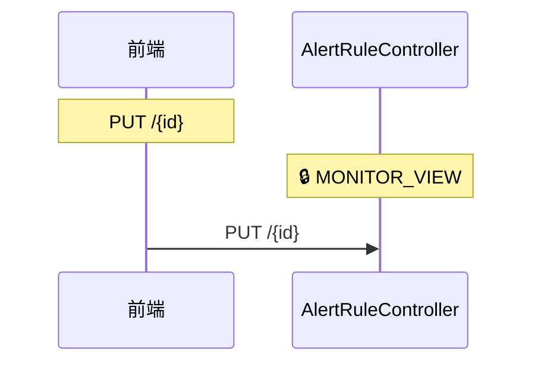
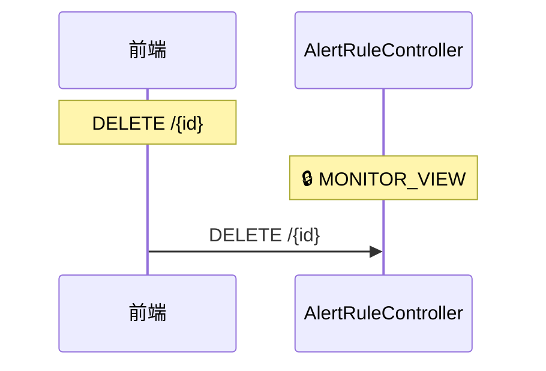
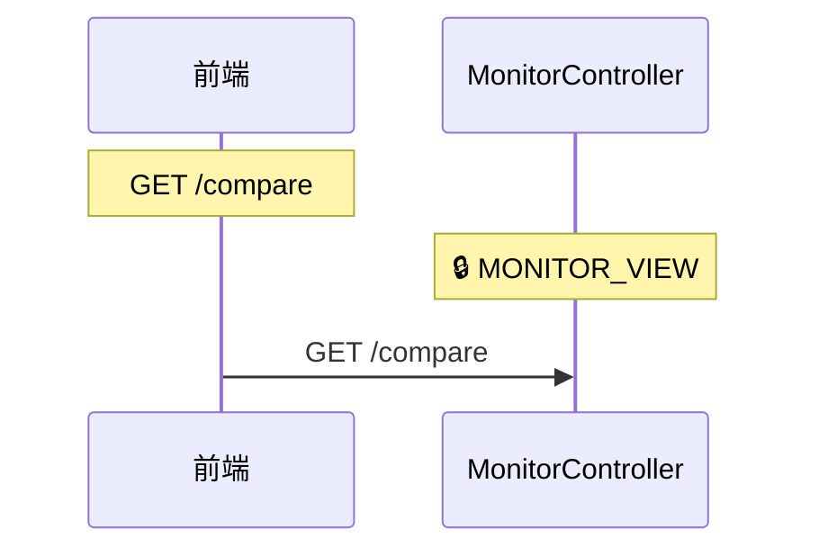
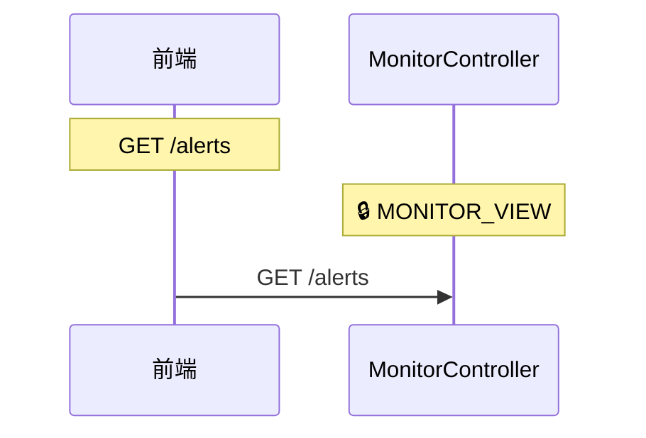
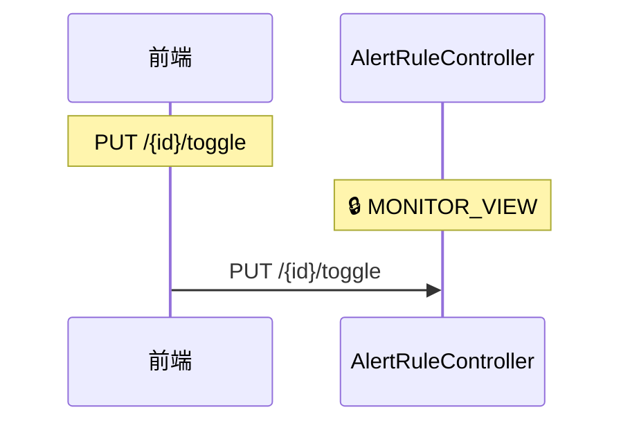
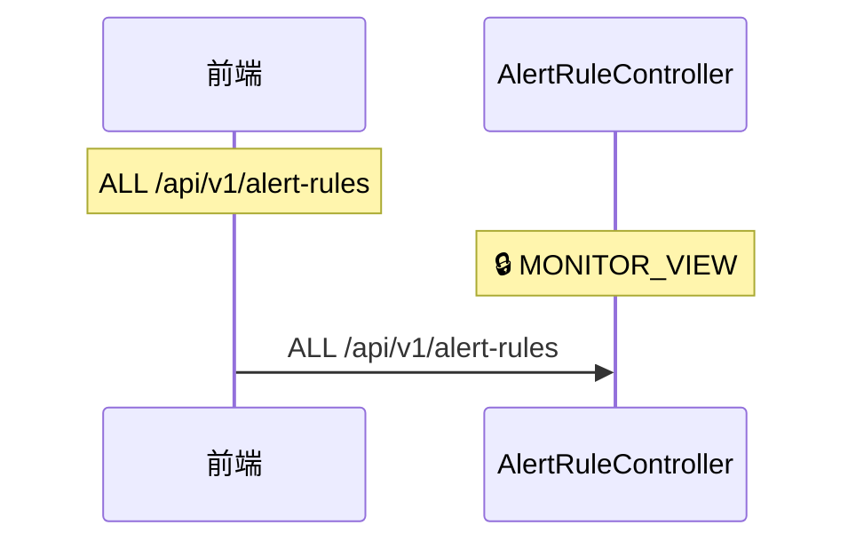
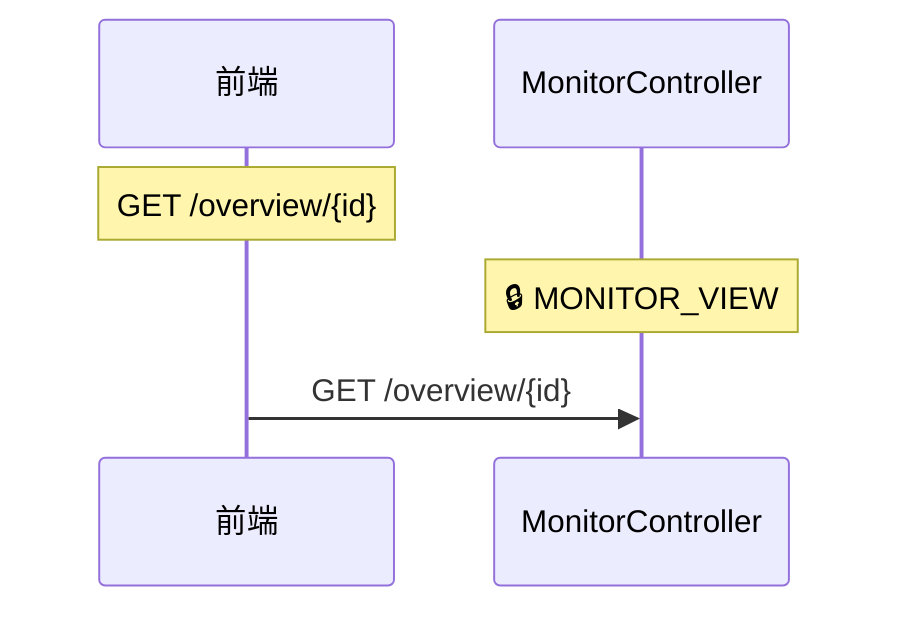
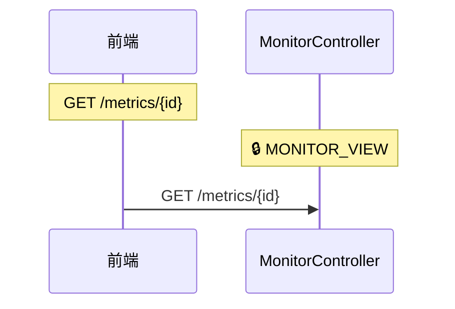
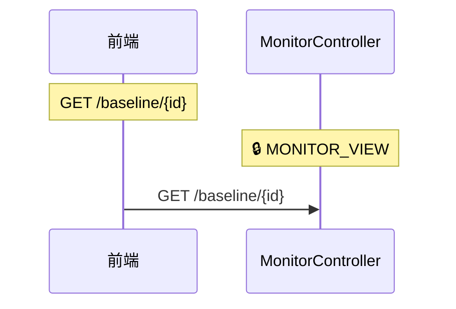

# rxas400adm-monitor 模块（自动生成）

> ⚠️ 此文件由 `scripts/generate-flow-diagrams.cjs` 自动生成，请勿手动编辑。

> 生成时间：2026-08-28T15:50:32.339Z

## root

### PUT /{id}

### DELETE /{id}

### GET /capacity

### GET /compare

### GET /alerts

## toggle

### PUT /{id}/toggle

## v1

### ALL /api/v1/alert-rules

### ALL /api/v1/monitor

## {id}

### GET /overview/{id}

### GET /metrics/{id}

### GET /baseline/{id}

