# rxas400adm-security 模块（自动生成）

> ⚠️ 此文件由 `scripts/generate-flow-diagrams.cjs` 自动生成，请勿手动编辑。

> 生成时间：2026-08-28T15:50:32.336Z

## root

### POST /logout

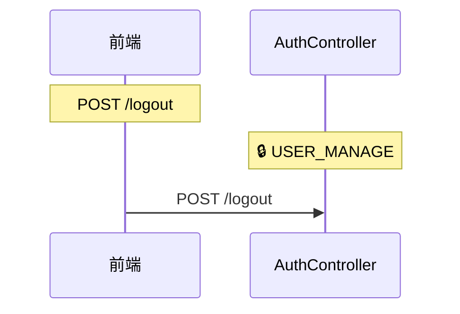

### POST /login

### POST /as400-login

### GET /login-attempts

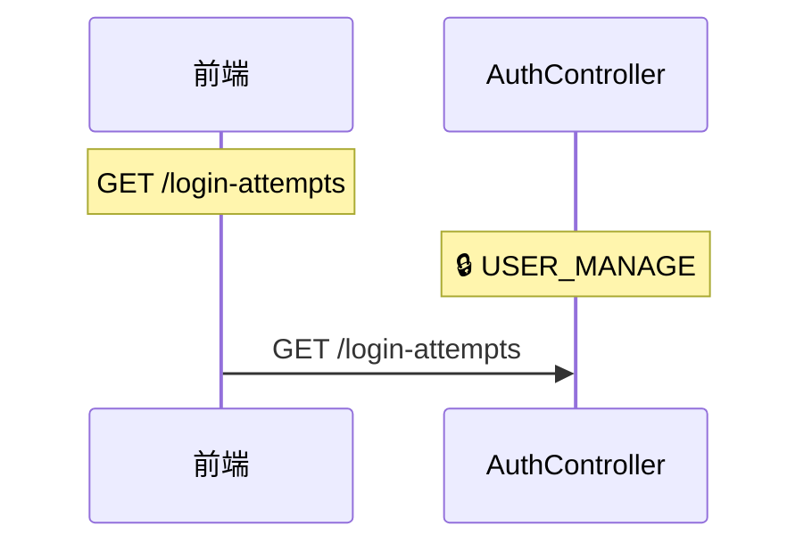

### POST /change-password

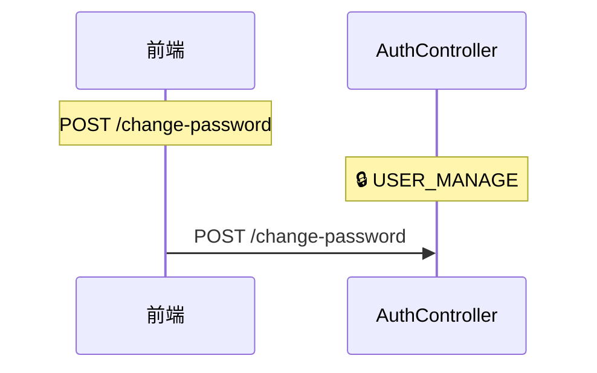

### POST /refresh

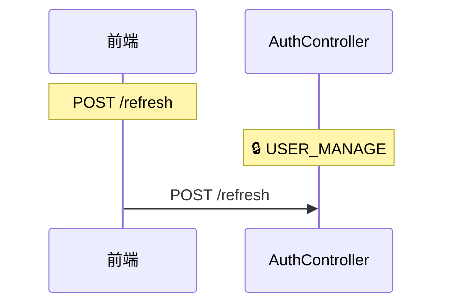

### GET /profile

### GET /menu

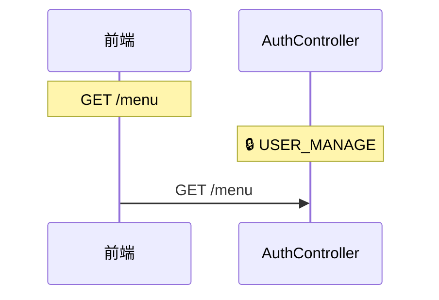

### GET /page

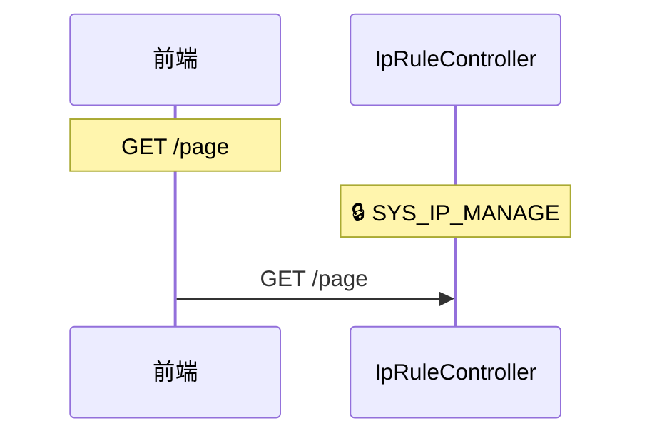

### PUT /{id}

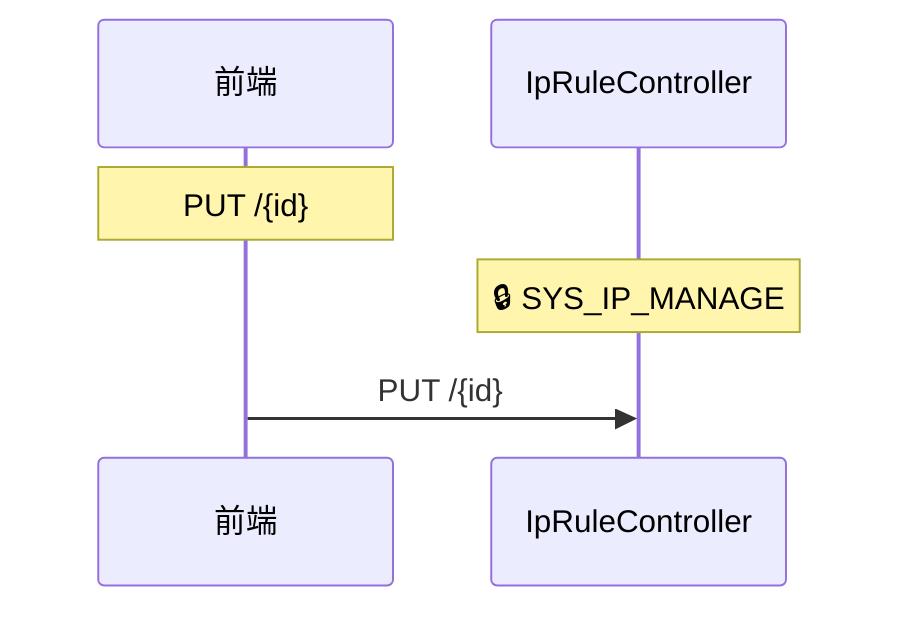

### DELETE /{id}

## ips

### GET /login-attempts/ips

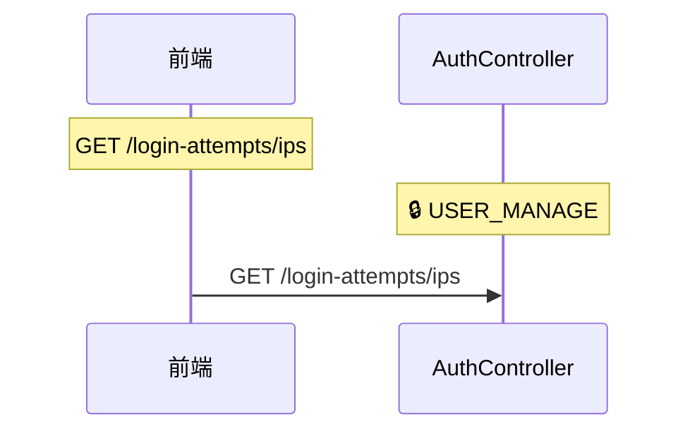

## {username}

### DELETE /login-attempts/{username}

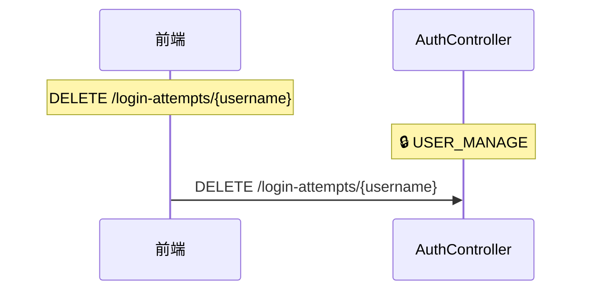

## v1

### ALL /api/v1/auth

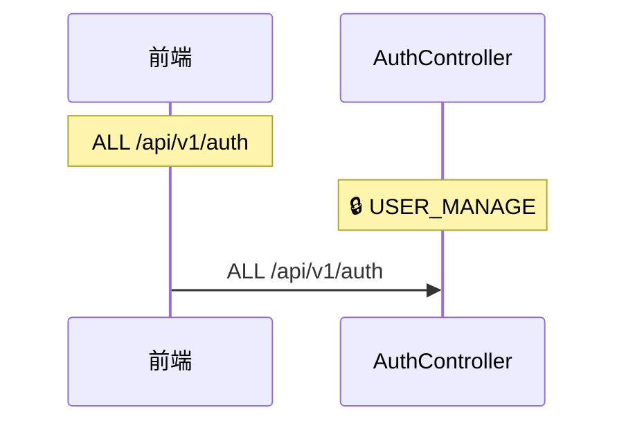

### ALL /api/v1/ip-rules

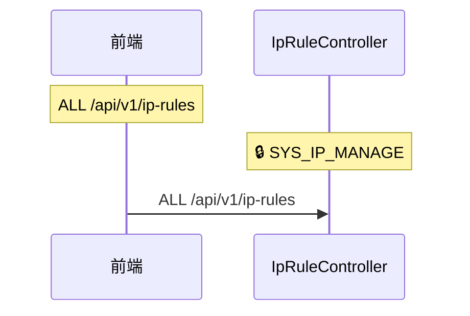
