# rxas400adm-system 模块（自动生成）

> ⚠️ 此文件由 `scripts/generate-flow-diagrams.cjs` 自动生成，请勿手动编辑。

> 生成时间：2026-08-28T15:50:32.332Z

## v1

### ALL /api/v1/audit-logs

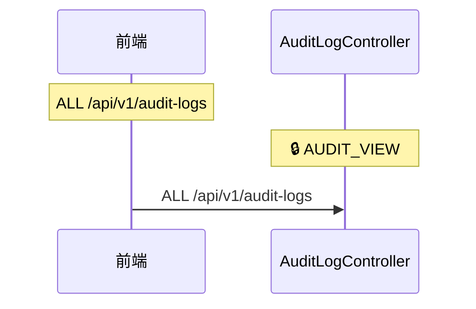
```mermaid
sequenceDiagram
    participant F as 前端
    participant P1 as AuditLogController

    Note over F: ALL /api/v1/audit-logs
    Note over P1: 🔒 AUDIT_VIEW
    F->>P1: ALL /api/v1/audit-logs
```

### ALL /api/v1/calendar/events

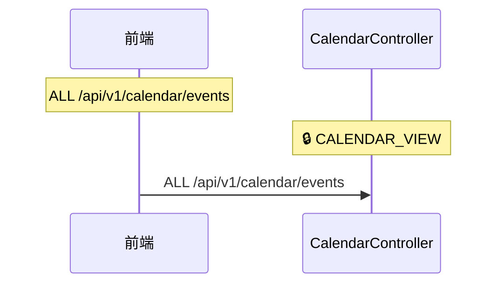
```mermaid
sequenceDiagram
    participant F as 前端
    participant P1 as CalendarController

    Note over F: ALL /api/v1/calendar/events
    Note over P1: 🔒 CALENDAR_VIEW
    F->>P1: ALL /api/v1/calendar/events
```

### ALL /api/v1/configs

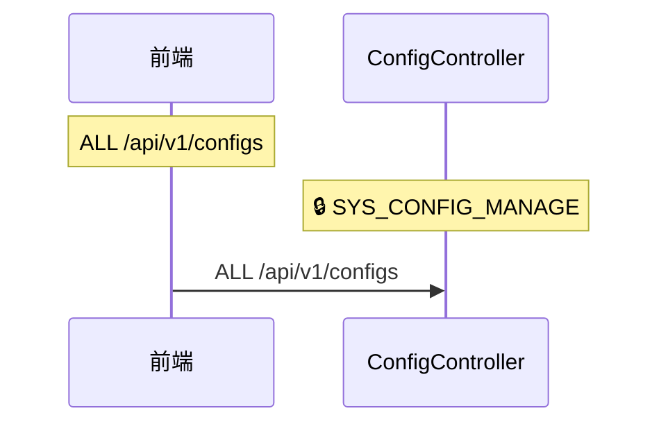
```mermaid
sequenceDiagram
    participant F as 前端
    participant P1 as ConfigController

    Note over F: ALL /api/v1/configs
    Note over P1: 🔒 SYS_CONFIG_MANAGE
    F->>P1: ALL /api/v1/configs
```

### ALL /api/v1/dashboard/widgets

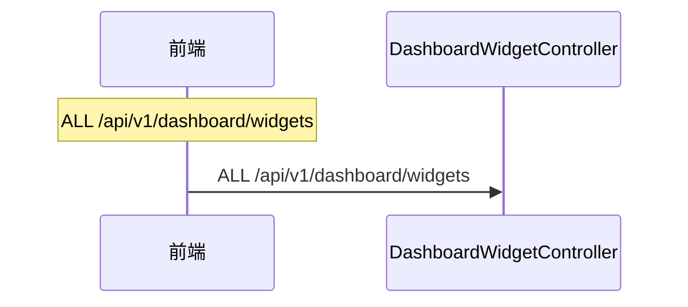
```mermaid
sequenceDiagram
    participant F as 前端
    participant P1 as DashboardWidgetController

    Note over F: ALL /api/v1/dashboard/widgets
    F->>P1: ALL /api/v1/dashboard/widgets
```

### ALL /api/v1/dicts

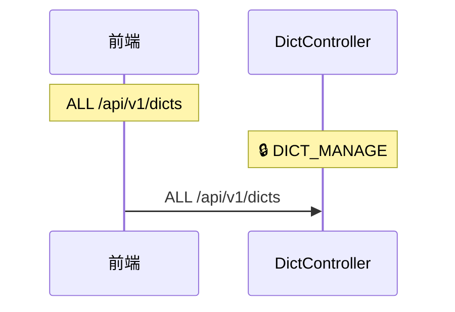
```mermaid
sequenceDiagram
    participant F as 前端
    participant P1 as DictController

    Note over F: ALL /api/v1/dicts
    Note over P1: 🔒 DICT_MANAGE
    F->>P1: ALL /api/v1/dicts
```

### ALL /api/v1/favorites

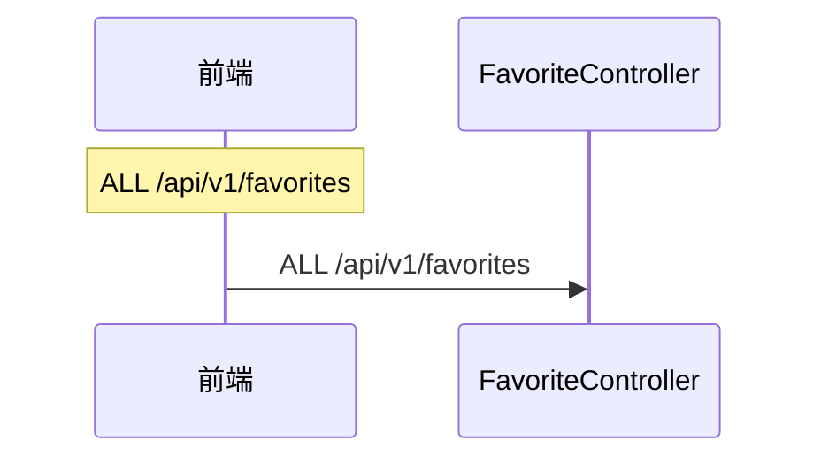
```mermaid
sequenceDiagram
    participant F as 前端
    participant P1 as FavoriteController

    Note over F: ALL /api/v1/favorites
    F->>P1: ALL /api/v1/favorites
```

### ALL /api/v1/i18n

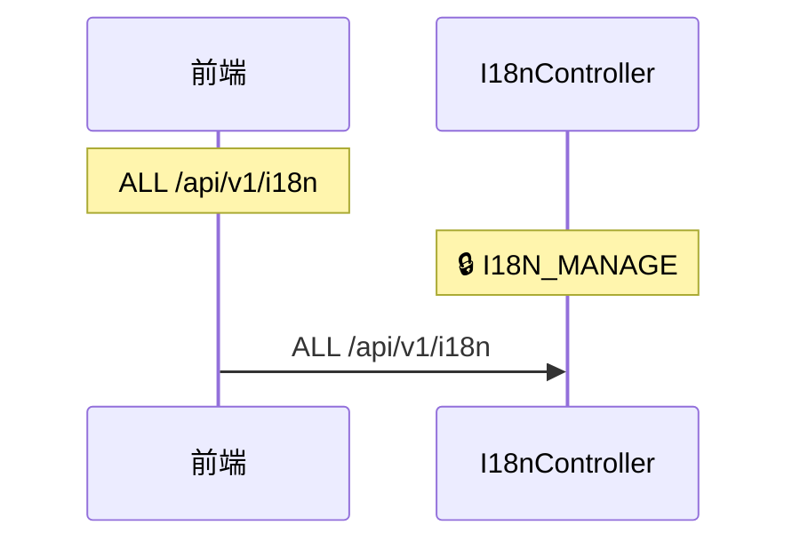
```mermaid
sequenceDiagram
    participant F as 前端
    participant P1 as I18nController

    Note over F: ALL /api/v1/i18n
    Note over P1: 🔒 I18N_MANAGE
    F->>P1: ALL /api/v1/i18n
```

### ALL /api/v1/notices

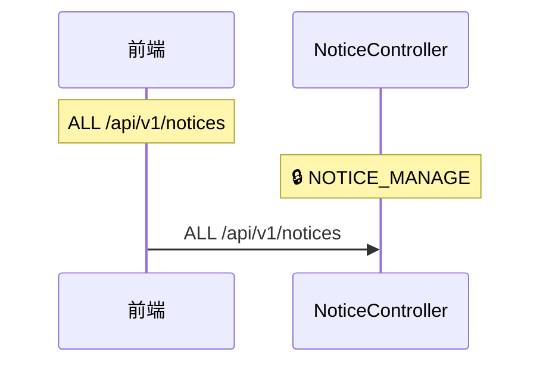
```mermaid
sequenceDiagram
    participant F as 前端
    participant P1 as NoticeController

    Note over F: ALL /api/v1/notices
    Note over P1: 🔒 NOTICE_MANAGE
    F->>P1: ALL /api/v1/notices
```

### ALL /api/v1/notifications

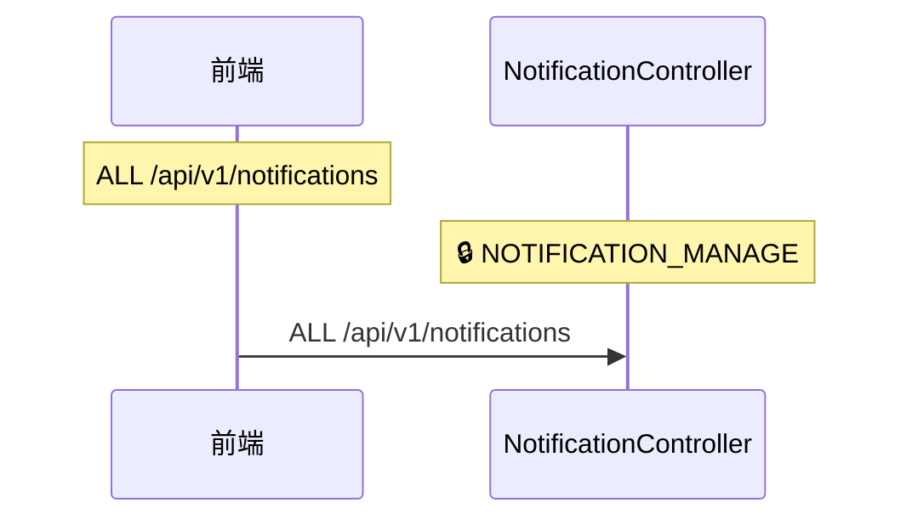
```mermaid
sequenceDiagram
    participant F as 前端
    participant P1 as NotificationController

    Note over F: ALL /api/v1/notifications
    Note over P1: 🔒 NOTIFICATION_MANAGE
    F->>P1: ALL /api/v1/notifications
```

### ALL /api/v1/permissions

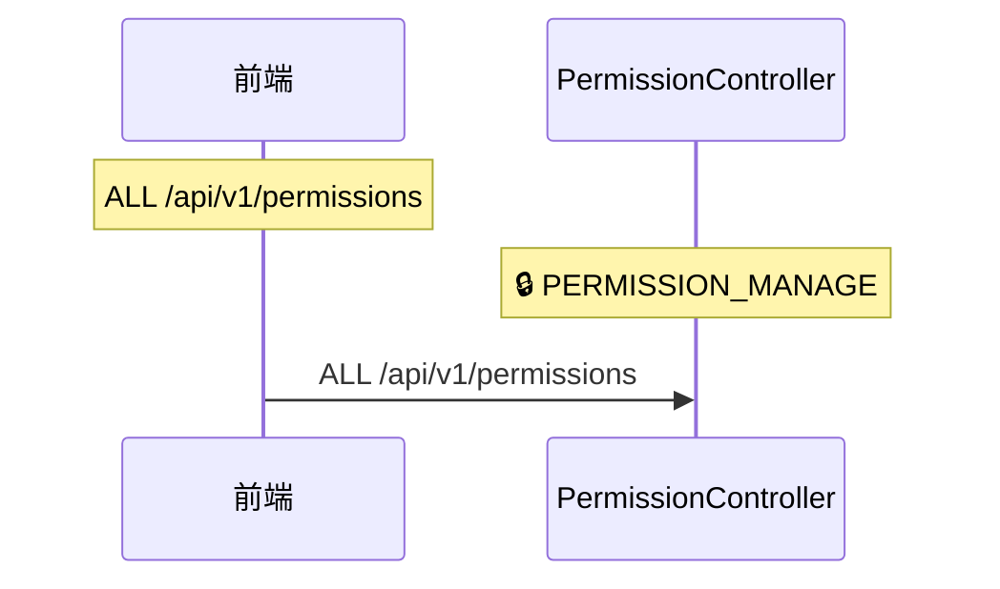
```mermaid
sequenceDiagram
    participant F as 前端
    participant P1 as PermissionController

    Note over F: ALL /api/v1/permissions
    Note over P1: 🔒 PERMISSION_MANAGE
    F->>P1: ALL /api/v1/permissions
```

### ALL /api/v1/permission-requests

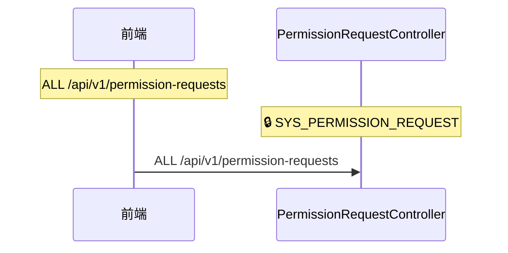
```mermaid
sequenceDiagram
    participant F as 前端
    participant P1 as PermissionRequestController

    Note over F: ALL /api/v1/permission-requests
    Note over P1: 🔒 SYS_PERMISSION_REQUEST
    F->>P1: ALL /api/v1/permission-requests
```

### ALL /api/v1/regions

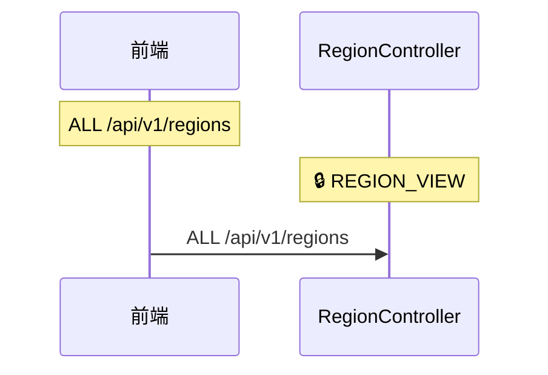
```mermaid
sequenceDiagram
    participant F as 前端
    participant P1 as RegionController

    Note over F: ALL /api/v1/regions
    Note over P1: 🔒 REGION_VIEW
    F->>P1: ALL /api/v1/regions
```

### ALL /api/v1/sys-docs

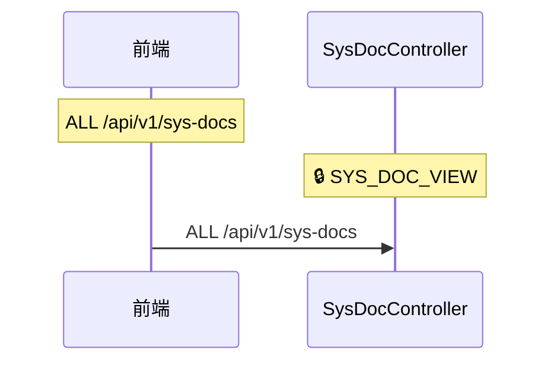
```mermaid
sequenceDiagram
    participant F as 前端
    participant P1 as SysDocController

    Note over F: ALL /api/v1/sys-docs
    Note over P1: 🔒 SYS_DOC_VIEW
    F->>P1: ALL /api/v1/sys-docs
```

### ALL /api/v1/menus

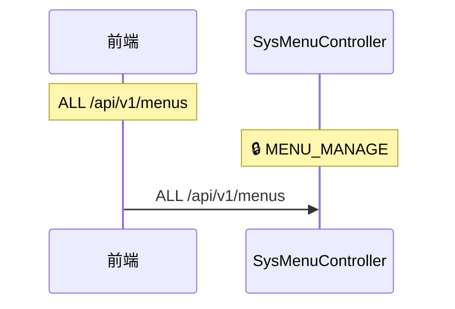
```mermaid
sequenceDiagram
    participant F as 前端
    participant P1 as SysMenuController

    Note over F: ALL /api/v1/menus
    Note over P1: 🔒 MENU_MANAGE
    F->>P1: ALL /api/v1/menus
```

### ALL /api/v1/roles

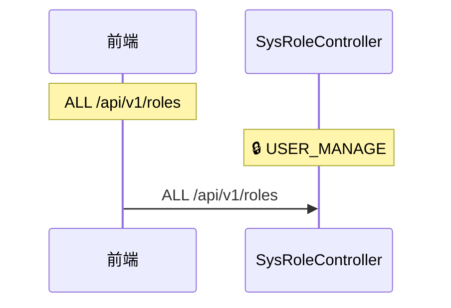
```mermaid
sequenceDiagram
    participant F as 前端
    participant P1 as SysRoleController

    Note over F: ALL /api/v1/roles
    Note over P1: 🔒 USER_MANAGE
    F->>P1: ALL /api/v1/roles
```

### ALL /api/v1/users

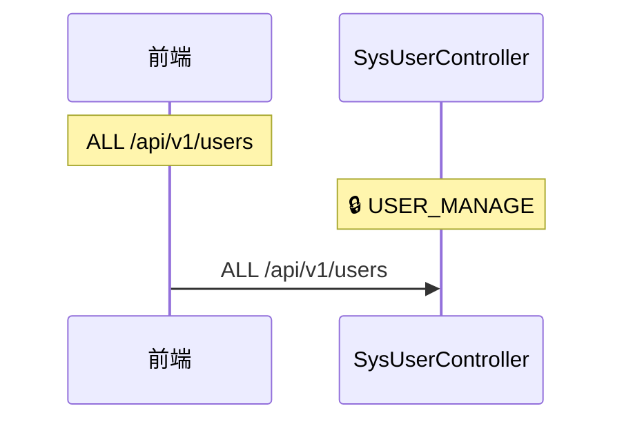
```mermaid
sequenceDiagram
    participant F as 前端
    participant P1 as SysUserController

    Note over F: ALL /api/v1/users
    Note over P1: 🔒 USER_MANAGE
    F->>P1: ALL /api/v1/users
```

### ALL /api/v1/webhooks

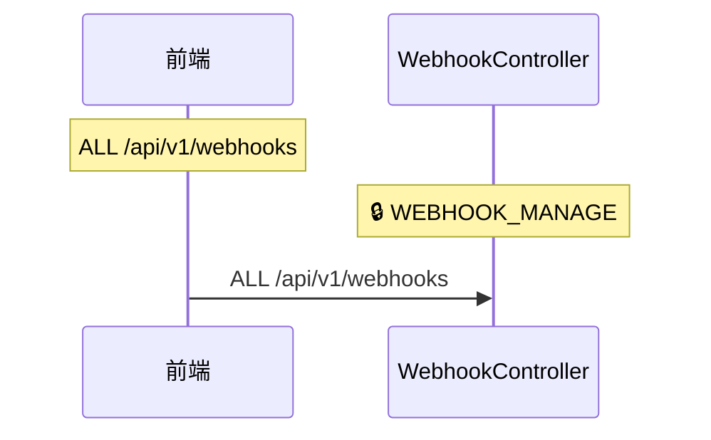
```mermaid
sequenceDiagram
    participant F as 前端
    participant P1 as WebhookController

    Note over F: ALL /api/v1/webhooks
    Note over P1: 🔒 WEBHOOK_MANAGE
    F->>P1: ALL /api/v1/webhooks
```

## root

### GET /month

```mermaid
sequenceDiagram
    participant F as 前端
    participant P1 as CalendarController

    Note over F: GET /month
    Note over P1: 🔒 CALENDAR_VIEW
    F->>P1: GET /month
```

### PUT /{id}

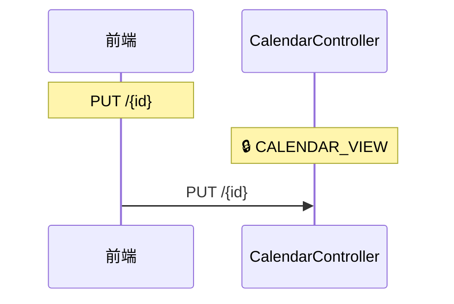
```mermaid
sequenceDiagram
    participant F as 前端
    participant P1 as CalendarController

    Note over F: PUT /{id}
    Note over P1: 🔒 CALENDAR_VIEW
    F->>P1: PUT /{id}
```

### DELETE /{id}

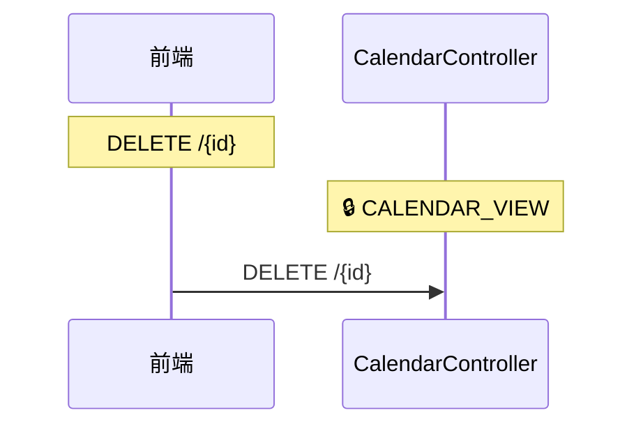
```mermaid
sequenceDiagram
    participant F as 前端
    participant P1 as CalendarController

    Note over F: DELETE /{id}
    Note over P1: 🔒 CALENDAR_VIEW
    F->>P1: DELETE /{id}
```

### PUT /{configKey}

```mermaid
sequenceDiagram
    participant F as 前端
    participant P1 as ConfigController

    Note over F: PUT /{configKey}
    Note over P1: 🔒 SYS_CONFIG_MANAGE
    F->>P1: PUT /{configKey}
```

### DELETE /{configKey}

```mermaid
sequenceDiagram
    participant F as 前端
    participant P1 as ConfigController

    Note over F: DELETE /{configKey}
    Note over P1: 🔒 SYS_CONFIG_MANAGE
    F->>P1: DELETE /{configKey}
```

### PUT /{widgetKey}

```mermaid
sequenceDiagram
    participant F as 前端
    participant P1 as DashboardWidgetController

    Note over F: PUT /{widgetKey}
    F->>P1: PUT /{widgetKey}
```

### GET /types

```mermaid
sequenceDiagram
    participant F as 前端
    participant P1 as DictController

    Note over F: GET /types
    Note over P1: 🔒 DICT_MANAGE
    F->>P1: GET /types
```

### POST /types

```mermaid
sequenceDiagram
    participant F as 前端
    participant P1 as DictController

    Note over F: POST /types
    Note over P1: 🔒 DICT_MANAGE
    F->>P1: POST /types
```

### GET /items

```mermaid
sequenceDiagram
    participant F as 前端
    participant P1 as DictController

    Note over F: GET /items
    Note over P1: 🔒 DICT_MANAGE
    F->>P1: GET /items
```

### POST /items

```mermaid
sequenceDiagram
    participant F as 前端
    participant P1 as DictController

    Note over F: POST /items
    Note over P1: 🔒 DICT_MANAGE
    F->>P1: POST /items
```

### GET /mine

```mermaid
sequenceDiagram
    participant F as 前端
    participant P1 as FavoriteController

    Note over F: GET /mine
    F->>P1: GET /mine
```

### GET /check

```mermaid
sequenceDiagram
    participant F as 前端
    participant P1 as FavoriteController

    Note over F: GET /check
    F->>P1: GET /check
```

### POST /toggle

```mermaid
sequenceDiagram
    participant F as 前端
    participant P1 as FavoriteController

    Note over F: POST /toggle
    F->>P1: POST /toggle
```

### GET /entries

```mermaid
sequenceDiagram
    participant F as 前端
    participant P1 as I18nController

    Note over F: GET /entries
    Note over P1: 🔒 I18N_MANAGE
    F->>P1: GET /entries
```

### POST /entry

```mermaid
sequenceDiagram
    participant F as 前端
    participant P1 as I18nController

    Note over F: POST /entry
    Note over P1: 🔒 I18N_MANAGE
    F->>P1: POST /entry
```

### PUT /entry

```mermaid
sequenceDiagram
    participant F as 前端
    participant P1 as I18nController

    Note over F: PUT /entry
    Note over P1: 🔒 I18N_MANAGE
    F->>P1: PUT /entry
```

### GET /page

```mermaid
sequenceDiagram
    participant F as 前端
    participant P1 as NoticeController

    Note over F: GET /page
    Note over P1: 🔒 NOTICE_MANAGE
    F->>P1: GET /page
```

### PUT /{id}

```mermaid
sequenceDiagram
    participant F as 前端
    participant P1 as NoticeController

    Note over F: PUT /{id}
    Note over P1: 🔒 NOTICE_MANAGE
    F->>P1: PUT /{id}
```

### DELETE /{id}

```mermaid
sequenceDiagram
    participant F as 前端
    participant P1 as NoticeController

    Note over F: DELETE /{id}
    Note over P1: 🔒 NOTICE_MANAGE
    F->>P1: DELETE /{id}
```

### GET /mine

```mermaid
sequenceDiagram
    participant F as 前端
    participant P1 as NotificationController

    Note over F: GET /mine
    Note over P1: 🔒 NOTIFICATION_MANAGE
    F->>P1: GET /mine
```

### GET /unread-count

```mermaid
sequenceDiagram
    participant F as 前端
    participant P1 as NotificationController

    Note over F: GET /unread-count
    Note over P1: 🔒 NOTIFICATION_MANAGE
    F->>P1: GET /unread-count
```

### POST /read-all

```mermaid
sequenceDiagram
    participant F as 前端
    participant P1 as NotificationController

    Note over F: POST /read-all
    Note over P1: 🔒 NOTIFICATION_MANAGE
    F->>P1: POST /read-all
```

### DELETE /{id}

```mermaid
sequenceDiagram
    participant F as 前端
    participant P1 as NotificationController

    Note over F: DELETE /{id}
    Note over P1: 🔒 NOTIFICATION_MANAGE
    F->>P1: DELETE /{id}
```

### POST /batch-delete

```mermaid
sequenceDiagram
    participant F as 前端
    participant P1 as NotificationController

    Note over F: POST /batch-delete
    Note over P1: 🔒 NOTIFICATION_MANAGE
    F->>P1: POST /batch-delete
```

### GET /all

```mermaid
sequenceDiagram
    participant F as 前端
    participant P1 as PermissionController

    Note over F: GET /all
    Note over P1: 🔒 PERMISSION_MANAGE
    F->>P1: GET /all
```

### GET /suggest

```mermaid
sequenceDiagram
    participant F as 前端
    participant P1 as PermissionController

    Note over F: GET /suggest
    Note over P1: 🔒 PERMISSION_MANAGE
    F->>P1: GET /suggest
```

### PUT /{id}

```mermaid
sequenceDiagram
    participant F as 前端
    participant P1 as PermissionController

    Note over F: PUT /{id}
    Note over P1: 🔒 PERMISSION_MANAGE
    F->>P1: PUT /{id}
```

### DELETE /{id}

```mermaid
sequenceDiagram
    participant F as 前端
    participant P1 as PermissionController

    Note over F: DELETE /{id}
    Note over P1: 🔒 PERMISSION_MANAGE
    F->>P1: DELETE /{id}
```

### GET /mine

```mermaid
sequenceDiagram
    participant F as 前端
    participant P1 as PermissionRequestController

    Note over F: GET /mine
    Note over P1: 🔒 SYS_PERMISSION_REQUEST
    F->>P1: GET /mine
```

### GET /pending-count

```mermaid
sequenceDiagram
    participant F as 前端
    participant P1 as PermissionRequestController

    Note over F: GET /pending-count
    Note over P1: 🔒 SYS_PERMISSION_REQUEST
    F->>P1: GET /pending-count
```

### GET /children

```mermaid
sequenceDiagram
    participant F as 前端
    participant P1 as RegionController

    Note over F: GET /children
    Note over P1: 🔒 REGION_VIEW
    F->>P1: GET /children
```

### GET /page

```mermaid
sequenceDiagram
    participant F as 前端
    participant P1 as RegionController

    Note over F: GET /page
    Note over P1: 🔒 REGION_VIEW
    F->>P1: GET /page
```

### GET /search

```mermaid
sequenceDiagram
    participant F as 前端
    participant P1 as RegionController

    Note over F: GET /search
    Note over P1: 🔒 REGION_VIEW
    F->>P1: GET /search
```

### PUT /{id}

```mermaid
sequenceDiagram
    participant F as 前端
    participant P1 as RegionController

    Note over F: PUT /{id}
    Note over P1: 🔒 REGION_VIEW
    F->>P1: PUT /{id}
```

### DELETE /{id}

```mermaid
sequenceDiagram
    participant F as 前端
    participant P1 as RegionController

    Note over F: DELETE /{id}
    Note over P1: 🔒 REGION_VIEW
    F->>P1: DELETE /{id}
```

### GET /{id}

```mermaid
sequenceDiagram
    participant F as 前端
    participant P1 as SysDocController

    Note over F: GET /{id}
    Note over P1: 🔒 SYS_DOC_VIEW
    F->>P1: GET /{id}
```

### PUT /{id}

```mermaid
sequenceDiagram
    participant F as 前端
    participant P1 as SysDocController

    Note over F: PUT /{id}
    Note over P1: 🔒 SYS_DOC_VIEW
    F->>P1: PUT /{id}
```

### DELETE /{id}

```mermaid
sequenceDiagram
    participant F as 前端
    participant P1 as SysDocController

    Note over F: DELETE /{id}
    Note over P1: 🔒 SYS_DOC_VIEW
    F->>P1: DELETE /{id}
```

### GET /requestable

```mermaid
sequenceDiagram
    participant F as 前端
    participant P1 as SysMenuController

    Note over F: GET /requestable
    Note over P1: 🔒 MENU_MANAGE
    F->>P1: GET /requestable
```

### GET /tree

```mermaid
sequenceDiagram
    participant F as 前端
    participant P1 as SysMenuController

    Note over F: GET /tree
    Note over P1: 🔒 MENU_MANAGE
    F->>P1: GET /tree
```

### PUT /{id}

```mermaid
sequenceDiagram
    participant F as 前端
    participant P1 as SysMenuController

    Note over F: PUT /{id}
    Note over P1: 🔒 MENU_MANAGE
    F->>P1: PUT /{id}
```

### DELETE /{id}

```mermaid
sequenceDiagram
    participant F as 前端
    participant P1 as SysMenuController

    Note over F: DELETE /{id}
    Note over P1: 🔒 MENU_MANAGE
    F->>P1: DELETE /{id}
```

### GET /page

```mermaid
sequenceDiagram
    participant F as 前端
    participant P1 as SysRoleController

    Note over F: GET /page
    Note over P1: 🔒 USER_MANAGE
    F->>P1: GET /page
```

### PUT /{id}

```mermaid
sequenceDiagram
    participant F as 前端
    participant P1 as SysRoleController

    Note over F: PUT /{id}
    Note over P1: 🔒 USER_MANAGE
    F->>P1: PUT /{id}
```

### DELETE /{id}

```mermaid
sequenceDiagram
    participant F as 前端
    participant P1 as SysRoleController

    Note over F: DELETE /{id}
    Note over P1: 🔒 USER_MANAGE
    F->>P1: DELETE /{id}
```

### POST /batch-delete

```mermaid
sequenceDiagram
    participant F as 前端
    participant P1 as SysRoleController

    Note over F: POST /batch-delete
    Note over P1: 🔒 USER_MANAGE
    F->>P1: POST /batch-delete
```

### PUT /{id}

```mermaid
sequenceDiagram
    participant F as 前端
    participant P1 as SysUserController

    Note over F: PUT /{id}
    Note over P1: 🔒 USER_MANAGE
    F->>P1: PUT /{id}
```

### DELETE /{id}

```mermaid
sequenceDiagram
    participant F as 前端
    participant P1 as SysUserController

    Note over F: DELETE /{id}
    Note over P1: 🔒 USER_MANAGE
    F->>P1: DELETE /{id}
```

### GET /logs

```mermaid
sequenceDiagram
    participant F as 前端
    participant P1 as WebhookController

    Note over F: GET /logs
    Note over P1: 🔒 WEBHOOK_MANAGE
    F->>P1: GET /logs
```

### PUT /{id}

```mermaid
sequenceDiagram
    participant F as 前端
    participant P1 as WebhookController

    Note over F: PUT /{id}
    Note over P1: 🔒 WEBHOOK_MANAGE
    F->>P1: PUT /{id}
```

### DELETE /{id}

```mermaid
sequenceDiagram
    participant F as 前端
    participant P1 as WebhookController

    Note over F: DELETE /{id}
    Note over P1: 🔒 WEBHOOK_MANAGE
    F->>P1: DELETE /{id}
```

### DELETE /logs

```mermaid
sequenceDiagram
    participant F as 前端
    participant P1 as WebhookController

    Note over F: DELETE /logs
    Note over P1: 🔒 WEBHOOK_MANAGE
    F->>P1: DELETE /logs
```

## {id}

### PUT /types/{id}

```mermaid
sequenceDiagram
    participant F as 前端
    participant P1 as DictController

    Note over F: PUT /types/{id}
    Note over P1: 🔒 DICT_MANAGE
    F->>P1: PUT /types/{id}
```

### DELETE /types/{id}

```mermaid
sequenceDiagram
    participant F as 前端
    participant P1 as DictController

    Note over F: DELETE /types/{id}
    Note over P1: 🔒 DICT_MANAGE
    F->>P1: DELETE /types/{id}
```

### PUT /items/{id}

```mermaid
sequenceDiagram
    participant F as 前端
    participant P1 as DictController

    Note over F: PUT /items/{id}
    Note over P1: 🔒 DICT_MANAGE
    F->>P1: PUT /items/{id}
```

### DELETE /items/{id}

```mermaid
sequenceDiagram
    participant F as 前端
    participant P1 as DictController

    Note over F: DELETE /items/{id}
    Note over P1: 🔒 DICT_MANAGE
    F->>P1: DELETE /items/{id}
```

## enabled

### GET /items/enabled

```mermaid
sequenceDiagram
    participant F as 前端
    participant P1 as DictController

    Note over F: GET /items/enabled
    Note over P1: 🔒 DICT_MANAGE
    F->>P1: GET /items/enabled
```

### PUT /{id}/enabled

```mermaid
sequenceDiagram
    participant F as 前端
    participant P1 as WebhookController

    Note over F: PUT /{id}/enabled
    Note over P1: 🔒 WEBHOOK_MANAGE
    F->>P1: PUT /{id}/enabled
```

## {lang}

### DELETE /entry/{lang}/{key}

```mermaid
sequenceDiagram
    participant F as 前端
    participant P1 as I18nController

    Note over F: DELETE /entry/{lang}/{key}
    Note over P1: 🔒 I18N_MANAGE
    F->>P1: DELETE /entry/{lang}/{key}
```

## read

### POST /{id}/read

```mermaid
sequenceDiagram
    participant F as 前端
    participant P1 as NotificationController

    Note over F: POST /{id}/read
    Note over P1: 🔒 NOTIFICATION_MANAGE
    F->>P1: POST /{id}/read
```

## approve

### POST /{id}/approve

```mermaid
sequenceDiagram
    participant F as 前端
    participant P1 as PermissionRequestController

    Note over F: POST /{id}/approve
    Note over P1: 🔒 SYS_PERMISSION_REQUEST
    F->>P1: POST /{id}/approve
```

## reject

### POST /{id}/reject

```mermaid
sequenceDiagram
    participant F as 前端
    participant P1 as PermissionRequestController

    Note over F: POST /{id}/reject
    Note over P1: 🔒 SYS_PERMISSION_REQUEST
    F->>P1: POST /{id}/reject
```

## status

### PUT /{id}/status

```mermaid
sequenceDiagram
    participant F as 前端
    participant P1 as SysMenuController

    Note over F: PUT /{id}/status
    Note over P1: 🔒 MENU_MANAGE
    F->>P1: PUT /{id}/status
```

## menus

### GET /{id}/menus

```mermaid
sequenceDiagram
    participant F as 前端
    participant P1 as SysUserController

    Note over F: GET /{id}/menus
    Note over P1: 🔒 USER_MANAGE
    F->>P1: GET /{id}/menus
```

### GET /{id}/menus/direct

```mermaid
sequenceDiagram
    participant F as 前端
    participant P1 as SysUserController

    Note over F: GET /{id}/menus/direct
    Note over P1: 🔒 USER_MANAGE
    F->>P1: GET /{id}/menus/direct
```

### GET /{id}/menus/manageable-tree

```mermaid
sequenceDiagram
    participant F as 前端
    participant P1 as SysUserController

    Note over F: GET /{id}/menus/manageable-tree
    Note over P1: 🔒 USER_MANAGE
    F->>P1: GET /{id}/menus/manageable-tree
```

### POST /{id}/menus/add

```mermaid
sequenceDiagram
    participant F as 前端
    participant P1 as SysUserController

    Note over F: POST /{id}/menus/add
    Note over P1: 🔒 USER_MANAGE
    F->>P1: POST /{id}/menus/add
```

### POST /{id}/menus/remove

```mermaid
sequenceDiagram
    participant F as 前端
    participant P1 as SysUserController

    Note over F: POST /{id}/menus/remove
    Note over P1: 🔒 USER_MANAGE
    F->>P1: POST /{id}/menus/remove
```

## test

### POST /{id}/test

```mermaid
sequenceDiagram
    participant F as 前端
    participant P1 as WebhookController

    Note over F: POST /{id}/test
    Note over P1: 🔒 WEBHOOK_MANAGE
    F->>P1: POST /{id}/test
```
