# 系统架构与流程图

本文档站包含 RXAS400ADM 项目的系统架构图和各模块的前后端交互流程图。

---

## 架构总览

```mermaid
graph TD
    subgraph Browser["浏览器 (Vue 3 + TypeScript)"]
        Login["Login.vue 登录页"]
        Layout["Layout.vue 主布局"]
        Views["各业务视图 (Dashboard/Job/Monitor/...)"]
        Pinia["Pinia Store (user / as400Server)"]
        Axios["Axios 请求层 (request.ts)"]
    end

    subgraph Security["Security Filter 链 (Spring Security)"]
        JwtFilter["JwtAuthenticationFilter (JWT 校验)"]
        CorsFilter["CorsFilter (CORS 白名单)"]
        SecurityConfig["SecurityConfig (CSP/CSRF/Session)"]
    end

    subgraph Backend["后端 Controller 层 (Spring Boot)"]
        AuthCtrl["AuthController /api/v1/auth"]
        As400Ctrl["As400Controller /api/v1/as400"]
        JobCtrl["JobController /api/v1/jobs"]
        MonitorCtrl["MonitorController /api/v1/monitor"]
        QueryCtrl["SqlQueryController /api/v1/query"]
        BizCtrl["BusinessController /api/v1/business"]
        SysCtrl["SysUser/Role/Menu/Permission/Config/..."]
        CompileCtrl["CompileController /api/v1/compile"]
        SourceCtrl["SourceController /api/v1/source"]
        IfsCtrl["IfsController /api/v1/ifs"]
        ObjectCtrl["ObjectController /api/v1/objects"]
        PfCtrl["PfController /api/v1/pf"]
        SubsysCtrl["SubsystemController /api/v1/subsystems"]
        ScriptCtrl["ScriptController /api/v1/scripts"]
        SchedCtrl["ScheduleController /api/v1/schedules"]
        ExecCtrl["ExecutionController /api/v1/executions"]
    end

    subgraph Service["Service 层"]
        SysUserSvc["SysUserService"]
        MenuSvc["MenuService"]
        PermissionSvc["PermissionService"]
        LoginAttemptSvc["LoginAttemptService"]
        IpRuleSvc["IpRuleService"]
        TokenBlacklistSvc["TokenBlacklistService"]
        JobSvc["JobService"]
        MetricSvc["MetricService"]
        AlertEngine["AlertEngine"]
        BusinessSvc["BusinessService"]
        SqlQuerySvc["SqlQueryService"]
        IbmiSystemSvc["IbmiSystemService"]
    end

    subgraph AS400["AS400 Client 层 (JTOpen)"]
        AS400Provider["AS400ClientProvider (按 X-AS400-Server 头路由)"]
        JTOpenClient["JTOpenAS400Client (委托模式, 12 个子接口)"]
        SqlClient["JTOpenSqlClient (PreparedStatement, DB2 for i)"]
        CommandClient["JTOpenCommandClient (CL 命令, 标识符校验)"]
    end

    subgraph Data["数据层"]
        MySQL[("MySQL / DB2 for i<br/>业务数据库")]
        IBMi[("IBM i (AS400)<br/>QSYS2 系统表")]
        Redis[("Redis (可选)<br/>缓存")]
    end

    Browser -->|"HTTP + JWT Header"| Security
    Security -->|"已认证"| Backend
    Backend --> Service
    Service --> AS400
    Service --> MySQL
    AS400 -->|"JDBC / CL Command"| IBMi

    style Browser fill:#e1f5fe
    style Security fill:#fff3e0
    style Backend fill:#e8f5e9
    style Service fill:#f3e5f5
    style AS400 fill:#fce4ec
    style Data fill:#fff9c4
```

---

## 模块流程图索引

| 模块 | 说明 | 页面 |
|------|------|------|
| 用户登录与认证 | 平台登录 / AS400登录 / 登出 / Token 管理 | [查看](01-auth.md) |
| Dashboard 仪表盘 | 仪表盘加载 / 服务器选择 / 指标展示 | [查看](02-dashboard.md) |
| 作业中心 | 活动作业 / 控制与日志 / SPOOL / SLA | [查看](03-job.md) |
| 监控中心 | 概览指标 / 对比告警 / 规则管理 / 巡检 | [查看](04-monitor.md) |
| SQL 查询与业务数据 | SQL 执行 / 库表浏览 / 业务数据 | [查看](05-query.md) |
| AS400 工具集 | IFS / 对象 / PF / 子系统 / 脚本 / 调度 / 编译 / 源码 | [查看](06-as400-tools.md) |
| 系统管理 | 用户 / 角色 / 菜单 / 权限 / 配置 / 审计等 | [查看](07-system.md) |
| 定时任务与后台采集 | CollectorScheduler 采集流程 | [查看](08-scheduler.md) |
| 请求拦截器链 | 前端 Axios 拦截器 / 后端 Security Filter | [查看](09-interceptors.md) |
| 数据表与权限码总览 | 全部业务表 / IBM i 系统表 / 权限码 | [查看](10-tables.md) |

---

## 图例说明

| 符号 | 含义 |
|:---:|------|
| 📖 | 读取数据表（SELECT / 查询） |
| ✏️ | 写入数据表（INSERT / UPDATE / DELETE） |
| 🔒 | 权限校验（@PreAuthorize） |
| ⚡ | 异步操作（WebSocket / Webhook） |
| 🗄️ | IBM i 系统表（QSYS2） |