# RXAS400ADM 项目模块流程图（Mermaid 源码）

> 本文档包含项目中所有模块的 Mermaid 时序图/流程图源码。  
> 文档站（`cd docs && npm run dev`）已接入 vitepress-plugin-mermaid，本页 `mermaid` 代码块直接在页面中渲染；也可在 VS Code（Markdown Preview Mermaid）或 GitHub 中查看。  
> 图例：📖 读表 / ✏️ 写表 / 🔒 权限校验 / ⚡ 异步 / 🗄️ IBM i 系统表

---

## 一、用户登录与认证

### 1.1 平台账号登录（POST /api/v1/auth/login）

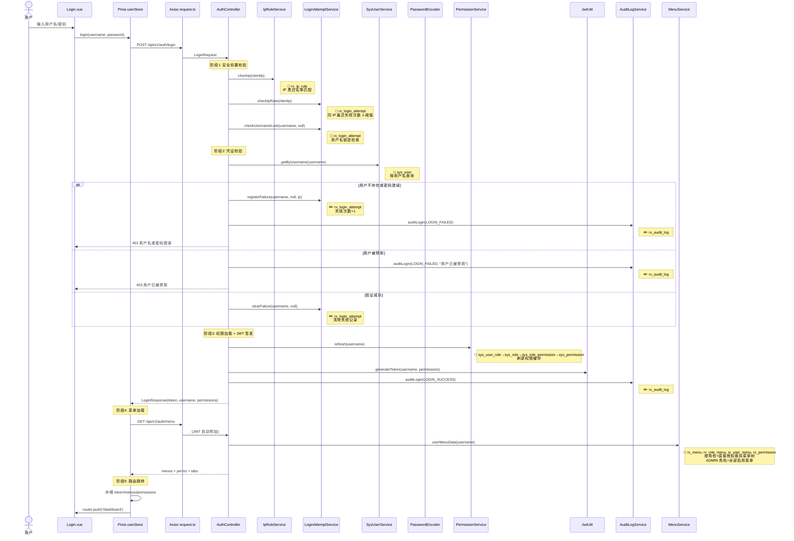
```mermaid
sequenceDiagram
    actor U as 用户
    participant Login as Login.vue
    participant Pinia as Pinia userStore
    participant Axios as Axios request.ts
    participant Auth as AuthController
    participant IpRule as IpRuleService
    participant LoginAttempt as LoginAttemptService
    participant UserSvc as SysUserService
    participant BCrypt as PasswordEncoder
    participant PermSvc as PermissionService
    participant JWT as JwtUtil
    participant AuditLog as AuditLogService
    participant MenuSvc as MenuService

    U->>Login: 输入用户名/密码
    Login->>Pinia: login(username, password)
    Pinia->>Axios: POST /api/v1/auth/login
    Axios->>Auth: LoginRequest

    Note over Auth: 阶段1: 安全前置校验
    Auth->>IpRule: checkIp(clientIp)
    Note right of IpRule: 📖 rx_ip_rule<br/>IP 黑白名单匹配
    Auth->>LoginAttempt: checkIpRate(clientIp)
    Note right of LoginAttempt: 📖 rx_login_attempt<br/>同 IP 最近失败次数 ≥ 阈值
    Auth->>LoginAttempt: checkUsernameLock(username, null)
    Note right of LoginAttempt: 📖 rx_login_attempt<br/>用户名锁定检查

    Note over Auth: 阶段2: 凭证校验
    Auth->>UserSvc: getByUsername(username)
    Note right of UserSvc: 📖 sys_user<br/>按用户名查询
    alt 用户不存在或密码错误
        Auth->>LoginAttempt: registerFailure(username, null, ip)
        Note right of LoginAttempt: ✏️ rx_login_attempt<br/>失败次数+1
        Auth->>AuditLog: auditLogin(LOGIN_FAILED)
        Note right of AuditLog: ✏️ rx_audit_log
        Auth-->>Login: 401 用户名或密码错误
    else 用户被禁用
        Auth->>AuditLog: auditLogin(LOGIN_FAILED, "用户已被禁用")
        Note right of AuditLog: ✏️ rx_audit_log
        Auth-->>Login: 403 用户已被禁用
    else 验证成功
        Auth->>LoginAttempt: clearFailure(username, null)
        Note right of LoginAttempt: ✏️ rx_login_attempt<br/>清除失败记录
    end

    Note over Auth: 阶段3: 权限加载 + JWT 签发
    Auth->>PermSvc: refresh(username)
    Note right of PermSvc: 📖 sys_user_role→sys_role→sys_role_permission→sys_permission<br/>刷新权限缓存
    Auth->>JWT: generateToken(username, permissions)
    Auth->>AuditLog: auditLogin(LOGIN_SUCCESS)
    Note right of AuditLog: ✏️ rx_audit_log
    Auth-->>Pinia: LoginResponse(token, username, permissions)

    Note over Pinia: 阶段4: 菜单加载
    Pinia->>Axios: GET /api/v1/auth/menu
    Axios->>Auth: (JWT 自动附加)
    Auth->>MenuSvc: userMenuData(username)
    Note right of MenuSvc: 📖 rx_menu, rx_role_menu, rx_user_menu, rx_permission<br/>按角色+直接授权裁剪菜单树<br/>ADMIN 角色=全部启用菜单
    Auth-->>Pinia: menus + perms + tabs

    Note over Pinia: 阶段5: 路由跳转
    Pinia->>Pinia: 存储 token/menus/permissions
    Pinia->>Login: router.push('/dashboard')
```

### 1.2 登录流程图数据表汇总

| 阶段 | 数据表 | 操作 | 说明 |
|------|--------|------|------|
| 安全前置 | `rx_ip_rule` | 📖 | IP 黑白名单匹配 |
| 安全前置 | `rx_login_attempt` | 📖 | 同 IP 失败次数 / 用户名锁定 |
| 凭证校验 | `sys_user` | 📖 | 按用户名查询用户信息 |
| 登录失败 | `rx_login_attempt` | ✏️ | 失败次数 +1 |
| 登录失败 | `rx_audit_log` | ✏️ | 记录失败审计 |
| 登录成功 | `rx_login_attempt` | ✏️ | 清除失败记录 |
| 权限加载 | `sys_user_role` | 📖 | 用户角色关联 |
| 权限加载 | `sys_role` | 📖 | 角色信息 |
| 权限加载 | `sys_role_permission` | 📖 | 角色权限关联 |
| 权限加载 | `sys_permission` | 📖 | 权限码列表 |
| 登录成功 | `rx_audit_log` | ✏️ | 记录成功审计 |
| 菜单加载 | `rx_menu` | 📖 | 菜单树 + 按钮权限码 |
| 菜单加载 | `rx_role_menu` | 📖 | 角色菜单授权 |
| 菜单加载 | `rx_user_menu` | 📖 | 用户直接菜单授权 |
| 菜单加载 | `rx_tab` | 📖 | 标签页定义 |

### 1.3 AS400 用户画像登录（POST /api/v1/auth/as400-login）

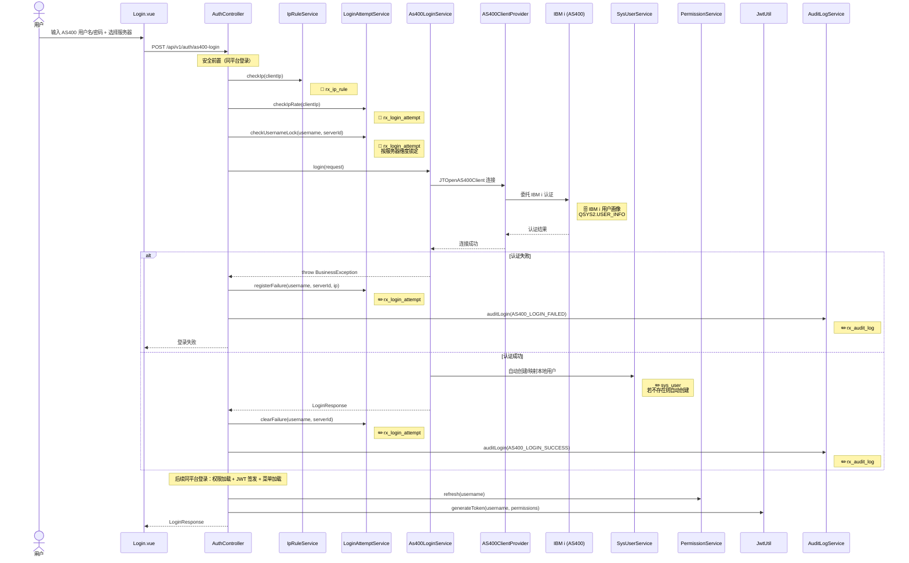
```mermaid
sequenceDiagram
    actor U as 用户
    participant Login as Login.vue
    participant Auth as AuthController
    participant IpRule as IpRuleService
    participant LoginAttempt as LoginAttemptService
    participant As400Login as As400LoginService
    participant AS400Client as AS400ClientProvider
    participant IBMi as IBM i (AS400)
    participant UserSvc as SysUserService
    participant PermSvc as PermissionService
    participant JWT as JwtUtil
    participant AuditLog as AuditLogService

    U->>Login: 输入 AS400 用户名/密码 + 选择服务器
    Login->>Auth: POST /api/v1/auth/as400-login

    Note over Auth: 安全前置（同平台登录）
    Auth->>IpRule: checkIp(clientIp)
    Note right of IpRule: 📖 rx_ip_rule
    Auth->>LoginAttempt: checkIpRate(clientIp)
    Note right of LoginAttempt: 📖 rx_login_attempt
    Auth->>LoginAttempt: checkUsernameLock(username, serverId)
    Note right of LoginAttempt: 📖 rx_login_attempt<br/>按服务器维度锁定

    Auth->>As400Login: login(request)
    As400Login->>AS400Client: JTOpenAS400Client 连接
    AS400Client->>IBMi: 委托 IBM i 认证
    Note right of IBMi: 🗄️ IBM i 用户画像<br/>QSYS2.USER_INFO
    IBMi-->>AS400Client: 认证结果
    AS400Client-->>As400Login: 连接成功

    alt 认证失败
        As400Login-->>Auth: throw BusinessException
        Auth->>LoginAttempt: registerFailure(username, serverId, ip)
        Note right of LoginAttempt: ✏️ rx_login_attempt
        Auth->>AuditLog: auditLogin(AS400_LOGIN_FAILED)
        Note right of AuditLog: ✏️ rx_audit_log
        Auth-->>Login: 登录失败
    else 认证成功
        As400Login->>UserSvc: 自动创建/映射本地用户
        Note right of UserSvc: ✏️ sys_user<br/>若不存在则自动创建
        As400Login-->>Auth: LoginResponse
        Auth->>LoginAttempt: clearFailure(username, serverId)
        Note right of LoginAttempt: ✏️ rx_login_attempt
        Auth->>AuditLog: auditLogin(AS400_LOGIN_SUCCESS)
        Note right of AuditLog: ✏️ rx_audit_log
    end

    Note over Auth: 后续同平台登录：权限加载 + JWT 签发 + 菜单加载
    Auth->>PermSvc: refresh(username)
    Auth->>JWT: generateToken(username, permissions)
    Auth-->>Login: LoginResponse
```

### 1.4 登出流程（POST /api/v1/auth/logout）

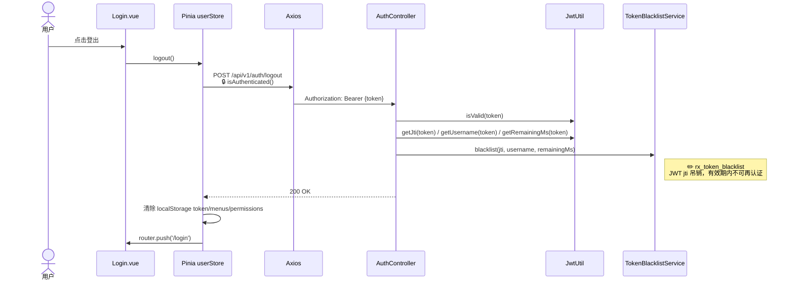
```mermaid
sequenceDiagram
    actor U as 用户
    participant Login as Login.vue
    participant Pinia as Pinia userStore
    participant Axios as Axios
    participant Auth as AuthController
    participant JWT as JwtUtil
    participant Blacklist as TokenBlacklistService

    U->>Login: 点击登出
    Login->>Pinia: logout()
    Pinia->>Axios: POST /api/v1/auth/logout<br/>🔒 isAuthenticated()
    Axios->>Auth: Authorization: Bearer {token}

    Auth->>JWT: isValid(token)
    Auth->>JWT: getJti(token) / getUsername(token) / getRemainingMs(token)
    Auth->>Blacklist: blacklist(jti, username, remainingMs)
    Note right of Blacklist: ✏️ rx_token_blacklist<br/>JWT jti 吊销，有效期内不可再认证

    Auth-->>Pinia: 200 OK
    Pinia->>Pinia: 清除 localStorage token/menus/permissions
    Pinia->>Login: router.push('/login')
```

---

## 二、Dashboard 仪表盘

### 2.1 仪表盘加载流程

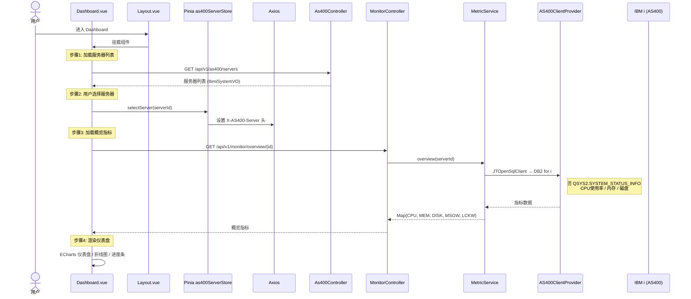
```mermaid
sequenceDiagram
    actor U as 用户
    participant Dashboard as Dashboard.vue
    participant Layout as Layout.vue
    participant Pinia as Pinia as400ServerStore
    participant Axios as Axios
    participant As400Ctrl as As400Controller
    participant MonitorCtrl as MonitorController
    participant MetricSvc as MetricService
    participant AS400Client as AS400ClientProvider
    participant IBMi as IBM i (AS400)

    U->>Layout: 进入 Dashboard
    Layout->>Dashboard: 挂载组件

    Note over Dashboard: 步骤1: 加载服务器列表
    Dashboard->>As400Ctrl: GET /api/v1/as400/servers
    As400Ctrl-->>Dashboard: 服务器列表 (IbmiSystemVO)

    Note over Dashboard: 步骤2: 用户选择服务器
    Dashboard->>Pinia: selectServer(serverId)
    Pinia->>Axios: 设置 X-AS400-Server 头

    Note over Dashboard: 步骤3: 加载概览指标
    Dashboard->>MonitorCtrl: GET /api/v1/monitor/overview/{id}
    MonitorCtrl->>MetricSvc: overview(serverId)
    MetricSvc->>AS400Client: JTOpenSqlClient → DB2 for i
    Note right of AS400Client: 🗄️ QSYS2.SYSTEM_STATUS_INFO<br/>CPU使用率 / 内存 / 磁盘
    AS400Client-->>MetricSvc: 指标数据
    MetricSvc-->>MonitorCtrl: Map(CPU, MEM, DISK, MSGW, LCKW)
    MonitorCtrl-->>Dashboard: 概览指标

    Note over Dashboard: 步骤4: 渲染仪表盘
    Dashboard->>Dashboard: ECharts 仪表盘 / 折线图 / 进度条
```

---

## 三、Job 作业中心

### 3.1 活动作业列表（GET /api/v1/jobs）

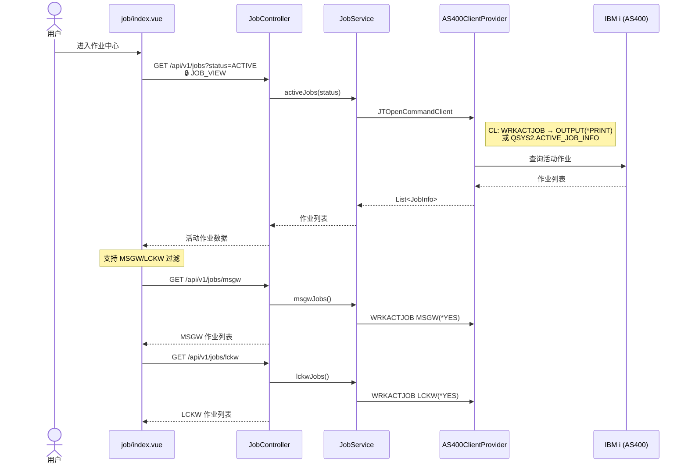
```mermaid
sequenceDiagram
    actor U as 用户
    participant JobView as job/index.vue
    participant JobCtrl as JobController
    participant JobSvc as JobService
    participant AS400Client as AS400ClientProvider
    participant IBMi as IBM i (AS400)

    U->>JobView: 进入作业中心
    JobView->>JobCtrl: GET /api/v1/jobs?status=ACTIVE<br/>🔒 JOB_VIEW
    JobCtrl->>JobSvc: activeJobs(status)
    JobSvc->>AS400Client: JTOpenCommandClient
    Note right of AS400Client: CL: WRKACTJOB → OUTPUT(*PRINT)<br/>或 QSYS2.ACTIVE_JOB_INFO
    AS400Client->>IBMi: 查询活动作业
    IBMi-->>AS400Client: 作业列表
    AS400Client-->>JobSvc: List<JobInfo>
    JobSvc-->>JobCtrl: 作业列表
    JobCtrl-->>JobView: 活动作业数据

    Note over JobView: 支持 MSGW/LCKW 过滤
    JobView->>JobCtrl: GET /api/v1/jobs/msgw
    JobCtrl->>JobSvc: msgwJobs()
    JobSvc->>AS400Client: WRKACTJOB MSGW(*YES)
    JobCtrl-->>JobView: MSGW 作业列表

    JobView->>JobCtrl: GET /api/v1/jobs/lckw
    JobCtrl->>JobSvc: lckwJobs()
    JobSvc->>AS400Client: WRKACTJOB LCKW(*YES)
    JobCtrl-->>JobView: LCKW 作业列表
```

### 3.2 作业控制与日志（ENDJOB/HLDJOB/RLSJOB/DSPJOBLOG/MSGW应答）

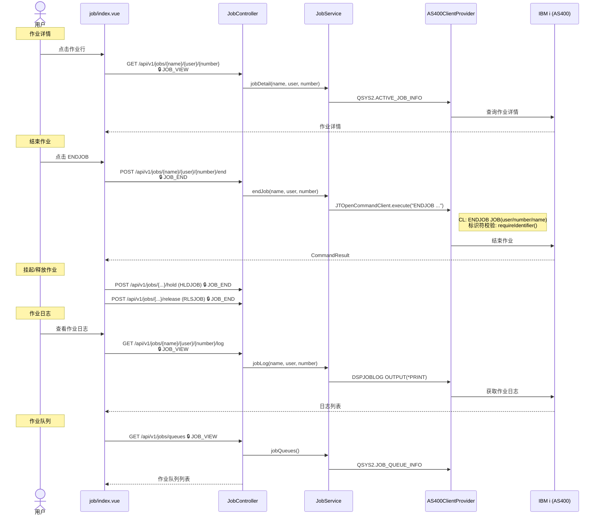
```mermaid
sequenceDiagram
    actor U as 用户
    participant JobView as job/index.vue
    participant JobCtrl as JobController
    participant JobSvc as JobService
    participant AS400Client as AS400ClientProvider
    participant IBMi as IBM i (AS400)

    Note over U: 作业详情
    U->>JobView: 点击作业行
    JobView->>JobCtrl: GET /api/v1/jobs/{name}/{user}/{number}<br/>🔒 JOB_VIEW
    JobCtrl->>JobSvc: jobDetail(name, user, number)
    JobSvc->>AS400Client: QSYS2.ACTIVE_JOB_INFO
    AS400Client->>IBMi: 查询作业详情
    IBMi-->>JobView: 作业详情

    Note over U: 结束作业
    U->>JobView: 点击 ENDJOB
    JobView->>JobCtrl: POST /api/v1/jobs/{name}/{user}/{number}/end<br/>🔒 JOB_END
    JobCtrl->>JobSvc: endJob(name, user, number)
    JobSvc->>AS400Client: JTOpenCommandClient.execute("ENDJOB ...")
    Note right of AS400Client: CL: ENDJOB JOB(user/number/name)<br/>标识符校验: requireIdentifier()
    AS400Client->>IBMi: 结束作业
    IBMi-->>JobView: CommandResult

    Note over U: 挂起/释放作业
    JobView->>JobCtrl: POST /api/v1/jobs/{...}/hold (HLDJOB) 🔒 JOB_END
    JobView->>JobCtrl: POST /api/v1/jobs/{...}/release (RLSJOB) 🔒 JOB_END

    Note over U: 作业日志
    U->>JobView: 查看作业日志
    JobView->>JobCtrl: GET /api/v1/jobs/{name}/{user}/{number}/log<br/>🔒 JOB_VIEW
    JobCtrl->>JobSvc: jobLog(name, user, number)
    JobSvc->>AS400Client: DSPJOBLOG OUTPUT(*PRINT)
    AS400Client->>IBMi: 获取作业日志
    IBMi-->>JobView: 日志列表

    Note over U: 作业队列
    JobView->>JobCtrl: GET /api/v1/jobs/queues 🔒 JOB_VIEW
    JobCtrl->>JobSvc: jobQueues()
    JobSvc->>AS400Client: QSYS2.JOB_QUEUE_INFO
    JobCtrl-->>JobView: 作业队列列表
```

### 3.3 SPOOL 文件与管理

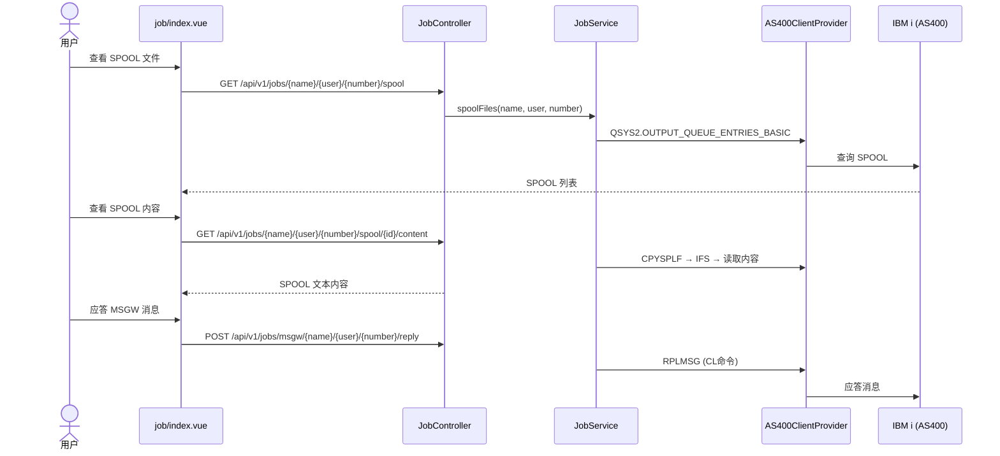
```mermaid
sequenceDiagram
    actor U as 用户
    participant JobView as job/index.vue
    participant JobCtrl as JobController
    participant JobSvc as JobService
    participant AS400Client as AS400ClientProvider
    participant IBMi as IBM i (AS400)

    U->>JobView: 查看 SPOOL 文件
    JobView->>JobCtrl: GET /api/v1/jobs/{name}/{user}/{number}/spool
    JobCtrl->>JobSvc: spoolFiles(name, user, number)
    JobSvc->>AS400Client: QSYS2.OUTPUT_QUEUE_ENTRIES_BASIC
    AS400Client->>IBMi: 查询 SPOOL
    IBMi-->>JobView: SPOOL 列表

    U->>JobView: 查看 SPOOL 内容
    JobView->>JobCtrl: GET /api/v1/jobs/{name}/{user}/{number}/spool/{id}/content
    JobSvc->>AS400Client: CPYSPLF → IFS → 读取内容
    JobCtrl-->>JobView: SPOOL 文本内容

    U->>JobView: 应答 MSGW 消息
    JobView->>JobCtrl: POST /api/v1/jobs/msgw/{name}/{user}/{number}/reply
    JobSvc->>AS400Client: RPLMSG (CL命令)
    AS400Client->>IBMi: 应答消息
```

### 3.4 Job SLA 与依赖

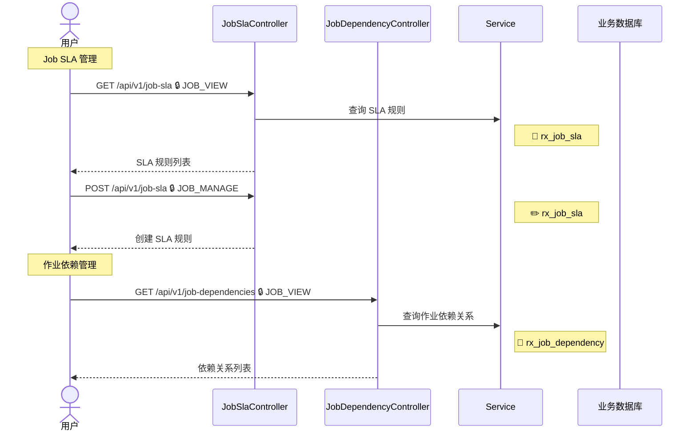
```mermaid
sequenceDiagram
    actor U as 用户
    participant JobCtrl as JobSlaController
    participant JobDepCtrl as JobDependencyController
    participant Svc as Service
    participant DB as 业务数据库

    Note over U: Job SLA 管理
    U->>JobCtrl: GET /api/v1/job-sla 🔒 JOB_VIEW
    JobCtrl->>Svc: 查询 SLA 规则
    Note right of Svc: 📖 rx_job_sla
    JobCtrl-->>U: SLA 规则列表

    U->>JobCtrl: POST /api/v1/job-sla 🔒 JOB_MANAGE
    Note right of Svc: ✏️ rx_job_sla
    JobCtrl-->>U: 创建 SLA 规则

    Note over U: 作业依赖管理
    U->>JobDepCtrl: GET /api/v1/job-dependencies 🔒 JOB_VIEW
    JobDepCtrl->>Svc: 查询作业依赖关系
    Note right of Svc: 📖 rx_job_dependency
    JobDepCtrl-->>U: 依赖关系列表
```

---

## 四、Monitor 监控中心

### 4.1 监控概览与指标历史

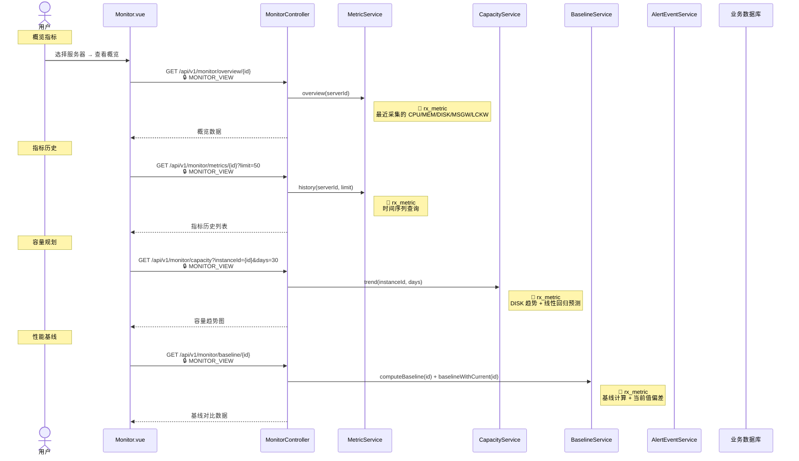
```mermaid
sequenceDiagram
    actor U as 用户
    participant Monitor as Monitor.vue
    participant MonitorCtrl as MonitorController
    participant MetricSvc as MetricService
    participant CapacitySvc as CapacityService
    participant BaselineSvc as BaselineService
    participant AlertSvc as AlertEventService
    participant DB as 业务数据库

    Note over U: 概览指标
    U->>Monitor: 选择服务器 → 查看概览
    Monitor->>MonitorCtrl: GET /api/v1/monitor/overview/{id}<br/>🔒 MONITOR_VIEW
    MonitorCtrl->>MetricSvc: overview(serverId)
    Note right of MetricSvc: 📖 rx_metric<br/>最近采集的 CPU/MEM/DISK/MSGW/LCKW
    MonitorCtrl-->>Monitor: 概览数据

    Note over U: 指标历史
    Monitor->>MonitorCtrl: GET /api/v1/monitor/metrics/{id}?limit=50<br/>🔒 MONITOR_VIEW
    MonitorCtrl->>MetricSvc: history(serverId, limit)
    Note right of MetricSvc: 📖 rx_metric<br/>时间序列查询
    MonitorCtrl-->>Monitor: 指标历史列表

    Note over U: 容量规划
    Monitor->>MonitorCtrl: GET /api/v1/monitor/capacity?instanceId={id}&days=30<br/>🔒 MONITOR_VIEW
    MonitorCtrl->>CapacitySvc: trend(instanceId, days)
    Note right of CapacitySvc: 📖 rx_metric<br/>DISK 趋势 + 线性回归预测
    MonitorCtrl-->>Monitor: 容量趋势图

    Note over U: 性能基线
    Monitor->>MonitorCtrl: GET /api/v1/monitor/baseline/{id}<br/>🔒 MONITOR_VIEW
    MonitorCtrl->>BaselineSvc: computeBaseline(id) + baselineWithCurrent(id)
    Note right of BaselineSvc: 📖 rx_metric<br/>基线计算 + 当前值偏差
    MonitorCtrl-->>Monitor: 基线对比数据
```

### 4.2 服务器对比与告警

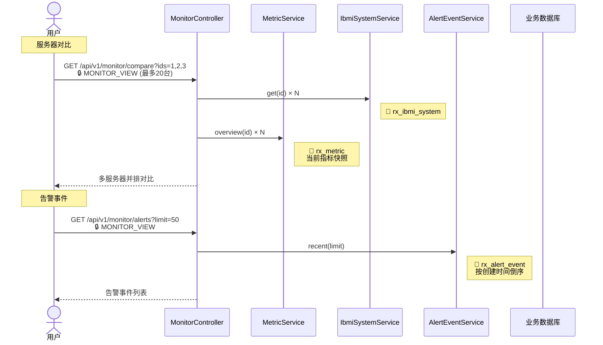
```mermaid
sequenceDiagram
    actor U as 用户
    participant MonitorCtrl as MonitorController
    participant MetricSvc as MetricService
    participant SystemSvc as IbmiSystemService
    participant AlertSvc as AlertEventService
    participant DB as 业务数据库

    Note over U: 服务器对比
    U->>MonitorCtrl: GET /api/v1/monitor/compare?ids=1,2,3<br/>🔒 MONITOR_VIEW (最多20台)
    MonitorCtrl->>SystemSvc: get(id) × N
    Note right of SystemSvc: 📖 rx_ibmi_system
    MonitorCtrl->>MetricSvc: overview(id) × N
    Note right of MetricSvc: 📖 rx_metric<br/>当前指标快照
    MonitorCtrl-->>U: 多服务器并排对比

    Note over U: 告警事件
    U->>MonitorCtrl: GET /api/v1/monitor/alerts?limit=50<br/>🔒 MONITOR_VIEW
    MonitorCtrl->>AlertSvc: recent(limit)
    Note right of AlertSvc: 📖 rx_alert_event<br/>按创建时间倒序
    MonitorCtrl-->>U: 告警事件列表
```

### 4.3 告警规则管理

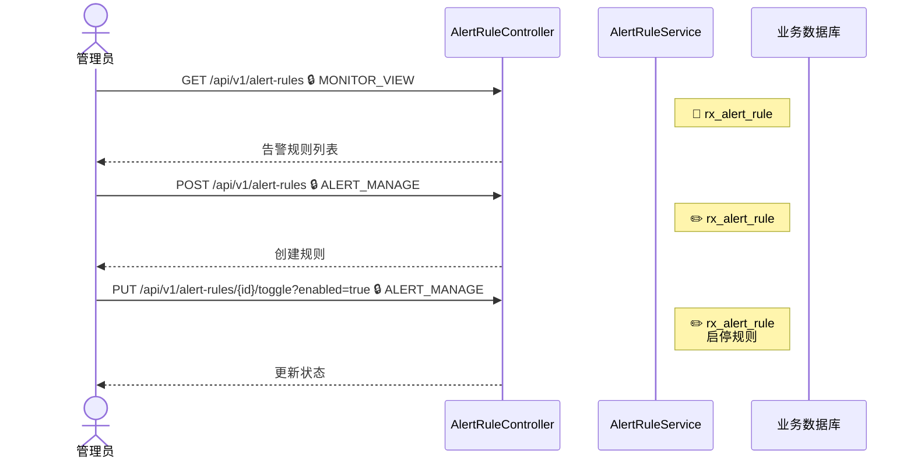
```mermaid
sequenceDiagram
    actor U as 管理员
    participant AlertRuleCtrl as AlertRuleController
    participant AlertRuleSvc as AlertRuleService
    participant DB as 业务数据库

    U->>AlertRuleCtrl: GET /api/v1/alert-rules 🔒 MONITOR_VIEW
    Note right of AlertRuleSvc: 📖 rx_alert_rule
    AlertRuleCtrl-->>U: 告警规则列表

    U->>AlertRuleCtrl: POST /api/v1/alert-rules 🔒 ALERT_MANAGE
    Note right of AlertRuleSvc: ✏️ rx_alert_rule
    AlertRuleCtrl-->>U: 创建规则

    U->>AlertRuleCtrl: PUT /api/v1/alert-rules/{id}/toggle?enabled=true 🔒 ALERT_MANAGE
    Note right of AlertRuleSvc: ✏️ rx_alert_rule<br/>启停规则
    AlertRuleCtrl-->>U: 更新状态
```

### 4.4 巡检（Inspection）

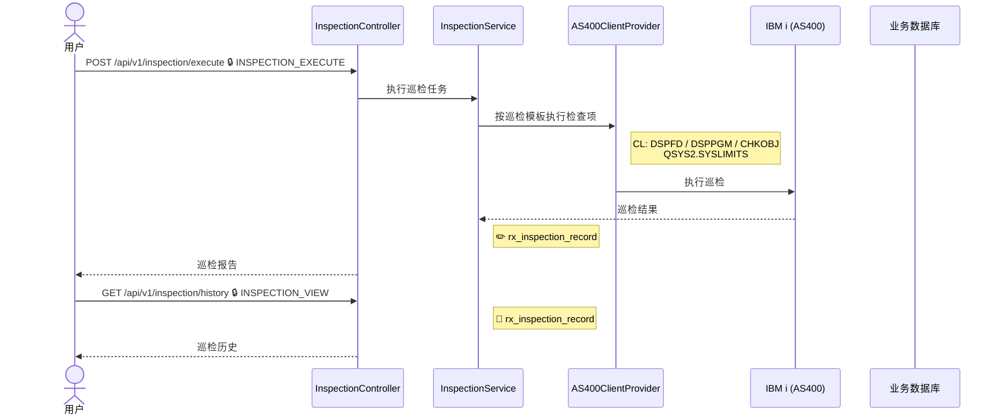
```mermaid
sequenceDiagram
    actor U as 用户
    participant InspectionCtrl as InspectionController
    participant Svc as InspectionService
    participant AS400Client as AS400ClientProvider
    participant IBMi as IBM i (AS400)
    participant DB as 业务数据库

    U->>InspectionCtrl: POST /api/v1/inspection/execute 🔒 INSPECTION_EXECUTE
    InspectionCtrl->>Svc: 执行巡检任务
    Svc->>AS400Client: 按巡检模板执行检查项
    Note right of AS400Client: CL: DSPFD / DSPPGM / CHKOBJ<br/>QSYS2.SYSLIMITS
    AS400Client->>IBMi: 执行巡检
    IBMi-->>Svc: 巡检结果
    Note right of Svc: ✏️ rx_inspection_record
    InspectionCtrl-->>U: 巡检报告

    U->>InspectionCtrl: GET /api/v1/inspection/history 🔒 INSPECTION_VIEW
    Note right of Svc: 📖 rx_inspection_record
    InspectionCtrl-->>U: 巡检历史
```

---

## 五、SQL 查询与业务数据

### 5.1 SQL 查询执行（POST /api/v1/query/execute）

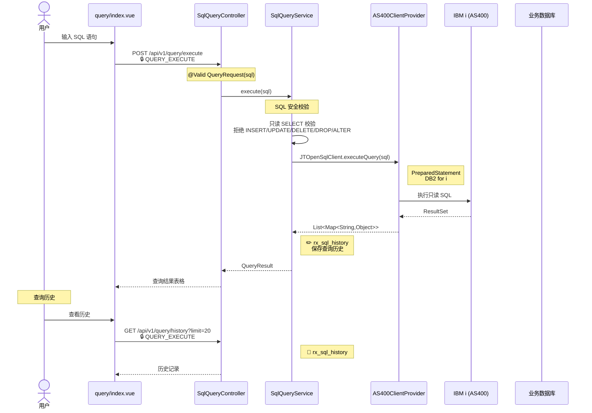
```mermaid
sequenceDiagram
    actor U as 用户
    participant QueryView as query/index.vue
    participant QueryCtrl as SqlQueryController
    participant QuerySvc as SqlQueryService
    participant AS400Client as AS400ClientProvider
    participant IBMi as IBM i (AS400)
    participant DB as 业务数据库

    U->>QueryView: 输入 SQL 语句
    QueryView->>QueryCtrl: POST /api/v1/query/execute<br/>🔒 QUERY_EXECUTE
    Note over QueryCtrl: @Valid QueryRequest(sql)
    QueryCtrl->>QuerySvc: execute(sql)

    Note over QuerySvc: SQL 安全校验
    QuerySvc->>QuerySvc: 只读 SELECT 校验<br/>拒绝 INSERT/UPDATE/DELETE/DROP/ALTER
    QuerySvc->>AS400Client: JTOpenSqlClient.executeQuery(sql)
    Note right of AS400Client: PreparedStatement<br/>DB2 for i
    AS400Client->>IBMi: 执行只读 SQL
    IBMi-->>AS400Client: ResultSet
    AS400Client-->>QuerySvc: List<Map<String,Object>>

    Note right of QuerySvc: ✏️ rx_sql_history<br/>保存查询历史
    QuerySvc-->>QueryCtrl: QueryResult
    QueryCtrl-->>QueryView: 查询结果表格

    Note over U: 查询历史
    U->>QueryView: 查看历史
    QueryView->>QueryCtrl: GET /api/v1/query/history?limit=20<br/>🔒 QUERY_EXECUTE
    Note right of QuerySvc: 📖 rx_sql_history
    QueryCtrl-->>QueryView: 历史记录
```

### 5.2 业务数据浏览（GET /api/v1/business/*）

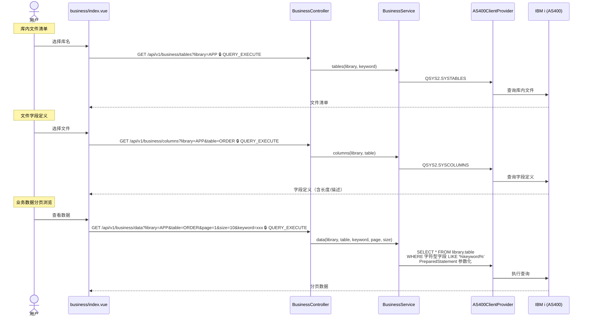
```mermaid
sequenceDiagram
    actor U as 用户
    participant BizView as business/index.vue
    participant BizCtrl as BusinessController
    participant BizSvc as BusinessService
    participant AS400Client as AS400ClientProvider
    participant IBMi as IBM i (AS400)

    Note over U: 库内文件清单
    U->>BizView: 选择库名
    BizView->>BizCtrl: GET /api/v1/business/tables?library=APP 🔒 QUERY_EXECUTE
    BizCtrl->>BizSvc: tables(library, keyword)
    BizSvc->>AS400Client: QSYS2.SYSTABLES
    AS400Client->>IBMi: 查询库内文件
    IBMi-->>BizView: 文件清单

    Note over U: 文件字段定义
    U->>BizView: 选择文件
    BizView->>BizCtrl: GET /api/v1/business/columns?library=APP&table=ORDER 🔒 QUERY_EXECUTE
    BizCtrl->>BizSvc: columns(library, table)
    BizSvc->>AS400Client: QSYS2.SYSCOLUMNS
    AS400Client->>IBMi: 查询字段定义
    IBMi-->>BizView: 字段定义（含长度/描述）

    Note over U: 业务数据分页浏览
    U->>BizView: 查看数据
    BizView->>BizCtrl: GET /api/v1/business/data?library=APP&table=ORDER&page=1&size=10&keyword=xxx 🔒 QUERY_EXECUTE
    BizCtrl->>BizSvc: data(library, table, keyword, page, size)
    BizSvc->>AS400Client: SELECT * FROM library.table<br/>WHERE 字符型字段 LIKE '%keyword%'<br/>PreparedStatement 参数化
    AS400Client->>IBMi: 执行查询
    IBMi-->>BizView: 分页数据
```

---

## 六、AS400 工具集

### 6.1 IFS 文件管理（GET/POST /api/v1/ifs/*）

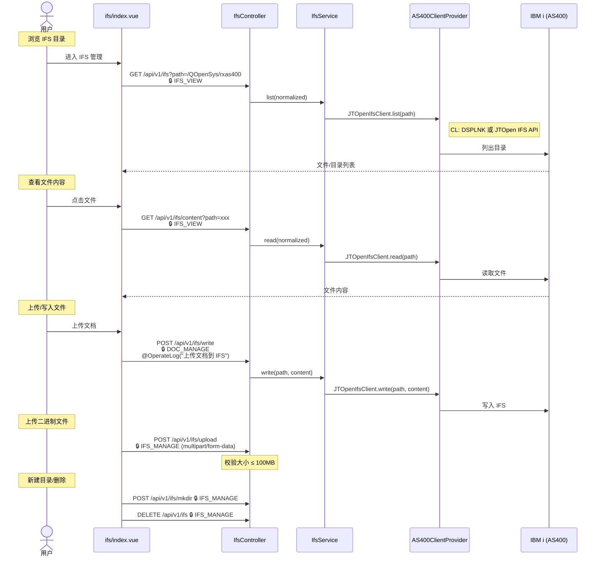
```mermaid
sequenceDiagram
    actor U as 用户
    participant IfsView as ifs/index.vue
    participant IfsCtrl as IfsController
    participant IfsSvc as IfsService
    participant AS400Client as AS400ClientProvider
    participant IBMi as IBM i (AS400)

    Note over U: 浏览 IFS 目录
    U->>IfsView: 进入 IFS 管理
    IfsView->>IfsCtrl: GET /api/v1/ifs?path=/QOpenSys/rxas400<br/>🔒 IFS_VIEW
    IfsCtrl->>IfsSvc: list(normalized)
    IfsSvc->>AS400Client: JTOpenIfsClient.list(path)
    Note right of AS400Client: CL: DSPLNK 或 JTOpen IFS API
    AS400Client->>IBMi: 列出目录
    IBMi-->>IfsView: 文件/目录列表

    Note over U: 查看文件内容
    U->>IfsView: 点击文件
    IfsView->>IfsCtrl: GET /api/v1/ifs/content?path=xxx<br/>🔒 IFS_VIEW
    IfsCtrl->>IfsSvc: read(normalized)
    IfsSvc->>AS400Client: JTOpenIfsClient.read(path)
    AS400Client->>IBMi: 读取文件
    IBMi-->>IfsView: 文件内容

    Note over U: 上传/写入文件
    U->>IfsView: 上传文档
    IfsView->>IfsCtrl: POST /api/v1/ifs/write<br/>🔒 DOC_MANAGE<br/>@OperateLog("上传文档到 IFS")
    IfsCtrl->>IfsSvc: write(path, content)
    IfsSvc->>AS400Client: JTOpenIfsClient.write(path, content)
    AS400Client->>IBMi: 写入 IFS

    Note over U: 上传二进制文件
    IfsView->>IfsCtrl: POST /api/v1/ifs/upload<br/>🔒 IFS_MANAGE (multipart/form-data)
    Note over IfsCtrl: 校验大小 ≤ 100MB

    Note over U: 新建目录/删除
    IfsView->>IfsCtrl: POST /api/v1/ifs/mkdir 🔒 IFS_MANAGE
    IfsView->>IfsCtrl: DELETE /api/v1/ifs 🔒 IFS_MANAGE
```

### 6.2 对象管理（GET /api/v1/objects/*）

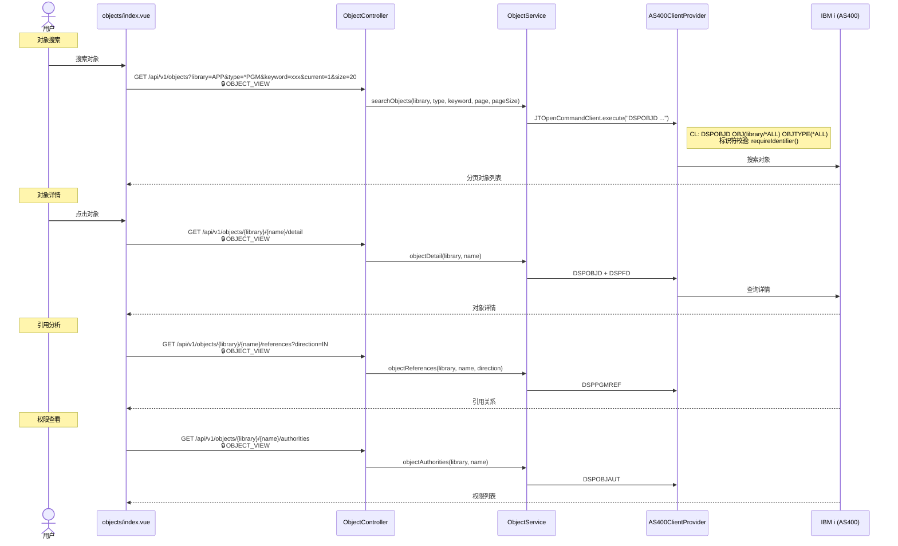
```mermaid
sequenceDiagram
    actor U as 用户
    participant ObjView as objects/index.vue
    participant ObjCtrl as ObjectController
    participant ObjSvc as ObjectService
    participant AS400Client as AS400ClientProvider
    participant IBMi as IBM i (AS400)

    Note over U: 对象搜索
    U->>ObjView: 搜索对象
    ObjView->>ObjCtrl: GET /api/v1/objects?library=APP&type=*PGM&keyword=xxx&current=1&size=20<br/>🔒 OBJECT_VIEW
    ObjCtrl->>ObjSvc: searchObjects(library, type, keyword, page, pageSize)
    ObjSvc->>AS400Client: JTOpenCommandClient.execute("DSPOBJD ...")
    Note right of AS400Client: CL: DSPOBJD OBJ(library/*ALL) OBJTYPE(*ALL)<br/>标识符校验: requireIdentifier()
    AS400Client->>IBMi: 搜索对象
    IBMi-->>ObjView: 分页对象列表

    Note over U: 对象详情
    U->>ObjView: 点击对象
    ObjView->>ObjCtrl: GET /api/v1/objects/{library}/{name}/detail<br/>🔒 OBJECT_VIEW
    ObjCtrl->>ObjSvc: objectDetail(library, name)
    ObjSvc->>AS400Client: DSPOBJD + DSPFD
    AS400Client->>IBMi: 查询详情
    IBMi-->>ObjView: 对象详情

    Note over U: 引用分析
    ObjView->>ObjCtrl: GET /api/v1/objects/{library}/{name}/references?direction=IN<br/>🔒 OBJECT_VIEW
    ObjCtrl->>ObjSvc: objectReferences(library, name, direction)
    ObjSvc->>AS400Client: DSPPGMREF
    IBMi-->>ObjView: 引用关系

    Note over U: 权限查看
    ObjView->>ObjCtrl: GET /api/v1/objects/{library}/{name}/authorities<br/>🔒 OBJECT_VIEW
    ObjCtrl->>ObjSvc: objectAuthorities(library, name)
    ObjSvc->>AS400Client: DSPOBJAUT
    IBMi-->>ObjView: 权限列表
```

### 6.3 PF 物理文件浏览（GET /api/v1/pf/*）

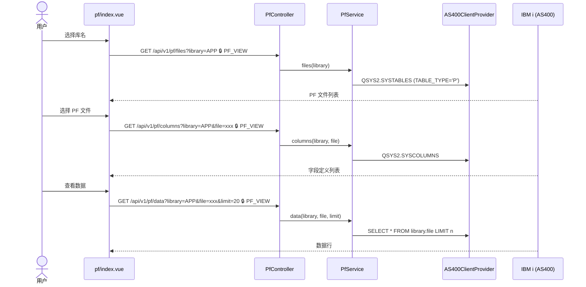
```mermaid
sequenceDiagram
    actor U as 用户
    participant PfView as pf/index.vue
    participant PfCtrl as PfController
    participant PfSvc as PfService
    participant AS400Client as AS400ClientProvider
    participant IBMi as IBM i (AS400)

    U->>PfView: 选择库名
    PfView->>PfCtrl: GET /api/v1/pf/files?library=APP 🔒 PF_VIEW
    PfCtrl->>PfSvc: files(library)
    PfSvc->>AS400Client: QSYS2.SYSTABLES (TABLE_TYPE='P')
    IBMi-->>PfView: PF 文件列表

    U->>PfView: 选择 PF 文件
    PfView->>PfCtrl: GET /api/v1/pf/columns?library=APP&file=xxx 🔒 PF_VIEW
    PfCtrl->>PfSvc: columns(library, file)
    PfSvc->>AS400Client: QSYS2.SYSCOLUMNS
    IBMi-->>PfView: 字段定义列表

    U->>PfView: 查看数据
    PfView->>PfCtrl: GET /api/v1/pf/data?library=APP&file=xxx&limit=20 🔒 PF_VIEW
    PfCtrl->>PfSvc: data(library, file, limit)
    PfSvc->>AS400Client: SELECT * FROM library.file LIMIT n
    IBMi-->>PfView: 数据行
```

### 6.4 子系统管理（GET/POST /api/v1/subsystems/*）

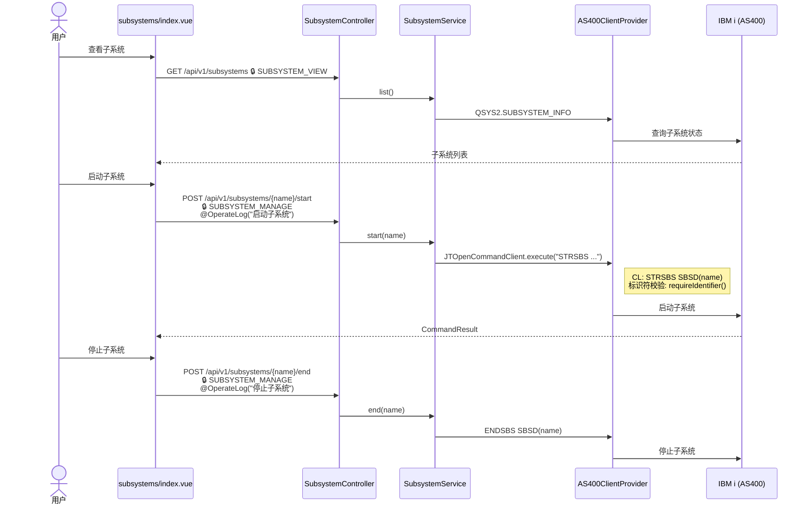
```mermaid
sequenceDiagram
    actor U as 用户
    participant SubsysView as subsystems/index.vue
    participant SubsysCtrl as SubsystemController
    participant SubsysSvc as SubsystemService
    participant AS400Client as AS400ClientProvider
    participant IBMi as IBM i (AS400)

    U->>SubsysView: 查看子系统
    SubsysView->>SubsysCtrl: GET /api/v1/subsystems 🔒 SUBSYSTEM_VIEW
    SubsysCtrl->>SubsysSvc: list()
    SubsysSvc->>AS400Client: QSYS2.SUBSYSTEM_INFO
    AS400Client->>IBMi: 查询子系统状态
    IBMi-->>SubsysView: 子系统列表

    U->>SubsysView: 启动子系统
    SubsysView->>SubsysCtrl: POST /api/v1/subsystems/{name}/start<br/>🔒 SUBSYSTEM_MANAGE<br/>@OperateLog("启动子系统")
    SubsysCtrl->>SubsysSvc: start(name)
    SubsysSvc->>AS400Client: JTOpenCommandClient.execute("STRSBS ...")
    Note right of AS400Client: CL: STRSBS SBSD(name)<br/>标识符校验: requireIdentifier()
    AS400Client->>IBMi: 启动子系统
    IBMi-->>SubsysView: CommandResult

    U->>SubsysView: 停止子系统
    SubsysView->>SubsysCtrl: POST /api/v1/subsystems/{name}/end<br/>🔒 SUBSYSTEM_MANAGE<br/>@OperateLog("停止子系统")
    SubsysCtrl->>SubsysSvc: end(name)
    SubsysSvc->>AS400Client: ENDSBS SBSD(name)
    AS400Client->>IBMi: 停止子系统
```

### 6.5 命令脚本中心（GET/POST /api/v1/scripts/*）

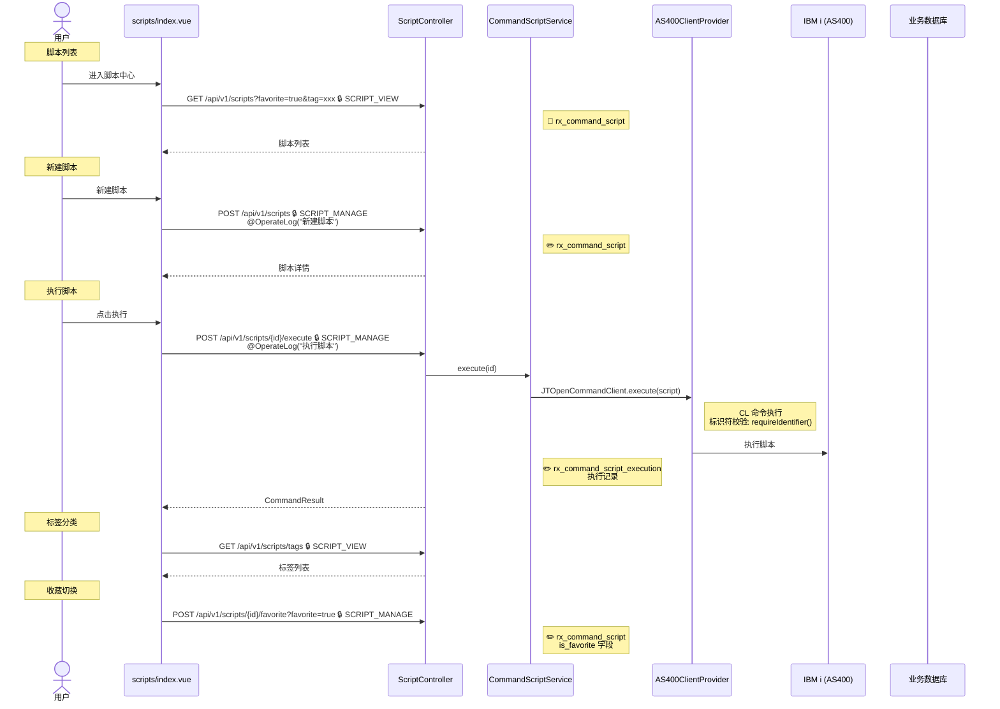
```mermaid
sequenceDiagram
    actor U as 用户
    participant ScriptView as scripts/index.vue
    participant ScriptCtrl as ScriptController
    participant ScriptSvc as CommandScriptService
    participant AS400Client as AS400ClientProvider
    participant IBMi as IBM i (AS400)
    participant DB as 业务数据库

    Note over U: 脚本列表
    U->>ScriptView: 进入脚本中心
    ScriptView->>ScriptCtrl: GET /api/v1/scripts?favorite=true&tag=xxx 🔒 SCRIPT_VIEW
    Note right of ScriptSvc: 📖 rx_command_script
    ScriptCtrl-->>ScriptView: 脚本列表

    Note over U: 新建脚本
    U->>ScriptView: 新建脚本
    ScriptView->>ScriptCtrl: POST /api/v1/scripts 🔒 SCRIPT_MANAGE<br/>@OperateLog("新建脚本")
    Note right of ScriptSvc: ✏️ rx_command_script
    ScriptCtrl-->>ScriptView: 脚本详情

    Note over U: 执行脚本
    U->>ScriptView: 点击执行
    ScriptView->>ScriptCtrl: POST /api/v1/scripts/{id}/execute 🔒 SCRIPT_MANAGE<br/>@OperateLog("执行脚本")
    ScriptCtrl->>ScriptSvc: execute(id)
    ScriptSvc->>AS400Client: JTOpenCommandClient.execute(script)
    Note right of AS400Client: CL 命令执行<br/>标识符校验: requireIdentifier()
    AS400Client->>IBMi: 执行脚本
    Note right of ScriptSvc: ✏️ rx_command_script_execution<br/>执行记录
    ScriptCtrl-->>ScriptView: CommandResult

    Note over U: 标签分类
    ScriptView->>ScriptCtrl: GET /api/v1/scripts/tags 🔒 SCRIPT_VIEW
    ScriptCtrl-->>ScriptView: 标签列表

    Note over U: 收藏切换
    ScriptView->>ScriptCtrl: POST /api/v1/scripts/{id}/favorite?favorite=true 🔒 SCRIPT_MANAGE
    Note right of ScriptSvc: ✏️ rx_command_script<br/>is_favorite 字段
```

### 6.6 作业调度中心（GET/POST /api/v1/schedules/*）

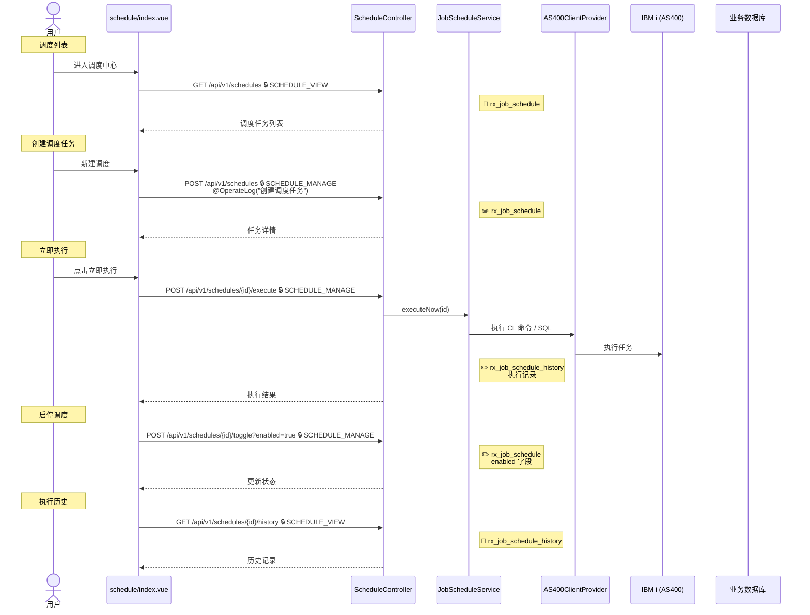
```mermaid
sequenceDiagram
    actor U as 用户
    participant SchedView as schedule/index.vue
    participant SchedCtrl as ScheduleController
    participant SchedSvc as JobScheduleService
    participant AS400Client as AS400ClientProvider
    participant IBMi as IBM i (AS400)
    participant DB as 业务数据库

    Note over U: 调度列表
    U->>SchedView: 进入调度中心
    SchedView->>SchedCtrl: GET /api/v1/schedules 🔒 SCHEDULE_VIEW
    Note right of SchedSvc: 📖 rx_job_schedule
    SchedCtrl-->>SchedView: 调度任务列表

    Note over U: 创建调度任务
    U->>SchedView: 新建调度
    SchedView->>SchedCtrl: POST /api/v1/schedules 🔒 SCHEDULE_MANAGE<br/>@OperateLog("创建调度任务")
    Note right of SchedSvc: ✏️ rx_job_schedule
    SchedCtrl-->>SchedView: 任务详情

    Note over U: 立即执行
    U->>SchedView: 点击立即执行
    SchedView->>SchedCtrl: POST /api/v1/schedules/{id}/execute 🔒 SCHEDULE_MANAGE
    SchedCtrl->>SchedSvc: executeNow(id)
    SchedSvc->>AS400Client: 执行 CL 命令 / SQL
    AS400Client->>IBMi: 执行任务
    Note right of SchedSvc: ✏️ rx_job_schedule_history<br/>执行记录
    SchedCtrl-->>SchedView: 执行结果

    Note over U: 启停调度
    SchedView->>SchedCtrl: POST /api/v1/schedules/{id}/toggle?enabled=true 🔒 SCHEDULE_MANAGE
    Note right of SchedSvc: ✏️ rx_job_schedule<br/>enabled 字段
    SchedCtrl-->>SchedView: 更新状态

    Note over U: 执行历史
    SchedView->>SchedCtrl: GET /api/v1/schedules/{id}/history 🔒 SCHEDULE_VIEW
    Note right of SchedSvc: 📖 rx_job_schedule_history
    SchedCtrl-->>SchedView: 历史记录
```

### 6.7 执行历史审计（GET /api/v1/executions）

```mermaid
sequenceDiagram
    actor U as 用户
    participant ExecView as executions/index.vue
    participant ExecCtrl as ExecutionController
    participant ExecSvc as ExecutionService
    participant DB as 业务数据库

    U->>ExecView: 进入执行历史
    ExecView->>ExecCtrl: GET /api/v1/executions?type=schedule&status=SUCCESS&keyword=xxx&current=1&size=20<br/>🔒 EXECUTION_VIEW
    ExecCtrl->>ExecSvc: scheduleExecutions / scriptExecutions
    Note right of ExecSvc: 📖 rx_job_schedule_history<br/>📖 rx_command_script_execution<br/>合并排序（按 runTime DESC）<br/>后端分页
    ExecCtrl-->>ExecView: 合并执行历史
```

### 6.8 编译中心（POST /api/v1/compile）

```mermaid
sequenceDiagram
    actor U as 用户
    participant CompileView as compile/index.vue
    participant CompileCtrl as CompileController
    participant CompileSvc as CompileService
    participant AS400Client as AS400ClientProvider
    participant IBMi as IBM i (AS400)
    participant DB as 业务数据库

    U->>CompileView: 提交编译请求
    CompileView->>CompileCtrl: POST /api/v1/compile 🔒 COMPILE_EXECUTE<br/>@OperateLog("编译成员")
    Note over CompileCtrl: @Valid CompileRequest
    CompileCtrl->>CompileSvc: compile(request)
    CompileSvc->>AS400Client: JTOpenCommandClient.execute(compile command)
    Note right of AS400Client: CL: CRTBNDRPG / CRTSQLRPGI / CRTCLPGM<br/>CL 命令白名单校验
    AS400Client->>IBMi: 执行编译
    Note right of CompileSvc: ✏️ rx_compile_record<br/>编译记录
    CompileSvc-->>CompileCtrl: CompileRecord
    CompileCtrl-->>CompileView: 编译结果

    U->>CompileView: 查看编译历史
    CompileView->>CompileCtrl: GET /api/v1/compile/history 🔒 COMPILE_EXECUTE
    Note right of CompileSvc: 📖 rx_compile_record
    CompileCtrl-->>CompileView: 编译历史
```

### 6.9 源码浏览（GET /api/v1/source/*）

```mermaid
sequenceDiagram
    actor U as 用户
    participant SourceView as Source.vue
    participant SourceCtrl as SourceController
    participant SourceSvc as SourceService
    participant AS400Client as AS400ClientProvider
    participant IBMi as IBM i (AS400)

    Note over SourceCtrl: 类级别 🔒 SOURCE_VIEW

    U->>SourceView: 浏览源码库
    SourceView->>SourceCtrl: GET /api/v1/source/libraries
    SourceCtrl->>SourceSvc: listLibraries()
    SourceSvc->>AS400Client: QSYS2.SYSTABLES (TABLE_TYPE='S')
    IBMi-->>SourceView: 源码库列表

    U->>SourceView: 选择源码文件
    SourceView->>SourceCtrl: GET /api/v1/source/libraries/{lib}/files
    SourceSvc->>AS400Client: QSYS2.SYSTABLES
    IBMi-->>SourceView: 源码文件列表

    U->>SourceView: 选择成员
    SourceView->>SourceCtrl: GET /api/v1/source/libraries/{lib}/files/{file}/members
    SourceSvc->>AS400Client: QSYS2.SYSPARTITIONSTAT
    IBMi-->>SourceView: 成员列表

    U->>SourceView: 查看源码
    SourceView->>SourceCtrl: GET /api/v1/source/libraries/{lib}/files/{file}/members/{mbr}
    SourceSvc->>AS400Client: 读取源码成员内容
    IBMi-->>SourceView: 源码内容
```

### 6.10 其他工具（拓扑/消息文件/系统值/表字段）

```mermaid
sequenceDiagram
    actor U as 用户
    participant TopologyCtrl as TopologyController
    participant MsgFileCtrl as MessageFileController
    participant SysvalCtrl as SystemValueController
    participant AS400Client as AS400ClientProvider
    participant IBMi as IBM i (AS400)
    participant DB as 业务数据库

    Note over U: 拓扑图
    U->>TopologyCtrl: GET /api/v1/topology 🔒 TOPOLOGY_VIEW
    Note right of TopologyCtrl: 📖 rx_topology_config
    TopologyCtrl-->>U: 拓扑数据

    Note over U: 消息文件
    U->>MsgFileCtrl: GET /api/v1/message-files 🔒 MSGF_VIEW
    MsgFileCtrl->>AS400Client: DSPMSGD
    AS400Client->>IBMi: 查询消息文件
    IBMi-->>U: 消息列表

    Note over U: 系统值
    U->>SysvalCtrl: GET /api/v1/sysvals 🔒 SYSVAL_VIEW
    SysvalCtrl->>AS400Client: QSYS2.SYSTEM_VALUE_INFO
    AS400Client->>IBMi: 查询系统值
    IBMi-->>U: 系统值列表

    Note over U: 表字段详情
    U->>MsgFileCtrl: GET /api/v1/table-fields 🔒 QUERY_EXECUTE
    Note right of AS400Client: QSYS2.SYSCOLUMNS<br/>扩展字段详情
    U->>U: 字段定义页
```

---

## 七、系统管理

### 7.1 用户管理（/api/v1/users/*）

```mermaid
sequenceDiagram
    actor U as 管理员
    participant UserView as system/Users.vue
    participant UserCtrl as SysUserController
    participant UserSvc as SysUserService
    participant UserMenuSvc as UserMenuService
    participant DB as 业务数据库

    Note over U: 用户列表
    U->>UserView: 进入用户管理
    UserView->>UserCtrl: GET /api/v1/users?current=1&size=10&keyword=xxx<br/>🔒 USER_MANAGE
    Note right of UserSvc: 📖 sys_user<br/>分页查询
    UserCtrl-->>UserView: PageResult<UserVO>

    Note over U: 创建用户
    U->>UserView: 新建用户
    UserView->>UserCtrl: POST /api/v1/users 🔒 USER_MANAGE
    Note right of UserSvc: ✏️ sys_user
    UserCtrl-->>UserView: UserVO

    Note over U: 编辑用户
    U->>UserView: 编辑用户
    UserView->>UserCtrl: PUT /api/v1/users/{id} 🔒 USER_MANAGE
    Note right of UserSvc: ✏️ sys_user
    UserCtrl-->>UserView: UserVO

    Note over U: 删除用户
    U->>UserView: 删除用户
    UserView->>UserCtrl: DELETE /api/v1/users/{id} 🔒 USER_MANAGE
    Note right of UserSvc: ✏️ sys_user (逻辑删除)
    UserCtrl-->>UserView: 200 OK

    Note over U: 用户菜单授权
    U->>UserView: 打开授权弹窗
    UserView->>UserCtrl: GET /api/v1/users/{id}/menus/manageable-tree 🔒 USER_MANAGE
    Note right of UserMenuSvc: 📖 rx_menu (排除已拥有)
    UserCtrl-->>UserView: 可分配权限树

    U->>UserView: 勾选菜单 → 保存
    UserView->>UserCtrl: POST /api/v1/users/{id}/menus/add 🔒 USER_MANAGE<br/>@OperateLog("用户菜单授权")
    Note right of UserMenuSvc: ✏️ rx_user_menu<br/>追加授权（幂等）
    UserCtrl-->>UserView: 200 OK

    U->>UserView: 移除授权
    UserView->>UserCtrl: POST /api/v1/users/{id}/menus/remove 🔒 USER_MANAGE<br/>@OperateLog("移除用户菜单授权")
    Note right of UserMenuSvc: ✏️ rx_user_menu<br/>移除（含子孙）
    UserCtrl-->>UserView: 200 OK
```

### 7.2 角色管理（/api/v1/roles/*）

```mermaid
sequenceDiagram
    actor U as 管理员
    participant RoleView as system/roles/index.vue
    participant RoleCtrl as SysRoleController
    participant RoleSvc as RoleService
    participant DB as 业务数据库

    U->>RoleView: 进入角色管理
    RoleView->>RoleCtrl: GET /api/v1/roles 🔒 USER_MANAGE
    Note right of RoleSvc: 📖 sys_role<br/>含已授权菜单 ID
    RoleCtrl-->>RoleView: 角色列表

    U->>RoleCtrl: GET /api/v1/roles/page?current=1&size=10 🔒 ROLE_MANAGE
    Note right of RoleSvc: 📖 sys_role<br/>分页查询
    RoleCtrl-->>RoleView: PageResult

    U->>RoleCtrl: POST /api/v1/roles 🔒 ROLE_MANAGE<br/>@OperateLog("新增角色")
    Note right of RoleSvc: ✏️ sys_role
    RoleCtrl-->>RoleView: 角色详情

    U->>RoleCtrl: PUT /api/v1/roles/{id} 🔒 ROLE_MANAGE<br/>@OperateLog("修改角色")
    Note right of RoleSvc: ✏️ sys_role + sys_role_menu
    RoleCtrl-->>RoleView: 更新后角色

    U->>RoleCtrl: DELETE /api/v1/roles/{id} 🔒 ROLE_MANAGE<br/>@OperateLog("删除角色")
    Note right of RoleSvc: ✏️ sys_role (级联删除关联)
    RoleCtrl-->>RoleView: 200 OK
```

### 7.3 菜单管理（/api/v1/menus/*）

```mermaid
sequenceDiagram
    actor U as 管理员
    participant MenuView as system/menus/index.vue
    participant MenuCtrl as SysMenuController
    participant MenuSvc as MenuService
    participant DB as 业务数据库

    U->>MenuView: 进入菜单管理
    MenuView->>MenuCtrl: GET /api/v1/menus/tree 🔒 MENU_MANAGE
    Note right of MenuSvc: 📖 rx_menu<br/>全量菜单树
    MenuCtrl-->>MenuView: 菜单树

    U->>MenuView: 新建菜单
    MenuView->>MenuCtrl: POST /api/v1/menus 🔒 MENU_MANAGE<br/>@OperateLog("新增菜单")
    Note right of MenuSvc: ✏️ rx_menu
    MenuCtrl-->>MenuView: 菜单详情

    U->>MenuView: 编辑菜单
    MenuView->>MenuCtrl: PUT /api/v1/menus/{id} 🔒 MENU_MANAGE<br/>@OperateLog("修改菜单")
    Note right of MenuSvc: ✏️ rx_menu
    MenuCtrl-->>MenuView: 更新后菜单

    U->>MenuView: 切换显示/隐藏
    MenuView->>MenuCtrl: PUT /api/v1/menus/{id}/status?status=1 🔒 MENU_MANAGE<br/>@OperateLog("切换菜单状态")
    Note right of MenuSvc: ✏️ rx_menu.status
    MenuCtrl-->>MenuView: 更新后菜单

    U->>MenuView: 删除菜单
    MenuView->>MenuCtrl: DELETE /api/v1/menus/{id} 🔒 MENU_MANAGE<br/>@OperateLog("删除菜单")
    Note right of MenuSvc: ✏️ rx_menu (级联删除)
    MenuCtrl-->>MenuView: 200 OK
```

### 7.4 权限码管理（/api/v1/permissions/*）

```mermaid
sequenceDiagram
    actor U as 管理员
    participant PermView as system/permissions/index.vue
    participant PermCtrl as PermissionController
    participant PermSvc as PermissionManageService
    participant DB as 业务数据库

    U->>PermView: 进入权限码管理
    PermView->>PermCtrl: GET /api/v1/permissions?current=1&size=20&keyword=xxx&module=xxx<br/>🔒 PERMISSION_MANAGE
    Note right of PermSvc: 📖 rx_permission<br/>分页查询
    PermCtrl-->>PermView: PageResult

    U->>PermCtrl: GET /api/v1/permissions/all
    Note right of PermSvc: 📖 rx_permission<br/>全部权限码（下拉字典）
    PermCtrl-->>PermView: 权限码列表

    U->>PermCtrl: GET /api/v1/permissions/suggest?menuTitle=xxx 🔒 MENU_MANAGE
    Note right of PermSvc: 📖 rx_permission<br/>按菜单业务域过滤建议码
    PermCtrl-->>PermView: 建议码列表

    U->>PermCtrl: POST /api/v1/permissions 🔒 PERMISSION_MANAGE
    Note right of PermSvc: ✏️ rx_permission
    PermCtrl-->>PermView: 权限码详情

    U->>PermCtrl: PUT /api/v1/permissions/{id} 🔒 PERMISSION_MANAGE
    Note right of PermSvc: ✏️ rx_permission
    PermCtrl-->>PermView: 更新后权限码

    U->>PermCtrl: DELETE /api/v1/permissions/{id} 🔒 PERMISSION_MANAGE
    Note right of PermSvc: ✏️ rx_permission<br/>（被引用则拒绝）
    PermCtrl-->>PermView: 200 OK
```

### 7.5 系统配置、国际化、数据字典

```mermaid
sequenceDiagram
    actor U as 管理员
    participant ConfigCtrl as ConfigController
    participant I18nCtrl as I18nController
    participant DictCtrl as DictController
    participant DB as 业务数据库

    Note over U: 系统参数管理
    U->>ConfigCtrl: GET /api/v1/configs 🔒 SYS_CONFIG_MANAGE
    Note right of ConfigCtrl: 📖 rx_config
    ConfigCtrl-->>U: 参数列表（含掩码处理）

    U->>ConfigCtrl: PUT /api/v1/configs/{key} 🔒 SYS_CONFIG_MANAGE
    Note right of ConfigCtrl: ✏️ rx_config
    ConfigCtrl-->>U: 更新后参数

    Note over U: 国际化管理
    U->>I18nCtrl: GET /api/v1/i18n 🔒 I18N_MANAGE
    Note right of I18nCtrl: 📖 rx_i18n
    I18nCtrl-->>U: i18n 键值列表

    U->>I18nCtrl: PUT /api/v1/i18n/{key} 🔒 I18N_MANAGE
    Note right of I18nCtrl: ✏️ rx_i18n
    I18nCtrl-->>U: 更新后翻译

    Note over U: 数据字典
    U->>DictCtrl: GET /api/v1/dicts/types
    Note right of DictCtrl: 📖 rx_dict_type
    DictCtrl-->>U: 字典类型列表

    U->>DictCtrl: GET /api/v1/dicts/items?typeCode=xxx
    Note right of DictCtrl: 📖 rx_dict_item
    DictCtrl-->>U: 字典项列表

    U->>DictCtrl: GET /api/v1/dicts/items/enabled?typeCode=xxx
    Note right of DictCtrl: 📖 rx_dict_item (启用中)
    DictCtrl-->>U: 下拉引用数据

    U->>DictCtrl: POST/PUT/DELETE /api/v1/dicts/types/* 🔒 DICT_MANAGE
    Note right of DictCtrl: ✏️ rx_dict_type / rx_dict_item
    DictCtrl-->>U: 操作结果
```

### 7.6 Webhook、通知、公告

```mermaid
sequenceDiagram
    actor U as 管理员/用户
    participant WebhookCtrl as WebhookController
    participant NotifCtrl as NotificationController
    participant NoticeCtrl as NoticeController
    participant DB as 业务数据库

    Note over U: Webhook 管理
    U->>WebhookCtrl: GET /api/v1/webhooks 🔒 WEBHOOK_MANAGE
    Note right of WebhookCtrl: 📖 rx_webhook
    WebhookCtrl-->>U: Webhook 配置列表

    U->>WebhookCtrl: POST /api/v1/webhooks 🔒 WEBHOOK_MANAGE
    Note right of WebhookCtrl: ✏️ rx_webhook
    WebhookCtrl-->>U: 新建配置

    U->>WebhookCtrl: GET /api/v1/webhooks/logs 🔒 WEBHOOK_MANAGE
    Note right of WebhookCtrl: 📖 rx_webhook_log
    WebhookCtrl-->>U: 发送日志

    Note over U: 站内通知
    U->>NotifCtrl: GET /api/v1/notifications/unread-count
    Note right of NotifCtrl: 📖 rx_notification<br/>当前用户未读计数
    NotifCtrl-->>U: 未读角标数

    U->>NotifCtrl: GET /api/v1/notifications/mine?unreadOnly=true
    Note right of NotifCtrl: 📖 rx_notification
    NotifCtrl-->>U: 通知列表

    U->>NotifCtrl: POST /api/v1/notifications/{id}/read
    Note right of NotifCtrl: ✏️ rx_notification<br/>标记已读
    NotifCtrl-->>U: 200 OK

    Note over U: 公告管理
    U->>NoticeCtrl: GET /api/v1/notices 🔒 NOTICE_VIEW
    Note right of NoticeCtrl: 📖 rx_notice
    NoticeCtrl-->>U: 公告列表

    U->>NoticeCtrl: POST /api/v1/notices 🔒 NOTICE_MANAGE
    Note right of NoticeCtrl: ✏️ rx_notice
    NoticeCtrl-->>U: 新建公告
```

### 7.7 审计日志、登录日志、缓存管理

```mermaid
sequenceDiagram
    actor U as 管理员
    participant AuditCtrl as AuditLogController
    participant LoginLogCtrl as LoginLogController
    participant CacheCtrl as CacheController
    participant DB as 业务数据库

    Note over U: 审计日志
    U->>AuditCtrl: GET /api/v1/audit-logs?module=xxx&username=xxx&action=xxx&keyword=xxx<br/>🔒 AUDIT_VIEW
    Note right of AuditCtrl: 📖 rx_audit_log<br/>按模块/用户/操作/时间过滤
    AuditCtrl-->>U: 分页审计日志

    Note over U: 登录日志
    U->>LoginLogCtrl: GET /api/v1/login-logs 🔒 USER_MANAGE
    Note right of LoginLogCtrl: 📖 rx_audit_log<br/>登录类型审计
    LoginLogCtrl-->>U: 登录日志列表

    Note over U: 缓存管理
    U->>CacheCtrl: GET /api/v1/cache 🔒 SYS_CONFIG_MANAGE
    Note right of CacheCtrl: Redis 缓存信息
    CacheCtrl-->>U: 缓存统计

    U->>CacheCtrl: DELETE /api/v1/cache/{key} 🔒 SYS_CONFIG_MANAGE
    Note right of CacheCtrl: Redis DEL
    CacheCtrl-->>U: 清除缓存
```

### 7.8 文档管理、报表、健康检查等其他功能

```mermaid
sequenceDiagram
    actor U as 用户
    participant DocCtrl as DocController
    participant ReportCtrl as ReportController
    participant HealthCtrl as HealthController
    participant FavCtrl as FavoriteController
    participant CalCtrl as CalendarController
    participant WidgetCtrl as DashboardWidgetController
    participant DB as 业务数据库

    Note over U: 文档管理
    U->>DocCtrl: GET /api/v1/docs 🔒 DOC_VIEW
    Note right of DocCtrl: 📖 rx_doc
    DocCtrl-->>U: 文档列表

    U->>DocCtrl: POST /api/v1/docs 🔒 DOC_MANAGE
    Note right of DocCtrl: ✏️ rx_doc
    DocCtrl-->>U: 新建文档

    Note over U: 报表
    U->>ReportCtrl: GET /api/v1/reports 🔒 REPORT_VIEW
    Note right of ReportCtrl: 📖 rx_report
    ReportCtrl-->>U: 报表列表

    Note over U: 健康检查
    U->>HealthCtrl: GET /api/v1/health
    Note over HealthCtrl: 无需认证
    HealthCtrl-->>U: 系统状态

    Note over U: 收藏夹
    U->>FavCtrl: GET /api/v1/favorites 🔒 FAVORITE_VIEW
    Note right of FavCtrl: 📖 rx_favorite
    FavCtrl-->>U: 收藏列表

    Note over U: 日历
    U->>CalCtrl: GET /api/v1/calendars 🔒 CALENDAR_VIEW
    Note right of CalCtrl: 📖 rx_calendar
    CalCtrl-->>U: 日历数据

    Note over U: Dashboard 小组件
    U->>WidgetCtrl: GET /api/v1/dashboard-widgets 🔒 DASHBOARD_VIEW
    Note right of WidgetCtrl: 📖 rx_dashboard_widget
    WidgetCtrl-->>U: 小组件配置
```

---

## 八、定时任务与后台采集

### 8.1 CollectorScheduler 后台采集流程

```mermaid
sequenceDiagram
    participant Scheduler as CollectorScheduler
    participant Lock as 分布式锁 (rx_dist_lock)
    participant SystemMapper as IbmiSystemMapper
    participant Collectors as MetricCollector[]
    participant AS400Client as AS400ClientProvider
    participant IBMi as IBM i (AS400)
    participant MetricSvc as MetricService
    participant AlertEngine as AlertEngine
    participant DB as 业务数据库

    Note over Scheduler: @Scheduled(fixedDelay=10s)
    Scheduler->>Scheduler: collect()

    Note over Scheduler: 分布式锁检查
    Scheduler->>Lock: tryLock(rx_monitor_collector, holder, TTL=60s)
    Note right of Lock: ✏️ rx_dist_lock<br/>原子 UPDATE 行影响数=1 表示 Leader
    alt 未获取锁（非 Leader）
        Scheduler->>Scheduler: return（跳过本轮）
    else 获取锁成功（Leader）
        Scheduler->>SystemMapper: selectList(enabled=true)
        Note right of SystemMapper: 📖 rx_ibmi_system
        SystemMapper-->>Scheduler: 启用的服务器列表

        alt 并行采集 (parallel=true && servers > 1)
            Scheduler->>Scheduler: collectParallel(systems)
            Note over Scheduler: CompletableFuture 并行<br/>每台服务器一个线程<br/>整轮超时 roundTimeoutMs
            loop 每台服务器 (并行)
                Scheduler->>Scheduler: collectServer(system)
                loop 每个 Collector
                    Scheduler->>Collectors: collector.collect(systemId)
                    Note over Collectors: CpuCollector / MemCollector / DiskCollector<br/>MsgwCollector / LckwCollector / ...
                    Collectors->>AS400Client: JTOpenSqlClient → DB2 for i
                    Note right of AS400Client: 🗄️ QSYS2.SYSTEM_STATUS_INFO<br/>QSYS2.ACTIVE_JOB_INFO<br/>等系统表
                    AS400Client->>IBMi: 查询指标
                    IBMi-->>Collectors: 指标数据
                    Collectors-->>Scheduler: Metric 对象
                    Scheduler->>MetricSvc: save(metric)
                    Note right of MetricSvc: ✏️ rx_metric
                    Scheduler->>AlertEngine: check(metric)
                    Note right of AlertEngine: 📖 rx_alert_rule<br/>规则匹配 + 阈值判断
                    alt 触发告警
                        AlertEngine->>AlertEngine: 创建告警事件
                        Note right of AlertEngine: ✏️ rx_alert_event<br/>⚡ WebSocket 推送<br/>⚡ Webhook 回调
                    end
                end
            end
        else 串行采集
            loop 每台服务器 (串行)
                Scheduler->>Scheduler: collectServer(system)
            end
        end

        Note over Scheduler: 释放分布式锁
        Scheduler->>Lock: releaseLock(rx_monitor_collector, holder)
        Note right of Lock: ✏️ rx_dist_lock<br/>校验 holder 归属后释放
    end
```

### 8.2 定时任务数据表

| 数据表/系统表 | 操作 | 说明 |
|--------------|------|------|
| `rx_dist_lock` | 📖✏️ | 分布式锁（Leader 选举） |
| `rx_ibmi_system` | 📖 | 启用的服务器列表 |
| QSYS2.SYSTEM_STATUS_INFO | 🗄️ | CPU/内存/磁盘指标 |
| QSYS2.ACTIVE_JOB_INFO | 🗄️ | MSGW/LCKW 作业计数 |
| `rx_metric` | ✏️ | 写入采集指标 |
| `rx_alert_rule` | 📖 | 告警规则匹配 |
| `rx_alert_event` | ✏️ | 触发的告警事件 |

---

## 九、请求拦截器链

### 9.1 前端 Axios 请求/响应拦截器

```mermaid
sequenceDiagram
    participant Vue as Vue 组件
    participant Axios as Axios (request.ts)
    participant Pinia as Pinia userStore
    participant Backend as 后端

    Note over Vue: 发起请求
    Vue->>Axios: axios.get/post/put/delete(url, data)

    Note over Axios: 请求拦截器
    Axios->>Axios: NProgress.start()
    Axios->>Pinia: useUserStore().token
    Pinia-->>Axios: token
    alt token 存在
        Axios->>Axios: headers.Authorization = "Bearer " + token
    end
    Axios->>Pinia: useAs400ServerStore().selectedServerId
    alt 已选择服务器
        Axios->>Axios: headers["X-AS400-Server"] = serverId
    end
    Axios->>Axios: Content-Type: application/json
    Axios->>Backend: 发送请求

    Note over Axios: 响应拦截器
    Backend-->>Axios: HTTP 响应
    Axios->>Axios: NProgress.done()

    alt 响应 code === 200
        Axios-->>Vue: response.data
    else 响应 code === 401
        Axios->>Pinia: logout()
        Axios->>Vue: ElMessage.error("登录过期")
        Axios->>Vue: router.push('/login')
    else 响应 code === 403
        Axios->>Vue: ElMessage.error("权限不足")
    else 其他错误
        Axios->>Vue: ElMessage.error(message)
    end
```

### 9.2 后端 Security Filter 链

```mermaid
sequenceDiagram
    participant Client as 浏览器
    participant CorsFilter as CorsFilter
    participant SecurityConfig as SecurityConfig
    participant JwtFilter as JwtAuthenticationFilter
    participant Controller as Controller
    participant Exception as 全局异常处理

    Client->>CorsFilter: HTTP Request
    Note over CorsFilter: CORS 白名单校验<br/>允许源 / 方法 / 头
    CorsFilter->>SecurityConfig: 通过 CORS

    Note over SecurityConfig: CSP / CSRF / Session 策略<br/>放行白名单: /api/v1/auth/login, /api/v1/auth/as400-login, /api/v1/health

    alt 白名单路径
        SecurityConfig->>Controller: 直接放行
    else 安全路径
        SecurityConfig->>JwtFilter: 进入 JWT 校验
        Note over JwtFilter: 从 Authorization 头提取 Bearer token<br/>解析 JWT → 校验签名 + 过期<br/>提取 username + permissions
        JwtFilter->>JwtFilter: 校验 token 是否在黑名单
        Note right of JwtFilter: 📖 rx_token_blacklist

        alt token 无效 / 已吊销 / 过期
            JwtFilter-->>Client: 401 Unauthorized
        else token 有效
            JwtFilter->>JwtFilter: 构建 Authentication 对象<br/>UsernamePasswordAuthenticationToken
            JwtFilter->>Controller: SecurityContext 设置认证信息
            Controller-->>Client: 业务响应
        end
    end

    Note over Exception: 全局异常处理
    alt 发生异常
        Controller->>Exception: throw
        Exception-->>Client: ApiResponse(code, message)
    end
```

---

## 十、数据表总览

### 10.1 业务数据表（MySQL / DB2 for i）

| 表名 | 所属模块 | 说明 |
|------|----------|------|
| `sys_user` | 系统管理 | 平台用户表 |
| `sys_role` | 系统管理 | 角色表 |
| `sys_role_menu` | 系统管理 | 角色菜单关联 |
| `sys_role_permission` | 系统管理 | 角色权限码关联 |
| `sys_user_role` | 系统管理 | 用户角色关联 |
| `rx_user_menu` | 系统管理 | 用户直接菜单授权 |
| `rx_permission` | 系统管理 | 权限码定义 |
| `rx_menu` | 系统管理 | 菜单树定义 |
| `rx_tab` | 系统管理 | 标签页定义 |
| `rx_ip_rule` | 登录安全 | IP 黑白名单 |
| `rx_login_attempt` | 登录安全 | 登录失败记录 |
| `rx_token_blacklist` | 登录安全 | JWT 吊销记录 |
| `rx_audit_log` | 审计 | 操作审计日志 |
| `rx_ibmi_system` | AS400 | IBM i 服务器配置 |
| `rx_metric` | 监控 | 指标采集数据 |
| `rx_alert_rule` | 监控 | 告警规则 |
| `rx_alert_event` | 监控 | 告警事件 |
| `rx_inspection_record` | 巡检 | 巡检记录 |
| `rx_sql_history` | SQL查询 | 查询历史 |
| `rx_command_script` | 工具集 | 命令脚本 |
| `rx_command_script_execution` | 工具集 | 脚本执行记录 |
| `rx_job_schedule` | 工具集 | 调度任务 |
| `rx_job_schedule_history` | 工具集 | 调度执行历史 |
| `rx_compile_record` | 编译 | 编译记录 |
| `rx_job_sla` | 作业中心 | SLA 规则 |
| `rx_job_dependency` | 作业中心 | 作业依赖关系 |
| `rx_topology_config` | 拓扑 | 拓扑配置 |
| `rx_config` | 系统管理 | 系统参数 |
| `rx_i18n` | 系统管理 | 国际化翻译 |
| `rx_dict_type` | 系统管理 | 字典类型 |
| `rx_dict_item` | 系统管理 | 字典项 |
| `rx_webhook` | 系统管理 | Webhook 配置 |
| `rx_webhook_log` | 系统管理 | Webhook 发送日志 |
| `rx_notification` | 系统管理 | 站内通知 |
| `rx_notice` | 系统管理 | 公告 |
| `rx_doc` | 系统管理 | 文档 |
| `rx_report` | 系统管理 | 报表 |
| `rx_favorite` | 系统管理 | 收藏夹 |
| `rx_calendar` | 系统管理 | 日历 |
| `rx_dashboard_widget` | 系统管理 | 仪表盘小组件 |
| `rx_dist_lock` | 监控 | 分布式锁 |

### 10.2 IBM i 系统表（QSYS2）

| 系统表 | 用途 | 对应功能 |
|--------|------|----------|
| `QSYS2.SYSTEM_STATUS_INFO` | CPU/内存/磁盘使用率 | Dashboard / 监控采集 |
| `QSYS2.ACTIVE_JOB_INFO` | 活动作业列表 | 作业中心 / 监控采集 |
| `QSYS2.JOB_QUEUE_INFO` | 作业队列信息 | 作业中心 |
| `QSYS2.OUTPUT_QUEUE_ENTRIES_BASIC` | SPOOL 文件列表 | 作业中心 |
| `QSYS2.SUBSYSTEM_INFO` | 子系统状态 | 子系统管理 |
| `QSYS2.SYSTABLES` | 库内文件清单 | 业务数据 / PF / 源码 |
| `QSYS2.SYSCOLUMNS` | 字段定义 | 业务数据 / PF / 表字段 |
| `QSYS2.SYSPARTITIONSTAT` | 源码成员 | 源码浏览 |
| `QSYS2.SYSTEM_VALUE_INFO` | 系统值 | 系统值查询 |
| `QSYS2.SYSLIMITS` | 系统限制 | 巡检 |
| `QSYS2.USER_INFO` | 用户画像 | AS400 登录认证 |

### 10.3 权限码汇总

| 权限码 | 所属模块 | 说明 |
|--------|----------|------|
| `USER_MANAGE` | 系统管理 | 用户管理 |
| `ROLE_MANAGE` | 系统管理 | 角色管理 |
| `MENU_MANAGE` | 系统管理 | 菜单管理 |
| `PERMISSION_MANAGE` | 系统管理 | 权限码管理 |
| `SYS_CONFIG_MANAGE` | 系统管理 | 系统配置管理 |
| `I18N_MANAGE` | 系统管理 | 国际化管理 |
| `DICT_MANAGE` | 系统管理 | 字典管理 |
| `WEBHOOK_MANAGE` | 系统管理 | Webhook 管理 |
| `NOTIFICATION_MANAGE` | 系统管理 | 通知管理 |
| `NOTICE_MANAGE` | 系统管理 | 公告管理 |
| `NOTICE_VIEW` | 系统管理 | 公告查看 |
| `AUDIT_VIEW` | 审计 | 审计日志查看 |
| `SYS_IP_MANAGE` | 登录安全 | IP 规则管理 |
| `MONITOR_VIEW` | 监控 | 监控查看 |
| `ALERT_MANAGE` | 监控 | 告警规则管理 |
| `INSPECTION_VIEW` | 巡检 | 巡检查看 |
| `INSPECTION_EXECUTE` | 巡检 | 巡检执行 |
| `JOB_VIEW` | 作业中心 | 作业查看 |
| `JOB_END` | 作业中心 | 作业控制 |
| `JOB_MANAGE` | 作业中心 | SLA 管理 |
| `QUERY_EXECUTE` | SQL查询 | 查询执行 |
| `IFS_VIEW` | IFS | IFS 查看 |
| `IFS_MANAGE` | IFS | IFS 管理 |
| `DOC_MANAGE` | 文档 | 文档管理 |
| `DOC_VIEW` | 文档 | 文档查看 |
| `OBJECT_VIEW` | 对象 | 对象查看 |
| `PF_VIEW` | PF | PF 查看 |
| `SUBSYSTEM_VIEW` | 子系统 | 子系统查看 |
| `SUBSYSTEM_MANAGE` | 子系统 | 子系统管理 |
| `SCRIPT_VIEW` | 脚本 | 脚本查看 |
| `SCRIPT_MANAGE` | 脚本 | 脚本管理 |
| `SCHEDULE_VIEW` | 调度 | 调度查看 |
| `SCHEDULE_MANAGE` | 调度 | 调度管理 |
| `EXECUTION_VIEW` | 执行 | 执行历史查看 |
| `COMPILE_EXECUTE` | 编译 | 编译执行 |
| `SOURCE_VIEW` | 源码 | 源码查看 |
| `TOPOLOGY_VIEW` | 拓扑 | 拓扑查看 |
| `MSGF_VIEW` | 消息文件 | 消息文件查看 |
| `SYSVAL_VIEW` | 系统值 | 系统值查看 |
| `REPORT_VIEW` | 报表 | 报表查看 |
| `FAVORITE_VIEW` | 收藏 | 收藏查看 |
| `CALENDAR_VIEW` | 日历 | 日历查看 |
| `DASHBOARD_VIEW` | 仪表盘 | 小组件查看 |