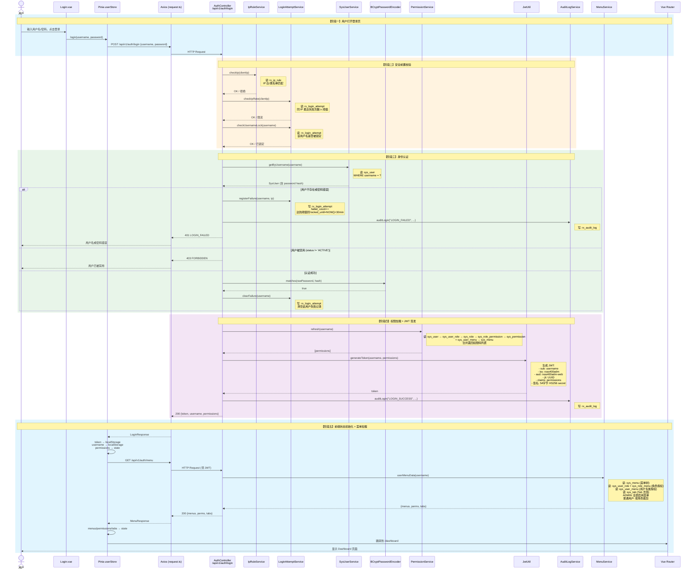
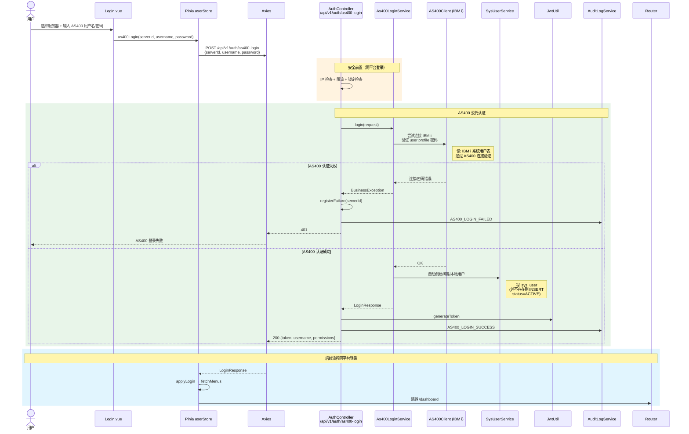
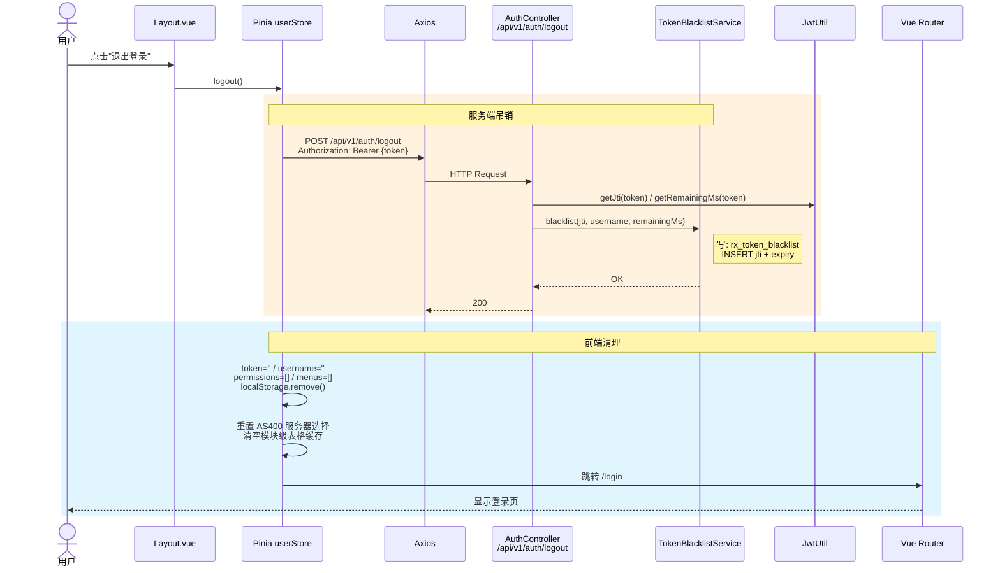
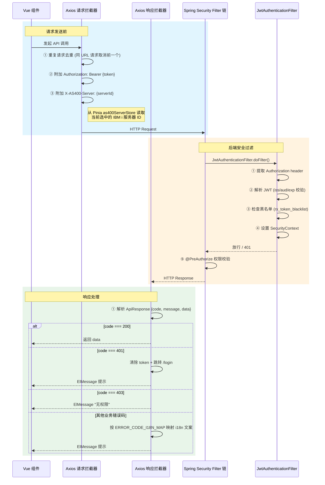

# RXAS400ADM 项目模块流程图

> 本文档使用 Mermaid 语法绘制，在 VS Code（安装 Markdown Preview Mermaid 插件）或 GitHub/GitLab 中可直接渲染。
> 涵盖从前端用户操作 → 后端 Controller → Service → AS400Client → IBM i 的完整调用链路，
> 以及每步涉及的数据表读写。

---

## 一、系统总体架构

```mermaid
graph TD
    subgraph Browser["浏览器 (Vue 3 + TypeScript)"]
        Login["Login.vue 登录页"]
        Layout["Layout.vue 主布局"]
        Views["各业务视图 (Dashboard/Job/Monitor/...)"]
        Pinia["Pinia Store (user / as400Server)"]
        Axios["Axios 请求层 (request.ts)"]
    end

    subgraph Security["Security Filter 链 (Spring Security)"]
        JwtFilter["JwtAuthenticationFilter (JWT 校验)"]
        CorsFilter["CorsFilter (CORS 白名单)"]
        SecurityConfig["SecurityConfig (CSP/CSRF/Session)"]
    end

    subgraph Backend["后端 Controller 层 (Spring Boot)"]
        AuthCtrl["AuthController /api/v1/auth"]
        As400Ctrl["As400Controller /api/v1/as400"]
        JobCtrl["JobController /api/v1/jobs"]
        MonitorCtrl["MonitorController /api/v1/monitor"]
        QueryCtrl["SqlQueryController /api/v1/query"]
        BizCtrl["BusinessController /api/v1/business"]
        SysCtrl["SysUser/Role/Menu/Permission/Config/... /api/v1/users|roles|menus|configs|..."]
        CompileCtrl["CompileController /api/v1/compile"]
        SourceCtrl["SourceController /api/v1/source"]
        IfsCtrl["IfsController /api/v1/ifs"]
        ObjectCtrl["ObjectController /api/v1/objects"]
        PfCtrl["PfController /api/v1/pf"]
        SubsysCtrl["SubsystemController /api/v1/subsystems"]
        ScriptCtrl["ScriptController /api/v1/scripts"]
        SchedCtrl["ScheduleController /api/v1/schedules"]
        ExecCtrl["ExecutionController /api/v1/executions"]
    end

    subgraph Service["Service 层"]
        SysUserSvc["SysUserService"]
        MenuSvc["MenuService"]
        PermissionSvc["PermissionService"]
        LoginAttemptSvc["LoginAttemptService"]
        IpRuleSvc["IpRuleService"]
        TokenBlacklistSvc["TokenBlacklistService"]
        JobSvc["JobService"]
        MetricSvc["MetricService"]
        AlertEngine["AlertEngine"]
        BusinessSvc["BusinessService"]
        SqlQuerySvc["SqlQueryService"]
        IbmiSystemSvc["IbmiSystemService"]
    end

    subgraph AS400["AS400 Client 层 (JTOpen)"]
        AS400Provider["AS400ClientProvider (按 X-AS400-Server 头路由)"]
        JTOpenClient["JTOpenAS400Client (委托模式, 12 个子接口)"]
        SqlClient["JTOpenSqlClient (PreparedStatement, DB2 for i)"]
        CommandClient["JTOpenCommandClient (CL 命令, 标识符校验)"]
    end

    subgraph Data["数据层"]
        MySQL[("MySQL / DB2 for i<br/>业务数据库")]
        IBMi[("IBM i (AS400)<br/>QSYS2 系统表")]
        Redis[("Redis (可选)<br/>缓存")]
    end

    Browser -->|"HTTP + JWT Header"| Security
    Security -->|"已认证"| Backend
    Backend --> Service
    Service --> AS400
    Service --> MySQL
    AS400 -->|"JDBC / CL Command"| IBMi

    style Browser fill:#e1f5fe
    style Security fill:#fff3e0
    style Backend fill:#e8f5e9
    style Service fill:#f3e5f5
    style AS400 fill:#fce4ec
    style Data fill:#fff9c4
```

点击展开 Mermaid 源码

---

## 二、用户登录模块

### 2.1 平台账号登录（用户名/密码）

### 2.2 涉及数据表汇总（登录流程）

| 阶段 | 数据表 | 操作 | 说明 |
|------|--------|------|------|
| 安全前置 | `rx_ip_rule` | **R** | IP 白/黑名单匹配 |
| 安全前置 | `rx_login_attempt` | **R** | 检查 IP 限流、用户名锁定 |
| 身份认证 | `sys_user` | **R** | 查询用户（username, password, status） |
| 认证失败 | `rx_login_attempt` | **W** | 记录失败次数 + 锁定 |
| 认证失败 | `rx_audit_log` | **W** | 审计记录 LOGIN_FAILED |
| 认证成功 | `rx_login_attempt` | **W** | 清空失败记录 |
| 认证成功 | `rx_audit_log` | **W** | 审计记录 LOGIN_SUCCESS |
| 权限加载 | `sys_user` → `sys_user_role` → `sys_role` → `sys_role_permission` → `sys_permission` | **R** | 角色→权限链 |
| 权限加载 | `sys_user_menu` → `sys_menu` | **R** | 用户专属菜单授权 |
| 菜单加载 | `sys_menu` | **R** | 菜单树（含 status/admin_only） |
| 菜单加载 | `sys_role_menu` | **R** | 角色→菜单授权 |
| 菜单加载 | `sys_tab` | **R** | Tab 页签定义 |

### 2.3 AS400 用户画像登录

### 2.4 登出流程

### 2.5 涉及数据表汇总（登出流程）

| 数据表 | 操作 | 说明 |
|--------|------|------|
| `rx_token_blacklist` | **W** | 写入 jti + expiry，JWT 有效期内该 token 失效 |

---

## 三、Axios 请求拦截器链（全局）

---

> **完整模块流程图请参阅：** [modules-mermaid-source.md](flowcharts/modules-mermaid-source.md)
>
> 该文档包含以下所有模块的完整 Mermaid 时序图源码：
>
> - 一、用户登录与认证（平台登录 / AS400登录 / 登出 / 菜单加载）
> - 二、Dashboard 仪表盘
> - 三、Job 作业中心（活动作业 / 作业控制 / SPOOL / MSGW应答 / SLA / 依赖）
> - 四、Monitor 监控中心（概览 / 指标历史 / 容量规划 / 基线 / 服务器对比 / 告警 / 巡检）
> - 五、SQL 查询与业务数据（查询执行 / 安全校验 / 业务数据浏览）
> - 六、AS400 工具集（IFS / 对象 / PF / 子系统 / 脚本 / 调度 / 执行历史 / 编译 / 源码 / 拓扑 / 消息文件 / 系统值 / 表字段）
> - 七、系统管理（用户 / 角色 / 菜单 / 权限码 / 配置 / 国际化 / 字典 / Webhook / 通知 / 公告 / 审计 / 缓存 / 文档 / 报表）
> - 八、定时任务与后台采集（CollectorScheduler / 分布式锁 / 并行采集 / 告警触发）
> - 九、请求拦截器链（前端 Axios / 后端 Security Filter）
> - 十、数据表总览（业务数据表 / IBM i QSYS2系统表 / 权限码汇总）